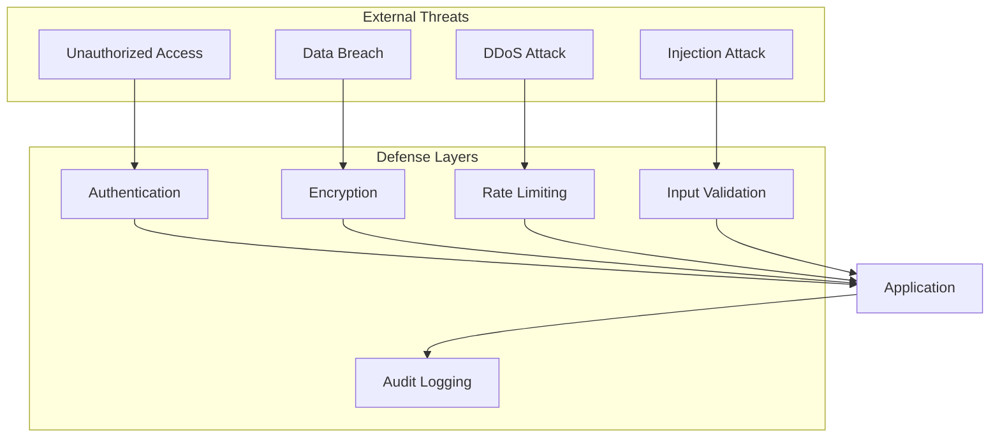
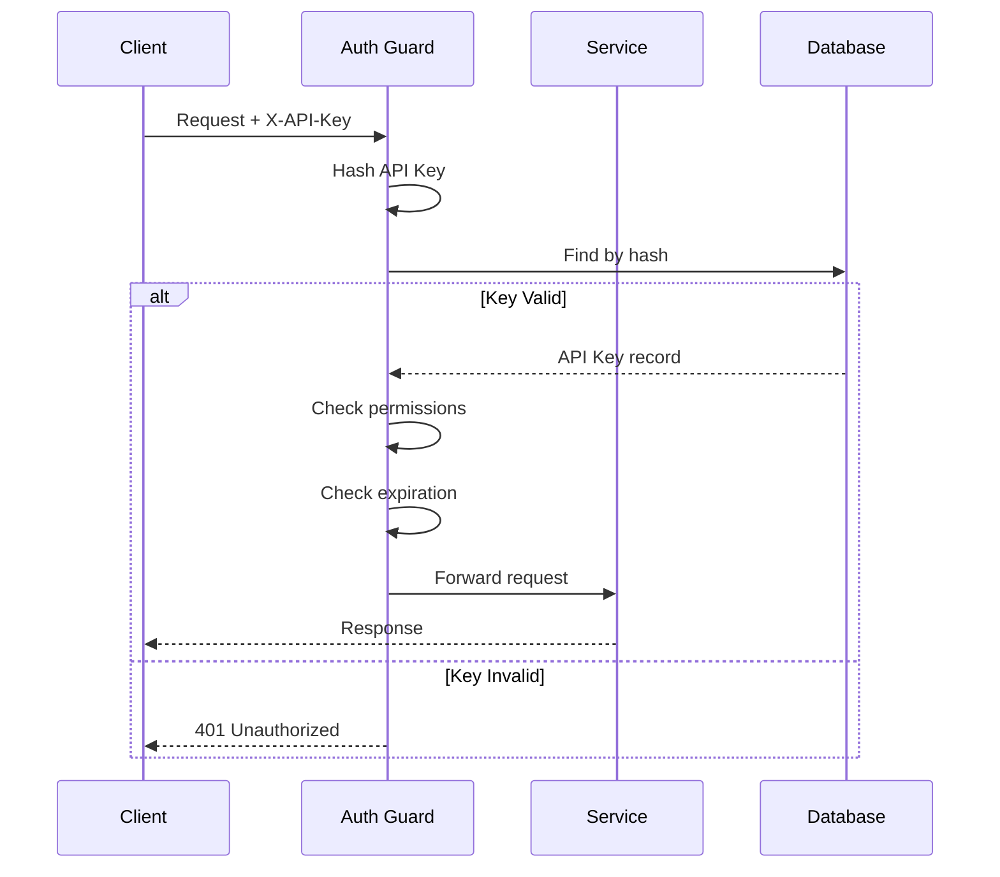
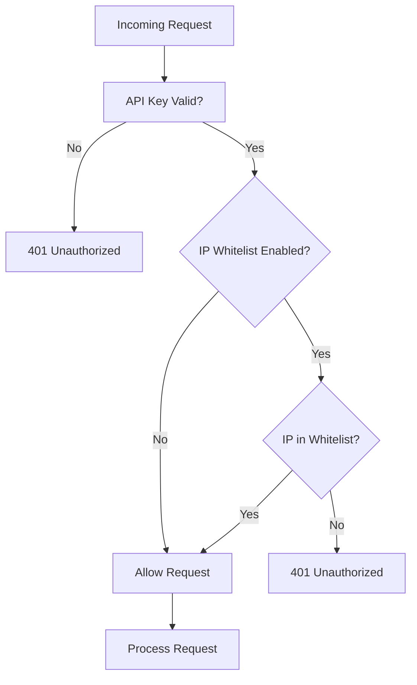
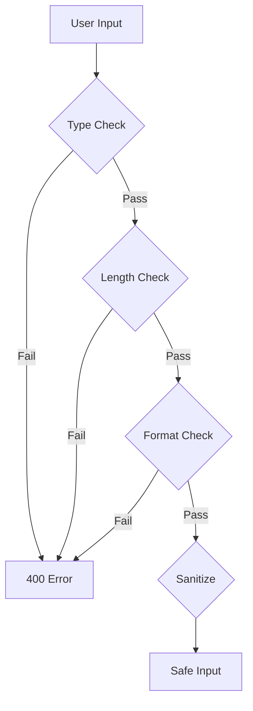
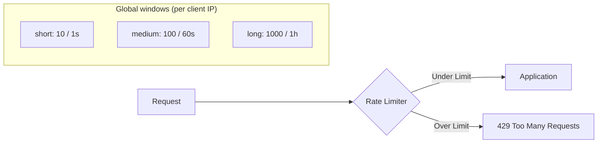
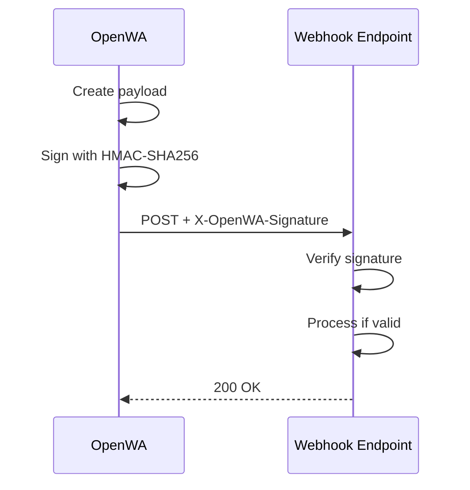
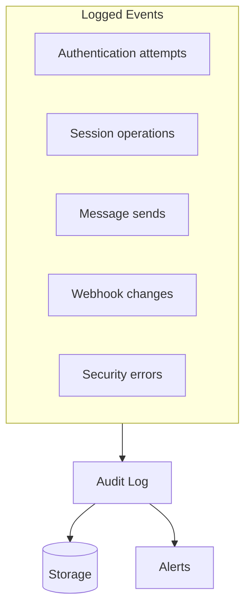
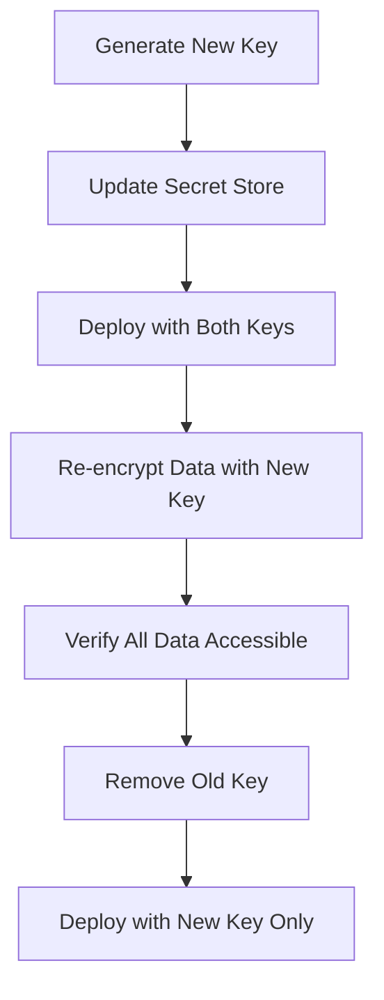
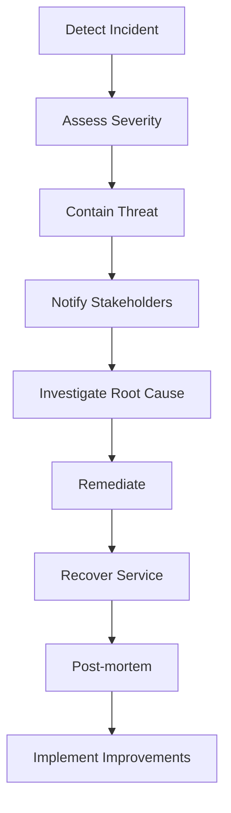

# 04 - Security Design

## 4.1 Security Overview



## 4.2 Authentication

### API Key Authentication Flow



### API Key Format

```
Format: owa_k1_<64 hex chars>   (32 random bytes, hex-encoded — 71 characters in total)
Example: owa_k1_3f9c1d0a7b2e4c5680a1f2d3e4b5c6a7980b1c2d3e4f50617283940a1b2c3d4e

Storage: SHA-256 hash only (never store plain key); `keyPrefix` keeps the first 12 characters
```

Every key minted through the API-keys endpoints uses that format. The bootstrap seed key is the only
exception: an explicit `API_MASTER_KEY` is taken verbatim, and `ALLOW_DEV_API_KEY=true` opts into the
fixed `dev-admin-key`; with neither set, the seed key is generated in the format above.

### Permission Model

API keys carry **no permission strings**. Authorization is a role hierarchy on the key itself, plus
two scoping dimensions enforced by `ApiKeyGuard`.

| Role       | Rank | Meaning                                                              |
| ---------- | ---- | -------------------------------------------------------------------- |
| `admin`    | 3    | Satisfies every `@RequireRole` level, including API-key management   |
| `operator` | 2    | Satisfies `operator` and `viewer` routes — the default for a new key |
| `viewer`   | 1    | Satisfies `viewer` routes only                                       |

A route declares its minimum level with `@RequireRole(...)`; a key passes when its role ranks at or
above that level (`AuthService.hasPermission`). A key below it is rejected with `403 Forbidden`.

| Scope     | Field             | Effect                                                                                                   |
| --------- | ----------------- | -------------------------------------------------------------------------------------------------------- |
| Source IP | `allowedIps`      | Empty/absent = unrestricted; non-empty = fail-closed IP whitelist (see §4.3)                             |
| Sessions  | `allowedSessions` | Empty/absent = every session; non-empty = a request carrying any other session id is rejected with `401` |

The key-lifecycle routes (`/api/auth/api-keys`) are additionally fenced with `@RequireUnscopedKey()`:
a session-scoped key is refused there whatever its role, so it cannot mint or widen credentials
beyond its own confinement.

## 4.3 IP Whitelisting

IP whitelisting adds an extra security layer by restricting API key access to specific IP addresses.

### IP Whitelist Flow



### Managing the whitelist

There is **no `/whitelist` sub-resource**. A key's allowed source IPs are the `allowedIps` field on the API key itself, set when you create or update the key via the API-keys endpoints (see §6.4.9 in the [API Specification](./06-api-specification.md)):

```http
POST /api/auth/api-keys
PUT  /api/auth/api-keys/:id
```

```json
{
  "name": "production-server",
  "allowedIps": ["203.0.113.50", "10.0.0.0/24"]
}
```

`allowedIps` accepts exact IPs and CIDR ranges. An empty or absent list means the key is **not** IP-restricted; a non-empty list fails closed (a request whose client IP can't be determined, or isn't in the list, is rejected). To change the whitelist, `PUT` the key with the new `allowedIps` array.

### Implementation

There is no dedicated whitelist guard, service or table — no `IpWhitelistGuard`, no whitelist
sub-resource, no per-entry `active` flag. Enforcement lives in two places:

- **Client IP resolution** — `ApiKeyGuard` calls `resolveClientIp(request, TRUSTED_PROXIES)`
  (`src/common/utils/ip.ts`). `X-Forwarded-For` is client-controllable, so it is honored **only**
  when the request actually arrives from a configured trusted proxy; with no trusted proxies set the
  header is ignored entirely and the direct socket address is used. That is what prevents a caller
  from spoofing its way past the whitelist with a forged header (see §4.6 for `TRUSTED_PROXIES`).
- **Matching** — `AuthService.validateApiKey` compares that IP against the key's `allowedIps` with
  the shared `ipMatches` helper, which accepts an exact address or CIDR notation and returns `false`
  on a malformed entry rather than coercing it into range. With a whitelist configured, an
  undeterminable client IP throws `UnauthorizedException` (`401`) straight away, with no log line;
  an IP outside the list writes a `logger.warn` with `action: 'ip_rejected'` first, then throws the
  same `401`.

### Best Practices

| Practice              | Description                                               |
| --------------------- | --------------------------------------------------------- |
| **Use CIDR notation** | For IP ranges, use CIDR instead of multiple entries       |
| **Trusted Proxies**   | Configure trusted proxies for accurate client IP          |
| **Regular Review**    | Review whitelist entries regularly                        |
| **Audit Logging**     | Log all blocked attempts for monitoring                   |
| **Fallback Plan**     | Prepare a process to update the whitelist when IPs change |

### IPv6 Support

CIDR matching is IPv4-only: an IPv6 range in `allowedIps` never matches. An exact IPv6 address still
works, by literal comparison — IPv4-mapped forms (`::ffff:203.0.113.50`) are normalized to their bare
IPv4 address first.

## 4.4 Data Encryption

### In Transit

OpenWA serves plain HTTP on its port; terminate **TLS at your reverse proxy / load balancer** (nginx, Traefik, Caddy) and expose the gateway only over HTTPS in production. The API key is bearer-equivalent and is sent on every request, so it must never traverse plaintext `http://` outside local development.

### At Rest

> **There is currently no application-level encryption at rest.** API keys are stored **hashed** (one-way), but other sensitive values are stored as plaintext in the database / on disk and are protected by filesystem and database permissions, not by encryption. Encryption at rest for these fields is a roadmap item, not a shipped feature — do not assume it.

| Data                                      | At rest                                                                       | How it is protected                                                                                              |
| ----------------------------------------- | ----------------------------------------------------------------------------- | ---------------------------------------------------------------------------------------------------------------- |
| API keys                                  | **Hashed** — SHA-256 with an optional `API_KEY_PEPPER` HMAC; never reversible | A database leak alone cannot recover the keys; with a pepper set, hashes can't be precomputed offline. See §4.2. |
| Session auth state (WhatsApp credentials) | Plaintext on disk (the engine's auth store under the data volume)             | Filesystem permissions on the data volume — keep it private.                                                     |
| Webhook secrets                           | Plaintext — `webhooks.secret` (`varchar`)                                     | Database access control; never returned by any API response (write-only response DTO).                           |
| Proxy credentials                         | Plaintext — `sessions.proxyUrl` may embed `user:pass`                         | Database access control; never returned by the session read DTOs.                                                |
| Generated config (`data/.env.generated`)  | Plaintext file, written `0600`                                                | Owner-only file permissions.                                                                                     |
| Message content                           | Plaintext in the `messages` table                                             | Database access control.                                                                                         |

**Hardening you can apply today:** set `API_KEY_PEPPER`; restrict the data volume and database to the app's user; and encrypt at the infrastructure layer (LUKS / cloud-provider encrypted volumes / an encrypted managed Postgres) rather than relying on application-level field encryption, which is not implemented.

## 4.5 Input Validation

### Validation Rules



### Validation Examples

| Field                        | Rules                                                                                                                                            |
| ---------------------------- | ------------------------------------------------------------------------------------------------------------------------------------------------ |
| `chatId`                     | Non-empty string — **no format pattern**; the engine resolves the id, so `@c.us`, `@g.us`, `@lid`, `@newsletter` and `status@broadcast` all pass |
| `phoneNumber` (pairing code) | Pattern: `^[0-9]{6,15}$` — digits only, international format                                                                                     |
| `url`                        | Valid URL (`require_tld: false`, so single-label hosts like `http://localhost:3000` pass); HTTPS is a recommendation, not enforced               |
| `text`                       | Max 4096 chars (`send-text`)                                                                                                                     |
| `sessionName`                | Alphanumeric + hyphen, 3-50 chars                                                                                                                |

### DTO Validation

```typescript
// src/modules/message/dto/send-message.dto.ts
export class SendTextMessageDto {
  @IsString()
  @IsNotEmpty()
  chatId: string;

  @IsString()
  @IsNotEmpty()
  @MaxLength(MESSAGE_TEXT_MAX_LENGTH) // 4096, shared with the agent-tool input schemas
  text: string;
}

// src/modules/webhook/dto/webhook.dto.ts
export class CreateWebhookDto {
  // require_tld:false allows hostnames without a dot (e.g. http://localhost:3000); the SSRF
  // guard still decides whether the host may actually be delivered to.
  @IsUrl({ require_tld: false })
  url: string;

  @IsOptional()
  @IsArray()
  @ArrayMinSize(1)
  // The full WEBHOOK_EVENTS catalog (message.*, status.received, session.*, group.*,
  // call.received) plus '*' for subscribe-all.
  @IsIn([...WEBHOOK_EVENTS, '*'], { each: true })
  events?: string[];
}
```

## 4.6 Rate Limiting

### Rate Limit Configuration



### Windows

All limits are **global and per client IP** (resolved through `TRUSTED_PROXIES`), applied by a global `ThrottlerGuard`. There is **no per-endpoint limit table** — these three windows apply to every non-exempt route, and exceeding any one returns `429 Too Many Requests`:

| Window   | Default limit | Window length | Env overrides                                       |
| -------- | ------------- | ------------- | --------------------------------------------------- |
| `short`  | 10 requests   | 1 s           | `RATE_LIMIT_SHORT_TTL` / `RATE_LIMIT_SHORT_LIMIT`   |
| `medium` | 100 requests  | 60 s          | `RATE_LIMIT_MEDIUM_TTL` / `RATE_LIMIT_MEDIUM_LIMIT` |
| `long`   | 1000 requests | 3600 s        | `RATE_LIMIT_LONG_TTL` / `RATE_LIMIT_LONG_LIMIT`     |

TTL values are in milliseconds. The `/api/metrics` and `/api/health*` routes are exempt (`@SkipThrottle`). To enforce tighter per-route limits, lower the global windows or add a limiter at your reverse proxy.

### Response on limit

Exceeding a window returns `429 Too Many Requests`. Because the windows are **named** throttlers (`short` / `medium` / `long`), `@nestjs/throttler` suffixes every rate-limit header with the throttler name — there are no unsuffixed `Retry-After` or `X-RateLimit-*` headers:

- On success, each response carries one header triple per window: `X-RateLimit-Limit-short` / `-Remaining-short` / `-Reset-short`, plus the `-medium` and `-long` equivalents.
- On `429`, the exceeded window sets `Retry-After-short`, `Retry-After-medium`, or `Retry-After-long` (seconds until the block expires) — read whichever is present rather than a plain `Retry-After`.

The ingress route (`ALL /api/ingress/:pluginId/:instanceId/*path`) additionally evaluates a per-instance window named `instance` (env: `INGRESS_INSTANCE_LIMIT`, default 120, per `INGRESS_INSTANCE_TTL`, default 60000 ms), so its responses carry `X-RateLimit-*-instance` and, on saturation, `Retry-After-instance`.

The API exposes the rate-limit headers via CORS (`exposedHeaders`) so browser clients can read them. The simplest backpressure signal remains the `429` status itself, with the suffixed `Retry-After-*` as the retry delay.

### WebSocket (`/events`) limits

Socket.IO frames never pass through the Nest enhancer pipeline, so the HTTP windows above do **not** apply to the WebSocket surface. `EventsGateway` enforces its own in-process limits instead (all keyed in-memory per process; any blank/non-positive/non-numeric env value falls back to the default):

| Limit                                                               | Keyed on                                       | Default                                | Env overrides                                                       |
| ------------------------------------------------------------------- | ---------------------------------------------- | -------------------------------------- | ------------------------------------------------------------------- |
| Client frames (subscribe/unsubscribe/ping) — token bucket           | API key (IP before auth completes)             | 60 frames/s sustained, 120-frame burst | `WS_RATE_LIMIT_FRAME_PER_SECOND` / `WS_RATE_LIMIT_FRAME_BURST`      |
| New handshakes — sliding window, enforced **before** key validation | client IP (resolved through `TRUSTED_PROXIES`) | 10 per 60 s                            | `WS_RATE_LIMIT_HANDSHAKE_MAX` / `WS_RATE_LIMIT_HANDSHAKE_WINDOW_MS` |
| Simultaneous sockets                                                | API key                                        | 16                                     | `WS_MAX_SOCKETS_PER_KEY`                                            |

The frame budget is sized ~6x above legitimate traffic: the dashboard emits ~8 subscribe frames at page mount and only occasional ping/unsubscribe frames afterwards (server→client event fan-out is not limited). The handshake window stops an unauthenticated connection flood from forcing a DB `validateApiKey` per attempt; Socket.IO's exponential-backoff reconnect (~6 attempts/min per tab) stays under it. The socket cap covers multi-tab dashboards and SDK clients sharing one key. A rejected handshake or excess socket is answered with a `RATE_LIMITED` error frame and a clean disconnect; an over-budget frame gets a `RATE_LIMITED` error frame and is not dispatched. Violations are audited as `rate_limit_exceeded`, sampled to at most one row per subject+kind per minute (suppressed occurrences are counted into the next row) so the audit trail itself cannot become the flood.

## 4.7 CORS Configuration

### CORS Settings

```typescript
// resolveCorsPolicy (src/config/bootstrap-security.ts): CORS_ORIGINS is a comma-separated
// allowlist; unset defaults to the wildcard. In production a wildcard is REFUSED — the policy
// collapses to same-origin only, with credentials off, so a misconfigured deployment cannot
// reflect arbitrary origins with credentials.
const corsPolicy = resolveCorsPolicy(process.env.CORS_ORIGINS, process.env.NODE_ENV);

app.enableCors({
  origin: (origin, callback) => {
    // Allow requests with no origin (mobile apps, Postman, server-to-server)
    if (!origin) return callback(null, true);

    if (corsPolicy.allowAnyOrigin || corsPolicy.origins.includes(origin)) {
      callback(null, true);
    } else {
      // Deny WITHOUT throwing — throwing surfaced as a 500 Internal Server Error (#250).
      // Returning false simply omits the CORS headers, so the browser blocks the genuine
      // cross-origin request itself while same-origin traffic keeps working.
      callback(null, false);
    }
  },
  credentials: corsPolicy.credentials, // false whenever the allowlist is a wildcard
  methods: ['GET', 'POST', 'PUT', 'DELETE', 'PATCH', 'OPTIONS'],
  allowedHeaders: ['Content-Type', 'X-API-Key', 'Authorization', 'X-Request-ID'],
  // Throttlers are named, so rate-limit headers carry a per-window suffix
  // (see "Response on limit" above); there are no unsuffixed variants.
  exposedHeaders: ['X-RateLimit-Limit-short', 'X-RateLimit-Remaining-short', '...'],
  maxAge: 86400, // 24 hours
});
```

## 4.8 Webhook Security

### Webhook Signature



### Signature Verification

```typescript
// OpenWA: Generate signature
function signPayload(payload: object, secret: string): string {
  const hmac = crypto.createHmac('sha256', secret);
  hmac.update(JSON.stringify(payload));
  return 'sha256=' + hmac.digest('hex');
}

// Client: Verify signature
function verifySignature(payload: string, signature: string, secret: string): boolean {
  const expected = 'sha256=' + crypto.createHmac('sha256', secret).update(payload).digest('hex');

  return crypto.timingSafeEqual(Buffer.from(signature), Buffer.from(expected));
}
```

### Fan-out and Payload Bounds

A single inbound event is delivered to **every** matching webhook of the session, and media arrives
from unauthenticated WhatsApp senders — so the copy amplification is bounded at four points:

| Bound                         | Knob                                      | Default                            | Behavior                                                                                                                                                                             |
| ----------------------------- | ----------------------------------------- | ---------------------------------- | ------------------------------------------------------------------------------------------------------------------------------------------------------------------------------------ |
| Webhooks per session          | `WEBHOOK_MAX_PER_SESSION`                 | 16 (`0` = unlimited)               | Creating a NEW webhook at/over the cap is rejected with `400`; existing webhooks are grandfathered                                                                                   |
| Autoreply rules per session   | `AUTOMATION_MAX_PER_SESSION`              | 32 (`0` = unlimited)               | Creating a NEW rule at/over the cap is rejected with `400`; existing rules are grandfathered. Every inbound message is evaluated against every rule of its session                   |
| Inline media in payloads      | `WEBHOOK_MEDIA_INLINE_MAX_BYTES`          | 1 MiB (`0` = never inline)         | Larger media is replaced once, before per-webhook cloning, with `media: { mimetype, filename?, omitted: true, sizeBytes }`                                                           |
| Serialized body size          | `WEBHOOK_MAX_PAYLOAD_BYTES`               | 1 MiB                              | Over-budget bodies shed any remaining inline media (marker form) and are re-checked; still over budget → recorded as undelivered, never sent/queued                                  |
| Failed-job retention in Redis | queue `removeOnComplete` / `removeOnFail` | 1h/1000 completed, 24h/5000 failed | Finished jobs auto-evict; payloads were already media-shed before enqueue, so retained jobs stay small. The durable record of a lost delivery is the `webhook_delivery_failures` row |

Each webhook still receives its own copy of the event data — a `webhook:before` hook may mutate
`payload.data` in place and must not bleed into sibling deliveries — but the copy is taken after
media shedding, so it is small. The HMAC signature is computed over the exact shed bytes sent.

## 4.9 Security Headers

### Helmet Configuration

The shipped configuration lives in `src/main.ts` — that file is the source of truth:

```typescript
app.use(helmet({
  contentSecurityPolicy: {
    directives: {
      defaultSrc: ["'self'"],
      // The bundled dashboard pulls webfonts from Google Fonts.
      styleSrc: ["'self'", "'unsafe-inline'", 'https://fonts.googleapis.com'],
      // Per-response nonce; the served dashboard document carries the same value.
      scriptSrc: ["'self'", (_req, res) => `'nonce-${res.locals.cspNonce}'`],
      // blob: for the outgoing attachment preview, data: for chat media rendered inline.
      imgSrc: ["'self'", 'data:', 'blob:', 'https:'],
      mediaSrc: ["'self'", 'data:', 'blob:', 'https:'],
      connectSrc: ["'self'"],
      fontSrc: ["'self'", 'https://fonts.gstatic.com'],
      objectSrc: ["'none'"],
      // On in production, unless CSP_UPGRADE_INSECURE_REQUESTS opts an HTTP-only
      // private-network deployment out (#611).
      upgradeInsecureRequests: isUpgradeInsecureRequestsEnabled(...) ? [] : null,
    },
  },
  hsts: { maxAge: 31536000, includeSubDomains: true, preload: true },
  noSniff: true,
  referrerPolicy: { policy: 'strict-origin-when-cross-origin' },
  crossOriginResourcePolicy: { policy: 'cross-origin' }, // API usage
}));
```

### Security Headers Checklist

| Header                      | Value                                          | Purpose                                                                       |
| --------------------------- | ---------------------------------------------- | ----------------------------------------------------------------------------- |
| `Strict-Transport-Security` | `max-age=31536000; includeSubDomains; preload` | Force HTTPS                                                                   |
| `X-Content-Type-Options`    | `nosniff`                                      | Prevent MIME sniffing                                                         |
| `X-Frame-Options`           | `SAMEORIGIN`                                   | Prevent clickjacking (helmet's default; not overridden)                       |
| `X-XSS-Protection`          | `0`                                            | Helmet 8 deliberately disables the legacy auditor — the CSP is the protection |
| `Referrer-Policy`           | `strict-origin-when-cross-origin`              | Control referrer                                                              |

## 4.10 Audit Logging

### What Gets Logged

> **Reality check:** persisted audit coverage currently includes API-key create/update/revoke/delete
> (updates carry before/after authorization state), rejected authentication, session lifecycle,
> integration-instance creation, secret rotation, deletion, and scope-binding bridge failures, the
> infra operations (config save, restart request, data export/import, storage export/import),
> WebSocket rate-limit violations (sampled — see §4.6), and Bull Board queue mutations. Enum
> members for API-key use, connection transitions, message sends, and webhook lifecycle are explicitly
> registered as intentionally unemitted; application logs cover those operational events until dedicated
> audit callsites are added. There is no global audit interceptor.



### Log Format

```json
{
  "id": "uuid",
  "action": "session_started",
  "severity": "info",
  "apiKeyId": "uuid",
  "sessionId": "sess_123",
  "ipAddress": "192.168.1.1",
  "method": "POST",
  "path": "/api/sessions/sess_123/start",
  "statusCode": 201,
  "userAgent": "MyApp/1.0",
  "metadata": {},
  "createdAt": "2026-02-02T10:00:00.000Z"
}
```

`action` is an `AuditAction` enum value (snake_case); `severity` is `info` / `warn` / `error`. There is no `requestId` or `responseTime` **column**, but the active request id is merged into the `metadata` object of every row written inside a request scope, so an entry still correlates with the application log lines for that request. There is no global request-logging interceptor — entries are written explicitly by the code paths that emit them.

### Security Alerts

> **Not implemented.** There is no alerting or automatic temp-block subsystem; the table below is a design target, not shipped behavior. The signals do get recorded — rejected authentication and WebSocket rate-limit violations write persisted audit rows (the latter sampled), and an IP-restricted key used from a disallowed IP also emits a `logger.warn` — but nothing acts on them. Forward the audit log / application log to your SIEM to build these alerts.

| Event                | Severity | Intended action (roadmap) |
| -------------------- | -------- | ------------------------- |
| Multiple failed auth | High     | Alert + temp block        |
| Rate limit exceeded  | Medium   | Log + block               |
| Invalid signature    | Medium   | Log                       |
| Unusual activity     | Low      | Log                       |

## 4.11 Security Checklist

### Development

- [ ] Input validation on all endpoints
- [ ] SQL injection prevention (parameterized queries)
- [ ] XSS prevention (output encoding)
- [ ] CSRF protection (if using cookies)
- [ ] Secure dependencies (npm audit)
- [ ] No secrets in code

### Deployment

- [ ] HTTPS only (TLS 1.2+)
- [ ] Security headers configured
- [ ] Rate limiting enabled
- [ ] CORS properly configured
- [ ] Firewall rules set
- [ ] Regular security updates

### Operations

- [ ] Audit logging enabled
- [ ] Log monitoring setup
- [ ] Backup encryption
- [ ] Incident response plan
- [ ] Regular security audits

---

## 4.12 Secrets Management

### Secrets Inventory

| Secret                            | Storage                                             | Rotation guidance                               |
| --------------------------------- | --------------------------------------------------- | ----------------------------------------------- |
| Database credentials              | Environment variable                                | 90 days                                         |
| Redis password                    | Environment variable                                | 90 days                                         |
| API master key (`API_MASTER_KEY`) | Environment variable                                | 180 days                                        |
| API key pepper (`API_KEY_PEPPER`) | Environment variable                                | Rotating it invalidates all existing key hashes |
| Webhook secrets                   | Database — **plaintext**; never returned by the API | Per webhook                                     |
| Session auth state                | File system (data volume) — **not encrypted**       | Never (tied to the WA session)                  |

> There is no application `ENCRYPTION_KEY` — OpenWA does not encrypt data at rest (see §4.4). The rotation cadences above are operational recommendations, not enforced by the app.

### Environment Variables Security

```bash
# ❌ BAD: Secrets hard-coded in a committed file (docker-compose.yml, Dockerfile, source)
DATABASE_PASSWORD=password123

# ✅ GOOD: Use .env file (not committed)
DATABASE_PASSWORD=${DATABASE_PASSWORD}

# ✅ BETTER: Use Docker secrets or vault
docker secret create db_password ./secret.txt
```

### Docker Secrets

> **Caveat:** the `*_FILE` convention shown below requires a secret-file reader in the app (see "Reading Secrets" below), which is **not currently implemented** — OpenWA reads secrets straight from environment variables. Until that helper exists, pass secrets as plain env vars (e.g. an `.env` file with restricted permissions) rather than `_FILE` paths.

```yaml
# Illustrative overlay — not the docker-compose.yml shipped in this repo
services:
  app:
    image: openwa:latest
    secrets:
      - db_password
      - api_master_key
    environment:
      - DATABASE_PASSWORD_FILE=/run/secrets/db_password

secrets:
  db_password:
    external: true
  api_master_key:
    external: true
```

### Reading Secrets in Application

> **Not implemented as shown.** OpenWA does **not** read `<NAME>_FILE` Docker-secret files — there is no `getSecret()` helper today. Secrets come straight from `process.env`, layered at boot as `process.env` → `.env` → `data/.env.generated` (`override:false`, so a real environment value wins). The function below is a suggested pattern to add if you want Docker-secret `_FILE` support; as-is, `DATABASE_PASSWORD_FILE` is not consulted.

```typescript
// config/secrets.ts
import { readFileSync, existsSync } from 'fs';

export function getSecret(name: string): string {
  // Try file-based secret first (Docker secrets)
  const filePath = process.env[`${name}_FILE`];
  if (filePath && existsSync(filePath)) {
    return readFileSync(filePath, 'utf8').trim();
  }

  // Fall back to environment variable
  const envValue = process.env[name];
  if (!envValue) {
    throw new Error(`Secret ${name} not configured`);
  }

  return envValue;
}

// Usage
const dbPassword = getSecret('DATABASE_PASSWORD');
const masterKey = getSecret('API_MASTER_KEY');
```

### Key Rotation Procedure

> **Not applicable today.** OpenWA stores no encrypted-at-rest data (see §4.4), so there is no data-encryption key to rotate and no `rotateEncryptionKey()` in the codebase. The flow below is illustrative for if/when field-level encryption is added. To rotate the `API_MASTER_KEY` or `API_KEY_PEPPER`, use the API-key endpoints (§4.2) — rotating the pepper invalidates existing key hashes.



```typescript
// Key rotation for encrypted data
async function rotateEncryptionKey(oldKey: string, newKey: string): Promise<void> {
  // 1. Get all encrypted records
  const sessions = await sessionRepo.find();

  for (const session of sessions) {
    // 2. Decrypt with old key
    const authState = decrypt(session.authState, oldKey);

    // 3. Re-encrypt with new key
    session.authState = encrypt(authState, newKey);

    await sessionRepo.save(session);
  }

  logger.log('Key rotation completed', {
    recordsUpdated: sessions.length,
  });
}
```

## 4.13 Dependency Security

### npm Audit Workflow

```bash
# Check for vulnerabilities
npm audit

# Auto-fix non-breaking vulnerabilities
npm audit fix

# View detailed report
npm audit --json > audit-report.json
```

### GitHub Dependabot Configuration

```yaml
# .github/dependabot.yml — the root npm ecosystem (the file also covers /dashboard,
# github-actions and docker)
version: 2
updates:
  - package-ecosystem: npm
    directory: /
    schedule:
      interval: weekly
      day: monday
    open-pull-requests-limit: 5
    groups:
      minor-and-patch:
        update-types: [minor, patch]
      major:
        update-types: [major]
    labels:
      - dependencies
    ignore:
      # TypeScript 7 is the native port: typescript-eslint and ts-jest cannot load it (#727/#729).
      - dependency-name: 'typescript'
        versions: ['>=7.0.0']
      # better-sqlite3 v13: every released TypeORM caps its peer at ^12, and the linux-arm64
      # prebuild needs glibc 2.38 (the node:22-slim base has 2.36).
      - dependency-name: 'better-sqlite3'
        versions: ['>=13.0.0']
```

Majors are **not** ignored — they arrive as their own grouped PR, separate from the minor/patch
group. The only ignores are the two pinned incompatibilities above, each with its lift condition
documented inline.

### Security Scanning in CI

> **Aspirational template — not in the repo.** There is no `security.yml`, no Snyk, and no CodeQL workflow today. The actual dependency check is a dedicated `audit` job ("Security audit") in `ci.yml`, running `npm audit --audit-level=high` on push/PR — not on a schedule. It is deliberately its own job rather than a step inside Lint: an advisory published against an unrelated dependency would otherwise abort the job before ESLint, the type-check and the drift gates ever ran. The threshold is `high` rather than `critical` because the `overrides` in `package.json` clear the root tree's existing HIGH advisories, so it now fences regressions. The workflow below is a recommended setup to add if you want scheduled scanning and SAST.

```yaml
# .github/workflows/security.yml
name: Security Scan

on:
  push:
    branches: [main, develop]
  schedule:
    - cron: '0 0 * * 1' # Weekly on Monday

jobs:
  audit:
    runs-on: ubuntu-latest
    steps:
      - uses: actions/checkout@v4

      - name: Setup Node.js
        uses: actions/setup-node@v4
        with:
          node-version: '22'

      - name: Install dependencies
        run: npm ci

      - name: Run npm audit
        run: npm audit --audit-level=high

      - name: Run Snyk security scan
        uses: snyk/actions/node@master
        env:
          SNYK_TOKEN: ${{ secrets.SNYK_TOKEN }}
        with:
          args: --severity-threshold=high

      - name: SAST with CodeQL
        uses: github/codeql-action/analyze@v2
```

### Allowed/Blocked Packages

```json
// package.json
{
  "overrides": {
    // Force specific version for security fix
    "lodash": "^4.17.21"
  },
  "scripts": {
    "preinstall": "npx npm-force-resolutions"
  }
}
```

### Vulnerability Response Matrix

| Severity | Response Time | Action                     |
| -------- | ------------- | -------------------------- |
| Critical | 24 hours      | Immediate patch or disable |
| High     | 72 hours      | Patch in next release      |
| Medium   | 2 weeks       | Plan for next sprint       |
| Low      | 1 month       | Backlog item               |

## 4.14 Incident Response

### Incident Severity Levels

| Level         | Description               | Example                | Response Time |
| ------------- | ------------------------- | ---------------------- | ------------- |
| P1 - Critical | Service down, data breach | Auth bypass, data leak | 15 minutes    |
| P2 - High     | Major feature broken      | Session creation fails | 1 hour        |
| P3 - Medium   | Partial degradation       | Slow webhook delivery  | 4 hours       |
| P4 - Low      | Minor issue               | UI glitch              | 24 hours      |

### Incident Response Flow



### Security Incident Checklist

```markdown
## Immediate Actions (First 15 Minutes)

- [ ] Confirm incident is real (not false positive)
- [ ] Assess severity level
- [ ] Create incident channel/thread
- [ ] Assign incident commander

## Containment (First Hour)

- [ ] Identify affected systems
- [ ] Isolate compromised components
- [ ] Preserve evidence (logs, snapshots)
- [ ] Block attacker if identified

## Investigation

- [ ] Timeline of events
- [ ] Entry point identification
- [ ] Scope of compromise
- [ ] Data accessed/exfiltrated

## Recovery

- [ ] Patch vulnerability
- [ ] Reset compromised credentials
- [ ] Restore from clean backup if needed
- [ ] Verify system integrity

## Post-Incident

- [ ] Document lessons learned
- [ ] Update security controls
- [ ] Notify affected users if required
- [ ] Schedule blameless post-mortem
```

### Emergency Contacts

A template for an operator to fill in and keep outside the repository — OpenWA ships no
`config/incident-response.yml` and reads no such file. The only contact the project itself
publishes is the vulnerability-reporting channel in [SECURITY.md](../SECURITY.md); the on-call,
channel and status-page entries below are placeholders with no upstream default.

```yaml
# config/incident-response.yml — operator-supplied, not shipped
contacts:
  primary_oncall:
    name: 'On-Call Engineer'
    phone: '+62xxx'
    slack: '@oncall'

  security_lead:
    name: 'Security Lead'
    email: 'yudhi@rmyndharis.com' # see SECURITY.md — GitHub Security Advisories preferred

  escalation:
    - level: 1
      wait: 15m
      contact: primary_oncall
    - level: 2
      wait: 30m
      contact: security_lead

communication:
  internal_channel: '' # e.g. a chat channel you own
  status_page: '' # e.g. a status page you own; the project publishes none
```

### Runbooks

```markdown
## Runbook: Suspected Data Breach

### Detection Signals

- Unusual API access patterns
- Large data exports
- Authentication from new locations
- Failed auth attempts spike

### Immediate Steps

1. Rotate all API keys for affected accounts
2. Enable IP whitelisting if not already
3. Check audit logs for scope
4. Snapshot affected database

### Evidence Collection

- Capture the audit log (the `audit_logs` table / audit query API) and the application logs (`docker compose logs openwa`) — there is no `logs:export` script
- Database query logs
- Network traffic captures
- System metrics at incident time
```

### Post-Mortem Template

```markdown
# Incident Post-Mortem: [Title]

**Date:** YYYY-MM-DD
**Severity:** P1/P2/P3
**Duration:** X hours
**Author:** [Name]

## Summary

Brief description of what happened.

## Impact

- Users affected: X
- Data compromised: None/Partial/Full
- Revenue impact: $X

## Timeline

| Time (UTC) | Event                 |
| ---------- | --------------------- |
| 10:00      | Alert triggered       |
| 10:05      | Incident confirmed    |
| 10:15      | Containment started   |
| 11:00      | Root cause identified |
| 12:00      | Service restored      |

## Root Cause

Technical explanation of what went wrong.

## What Went Well

- Detection was quick
- Communication was clear

## What Went Wrong

- Missing monitoring for X
- Delayed response due to Y

## Action Items

| Item                 | Owner     | Due Date   | Status |
| -------------------- | --------- | ---------- | ------ |
| Add monitoring for X | @eng      | 2026-02-15 | Open   |
| Update runbook       | @security | 2026-02-10 | Open   |

## Lessons Learned

Key takeaways for preventing future incidents.
```

---

<div align="center">

[← 03 - System Architecture](./03-system-architecture.md) · [Documentation Index](./README.md) · [Next: 05 - Database Design →](./05-database-design.md)

</div>
