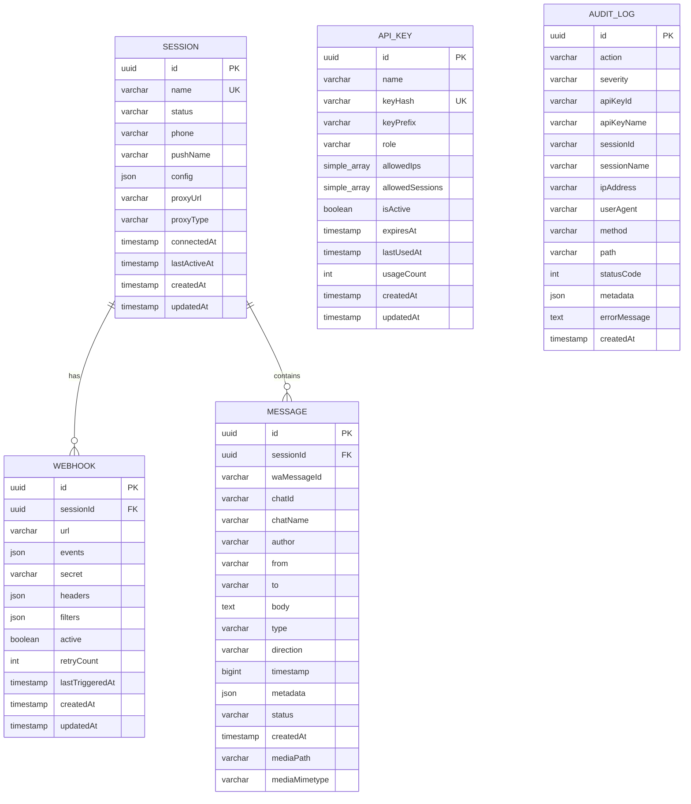
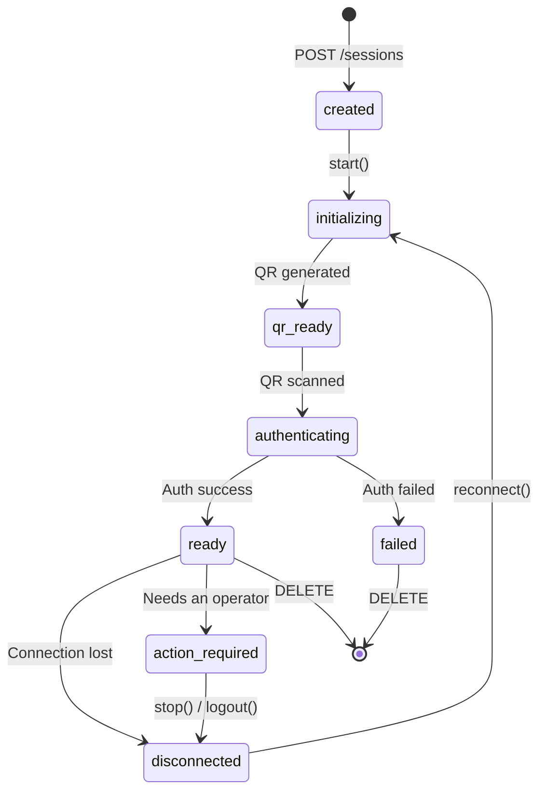
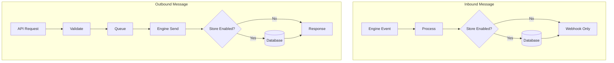
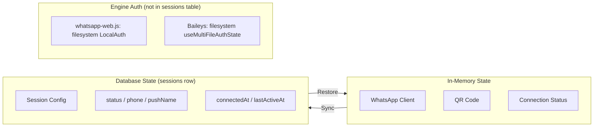
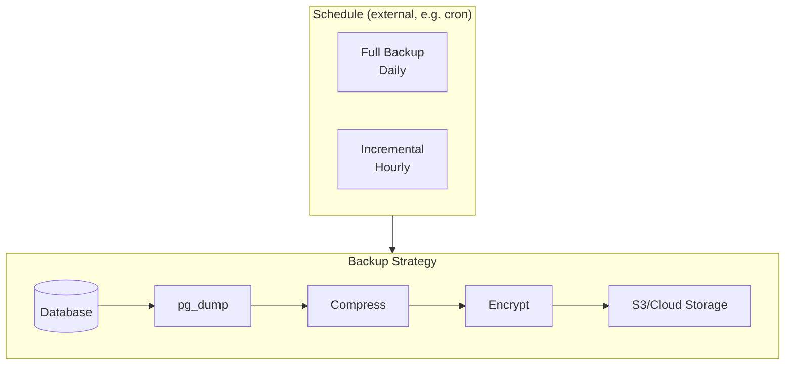

# 05 - Database Design

## 5.1 Overview

OpenWA uses a database to store:

- Session configuration & state
- Webhook configurations
- Message history (optional)
- API keys & authentication
- Audit logs

### Database Support

OpenWA supports two database backends that can be selected at deployment time:

| Database       | Use Case                                    | Sessions | Horizontal Scaling |
| -------------- | ------------------------------------------- | -------- | ------------------ |
| **SQLite**     | Development, personal bot, low-resource VPS | 1-5      | ❌                 |
| **PostgreSQL** | Production, multi-session, high volume      | 5+       | ✅                 |

> [!NOTE]
> **SQLite as a Production Option**
>
> SQLite can be used in production with limitations:
>
> - Maximum ~5 concurrent sessions (due to single-writer limitation)
> - Single-file storage — back up `./data/*.sqlite` rather than relying on a dump tool
> - No horizontal scaling support
> - Ideal for: personal bots, small businesses with 1-3 WhatsApp numbers
>
> For configuration, see [03 - System Architecture: Pluggable Adapters](./03-system-architecture.md#313-pluggable-adapters)

### Dual-Database Architecture

OpenWA v0.2+ implements a **dual-database architecture** that separates boot configuration from user data:

```
┌─────────────────────────────────────────────────────────────────┐
│                        OpenWA Application                        │
├─────────────────────────────┬───────────────────────────────────┤
│      Main DB (SQLite)       │        Data DB (Pluggable)        │
│  Default ./data/main.sqlite │   SQLite or PostgreSQL (config)   │
├─────────────────────────────┼───────────────────────────────────┤
│ • api_keys                  │ • sessions                        │
│ • audit_logs                │ • webhooks                        │
│                             │ • messages                        │
│                             │ • message_batches                 │
│                             │ • templates                       │
│                             │ • status_updates                  │
│                             │ • webhook_delivery_failures       │
│                             │ • plugin_instances                │
│                             │ • ingress_events                  │
│                             │ • conversation_mappings           │
│                             │ • integration_delivery_failures   │
│                             │ • baileys_stored_messages (engine)│
│                             │ • lid_mappings (engine)           │
└─────────────────────────────┴───────────────────────────────────┘
```

| Component   | Database             | Location                       | Purpose                                    |
| ----------- | -------------------- | ------------------------------ | ------------------------------------------ |
| **Main DB** | SQLite (always)      | `./data/main.sqlite` (default) | Boot-critical config, API keys, audit logs |
| **Data DB** | SQLite or PostgreSQL | Configurable                   | User data, sessions, messages, webhooks    |

The main DB is unconditionally SQLite, but its _path_ is not fixed: `MAIN_DATABASE_NAME` overrides the
`./data/main.sqlite` default, and is honoured by both the runtime connection factory
(`src/config/configuration.ts`) and the CLI DataSource (`src/database/data-source-main.ts`).

> [!IMPORTANT]
> **Why Dual-Database?**
>
> The Main DB is always SQLite to ensure the application can bootstrap without external dependencies:
>
> - API keys needed for authentication before any external DB connection
> - Audit logs must persist even if Data DB fails
> - Enables switching Data DB type without losing authentication

#### Built-in PostgreSQL Orchestration

When using PostgreSQL Built-in mode (`POSTGRES_BUILTIN=true`), `DockerService.onModuleInit()` runs a bootstrap orchestration that starts the managed `postgres` container (alongside `redis` / `minio` when their own `REDIS_BUILTIN` / `MINIO_BUILTIN` flags are set). This happens **during** Nest module initialization, not before it — there is no pre-bootstrap step in `main.ts`.

Because the container can therefore still be coming up when the `data` connection first dials it, that connection is configured with `retryAttempts: 10` and `retryDelay: 3000` (`src/app.module.ts`), giving the database roughly 30 seconds to become reachable.

> [!NOTE]
> If the Docker API is unreachable, orchestration logs a warning and is skipped — no container is started, and the `data` connection then fails its retries against whatever `DATABASE_HOST` points at.

#### PostgreSQL Schema Selection

When using PostgreSQL, OpenWA can place its tables and migration ledger in a dedicated schema via the `POSTGRES_SCHEMA` environment variable:

| Setting           | Default  | Description                                                      |
| ----------------- | -------- | ---------------------------------------------------------------- |
| `POSTGRES_SCHEMA` | `public` | PostgreSQL schema for OpenWA tables and TypeORM migration ledger |

**Use Cases:**

- **Managed PostgreSQL:** Use your cloud provider's project schema (e.g., a schema provisioned by the provider)
- **Multi-tenant databases:** Isolate OpenWA from other applications sharing the same database
- **Clean separation:** Keep OpenWA's tables organized separately from other schemas

**Configuration:**

```bash
# .env or dashboard Infrastructure page
POSTGRES_SCHEMA=openwa  # Use a dedicated schema
POSTGRES_SCHEMA=public   # Default behavior (historical)
```

**Requirements:**

- The schema must already exist before migration time
- Built-in PostgreSQL container automatically creates the schema via init script
- External/managed PostgreSQL: run `CREATE SCHEMA <name>;` once before first startup
- SQLite ignores this setting

**Validation:**

- Schema name is validated at boot as a legal Postgres identifier (letters, digits, underscores, max 63 chars)
- Reserved `pg_` prefix is rejected to prevent conflicts with system schemas
- Invalid values cause fast boot failure rather than migration-time errors

> [!NOTE]
> TypeORM's `schema` option alone does not set the session `search_path`. OpenWA additionally sets `search_path=<schema>,public` via PostgreSQL's startup `options` parameter so raw, unqualified migration DDL resolves to the configured schema. The migration ledger and all tables land in the specified schema while keeping `public` accessible for `pg_catalog` and helpers.

#### Data Migration API

OpenWA provides endpoints for migrating data between database types:

| Endpoint                 | Method | Description                          |
| ------------------------ | ------ | ------------------------------------ |
| `/api/infra/export-data` | GET    | Export all Data DB tables as JSON    |
| `/api/infra/import-data` | POST   | Import JSON data (replaces existing) |

**Migration Workflow:**

```bash
# 1. Export from current database
curl -s 'http://localhost:2785/api/infra/export-data' \
  -H 'X-API-Key: YOUR_KEY' > backup.json

# 2. Change database configuration (SQLite → PostgreSQL or vice versa)

# 3. Restart application with new config

# 4. Import to new database
curl -X POST 'http://localhost:2785/api/infra/import-data' \
  -H 'X-API-Key: YOUR_KEY' \
  -H 'Content-Type: application/json' \
  -d @backup.json
```

#### Cross-Database Date Portability

To ensure date/time values work across both SQLite and PostgreSQL, OpenWA uses a `DateTransformer` that stores dates as ISO 8601 text strings:

```typescript
// src/common/transformers/date.transformer.ts
export const DateTransformer: ValueTransformer = {
  from: (value: string | null) => value ? new Date(value) : null,
  to: (value: Date | null) => value ? value.toISOString() : null,
};

// Usage in entities (Data DB only)
@Column({ type: 'text', nullable: true, transformer: DateTransformer })
connectedAt: Date | null;
```

> [!NOTE]
> Main DB entities (api_keys, audit_logs) use native SQLite `datetime` type since they always remain in SQLite.

## 5.2 Entity Relationship Diagram



## 5.3 Table Specifications

> [!IMPORTANT]
> **Column names are camelCase — with one exception.** There is no snake_case naming strategy on
> either connection, so the columns really are `"sessionId"`, `"createdAt"`, `"waMessageId"` and so
> on, and hand-written SQL must quote them: unquoted, PostgreSQL folds them to lowercase and the
> statement fails at runtime.
>
> The exception is **`message_batches`**, whose columns genuinely are `batch_id` / `session_id` /
> `created_at` — it was created that way and never renamed. So no single rule covers the whole
> schema; the DDL below states each table's real names, and `SELECT * FROM <table> LIMIT 0` settles
> any doubt. The **types** in these blocks stay illustrative (they are dialect-portable and defined
> by the TypeORM entities), but every identifier is literal.

### 5.3.1 sessions

Stores WhatsApp session configuration and state.

```sql
CREATE TABLE sessions (
    id UUID PRIMARY KEY DEFAULT gen_random_uuid(),
    name VARCHAR(100) NOT NULL UNIQUE,
    status VARCHAR(50) NOT NULL DEFAULT 'created',
    phone VARCHAR(20),
    "pushName" VARCHAR(100),
    config JSONB NOT NULL DEFAULT '{}',
    "proxyUrl" VARCHAR(255),
    "proxyType" VARCHAR(10),
    "connectedAt" TIMESTAMP WITH TIME ZONE,
    "lastActiveAt" TIMESTAMP WITH TIME ZONE,
    -- Session ownership / multi-node routing: which process runs the engine, since when, where it
    -- answers HTTP for peers, and how long its claim survives unrenewed. All NULL on a single node.
    "nodeId" VARCHAR(190),
    "claimedAt" TIMESTAMP WITH TIME ZONE,
    "nodeUrl" VARCHAR(2048),
    "leaseExpiresAt" TIMESTAMP WITH TIME ZONE,
    "createdAt" TIMESTAMP WITH TIME ZONE NOT NULL DEFAULT NOW(),
    "updatedAt" TIMESTAMP WITH TIME ZONE NOT NULL DEFAULT NOW()
);
```

> [!NOTE]
> The **types** above are illustrative — the schema is defined by the TypeORM entity (`src/modules/session/entities/session.entity.ts`) and column types are dialect-portable (`jsonColumnType()` → `simple-json`, dates via `DateTransformer`). The **column names are literal**: see the naming note in §5.3 below before writing SQL against any of these tables. The `sessions` entity declares only the index implied by the `UNIQUE` constraint on `name`; there are no separate `status`/`phone`/`createdAt` indexes.

> [!NOTE]
> Auth state is **not** stored in this table. Both engines persist credentials on the **filesystem** (`whatsapp-web.js` LocalAuth; Baileys `useMultiFileAuthState`). The `baileys_stored_messages` table holds only Baileys' serialized message store (the library ships none), not credentials.

**Session Status Values:**



| Status            | Description                                                       |
| ----------------- | ----------------------------------------------------------------- |
| `created`         | Session created, not started                                      |
| `initializing`    | Starting browser & WhatsApp                                       |
| `qr_ready`        | QR code ready for scanning                                        |
| `authenticating`  | QR scanned, authenticating                                        |
| `ready`           | Connected and ready                                               |
| `disconnected`    | Disconnected, can reconnect                                       |
| `action_required` | Engine running, but it needs an operator before it can work again |
| `failed`          | Failed, needs recreation                                          |

`action_required` differs from `failed` in that the engine is still loaded and still holds its
WhatsApp connection — nothing is broken, but something outside the gateway has to change before the
session is usable. The reason is carried on `lastError`, and every engine-backed action (`stop`,
`logout`) still applies; sending is refused until the session returns to `ready`. Reaching it always
takes deliberate evidence, never a single failed probe, precisely because it stops sends. A restart
clears it, and so does a gateway restart.

**Config Schema:**

`config` is an opaque JSON blob; the keys the session service actually reads are:

```json
{
  "maxReconnectAttempts": 5,
  "reconnectBaseDelay": 5000,
  "autoRejectCalls": false
}
```

| Key                    | Default   | Effect                                                                   |
| ---------------------- | --------- | ------------------------------------------------------------------------ |
| `maxReconnectAttempts` | unlimited | Reconnect attempt cap, clamped to 0–20 (`0` disables reconnect entirely) |
| `reconnectBaseDelay`   | `5000` ms | Base delay of the reconnect backoff, clamped to 1000–300000 ms           |
| `autoRejectCalls`      | `false`   | Auto-reject an incoming call as soon as it rings                         |

> [!NOTE]
> Proxy settings are **not** read from `config` — they live in the dedicated `proxyUrl` / `proxyType` columns shown in the DDL above. Puppeteer options are global engine configuration from the environment (`engine.puppeteer.*`), not per-session. Anything else placed in `config` is stored but ignored.

---

### 5.3.2 webhooks

Stores webhook endpoint configurations.

```sql
CREATE TABLE webhooks (
    id UUID PRIMARY KEY DEFAULT gen_random_uuid(),
    "sessionId" UUID NOT NULL REFERENCES sessions(id) ON DELETE CASCADE,
    url VARCHAR(2048) NOT NULL,
    events JSONB NOT NULL DEFAULT '["message.received"]',
    secret VARCHAR(255),
    headers JSONB DEFAULT '{}',
    filters JSONB,                       -- optional smart pre-filter; null = fire on every subscribed event
    active BOOLEAN NOT NULL DEFAULT true,
    "retryCount" INTEGER NOT NULL DEFAULT 3,
    "lastTriggeredAt" TIMESTAMP WITH TIME ZONE,
    "createdAt" TIMESTAMP WITH TIME ZONE NOT NULL DEFAULT NOW(),
    "updatedAt" TIMESTAMP WITH TIME ZONE NOT NULL DEFAULT NOW()
);
```

**Events Schema (allowed values):**

```json
[
  "message.received",
  "message.sent",
  "message.ack",
  "message.failed",
  "message.revoked",
  "message.reaction",
  "message.edited",
  "status.received",
  "session.status",
  "session.qr",
  "session.authenticated",
  "session.disconnected",
  "session.reconnect_loop",
  "session.restriction",
  "presence.update",
  "group.join",
  "group.leave",
  "group.update",
  "call.received",
  "call.accepted",
  "call.rejected",
  "call.missed"
]
```

---

### 5.3.2a automation_rules

Per-session single-message autoreply rules. `conditions` reuses the webhook filter shape verbatim
(null/empty matches every inbound message); the reply goes through the ordinary send path.

```sql
CREATE TABLE automation_rules (
    id UUID PRIMARY KEY DEFAULT gen_random_uuid(),
    "sessionId" VARCHAR NOT NULL REFERENCES sessions(id) ON DELETE CASCADE,
    name VARCHAR(100) NOT NULL,
    enabled BOOLEAN NOT NULL DEFAULT true,
    conditions JSONB,                    -- webhook filter shape; null = match every inbound message
    "replyText" TEXT NOT NULL,
    "cooldownSeconds" INTEGER NOT NULL DEFAULT 60,  -- per-(rule, chat) quiet period; 0 disables
    "createdAt" TIMESTAMP WITH TIME ZONE NOT NULL DEFAULT NOW(),
    "updatedAt" TIMESTAMP WITH TIME ZONE NOT NULL DEFAULT NOW()
);
```

---

### 5.3.3 messages

Stores message history (optional, can be disabled). This is a **plain (non-partitioned)** table — the same schema on SQLite and PostgreSQL.

```sql
CREATE TABLE messages (
    id UUID PRIMARY KEY DEFAULT gen_random_uuid(),
    "sessionId" UUID NOT NULL,
    "waMessageId" VARCHAR,                -- nullable; transient outgoing rows have none yet
    "chatId" VARCHAR NOT NULL,
    "chatName" VARCHAR,                   -- nullable; contact pushName / group name when known
    author VARCHAR,                       -- nullable; participant JID for a group message ("from" is the group)
    "from" VARCHAR NOT NULL,
    "to" VARCHAR NOT NULL,
    body TEXT,
    type VARCHAR NOT NULL DEFAULT 'text',
    direction VARCHAR NOT NULL DEFAULT 'outgoing',  -- 'incoming' | 'outgoing'
    timestamp BIGINT,                     -- WhatsApp epoch seconds; read back as a JS number
    metadata JSONB,
    status VARCHAR NOT NULL DEFAULT 'sent',          -- pending | sent | delivered | read | failed
    "createdAt" TIMESTAMP WITH TIME ZONE NOT NULL DEFAULT NOW(),
    "mediaPath" VARCHAR,                  -- nullable; storage key of the archived media copy
    "mediaMimetype" VARCHAR               -- nullable; mimetype of that archived copy
);

-- Indexes (declared on the entity). Names TypeORM derives are hashes, not readable slugs —
-- the literal names are below so `DROP INDEX` / EXPLAIN output can be matched against them.
-- There is deliberately NO standalone "sessionId" index: the composite below leads with
-- "sessionId", so it already serves session-only lookups (see DropRedundantMessagesSessionIdIndex).
CREATE INDEX "IDX_399833392126349ef0b04b9bed" ON messages("sessionId", "createdAt");
CREATE INDEX "IDX_36bc604c820bb9adc4c75cd411" ON messages("chatId");
CREATE INDEX "IDX_befd307485dbf0559d17e4a4d2" ON messages(status);
CREATE INDEX "IDX_messages_createdAt" ON messages("createdAt");   -- createdAt-only stats aggregates

-- Inbound dedup (issue #464): one row per ("sessionId", "waMessageId").
-- NULL "waMessageId" rows are exempt (SQL treats NULLs as distinct).
CREATE UNIQUE INDEX "UQ_messages_sessionId_waMessageId"
    ON messages("sessionId", "waMessageId");
```

> [!NOTE]
> There is **no** PostgreSQL RANGE partitioning, `create_messages_partition()` function, or `pg_cron` schedule in OpenWA. `messages` is a single plain table on both backends. The `timestamp` column uses a `bigint→number` value transformer so the REST/SDK/MCP contract returns a JS number on both SQLite and PostgreSQL.

> [!NOTE]
> Message rows carry no separate `media`/`ack`/`from_me`/`is_group` columns. Media and other engine-specific details are stored in the `metadata` JSON column; delivery state is the `status` enum and `direction` distinguishes inbound vs. outbound.

---

### 5.3.4 (removed) contacts

> [!NOTE]
> **There is no `contacts` table.** Contacts are read live from the engine on demand (e.g. `GET /sessions/:id/contacts`) and are not persisted to the database.

---

### 5.3.5 api_keys

Stores API keys for authentication. Lives on the **main** (always-SQLite) connection.

```sql
CREATE TABLE api_keys (
    id VARCHAR PRIMARY KEY,
    name VARCHAR(100) NOT NULL,
    "keyHash" VARCHAR(64) NOT NULL,                -- UNIQUE index
    "keyPrefix" VARCHAR(12) NOT NULL,              -- shown in the UI; the full key is never stored
    role VARCHAR(20) NOT NULL DEFAULT 'operator',  -- admin | operator | viewer
    "allowedIps" TEXT,                             -- simple-array (comma-joined), null = any IP
    "allowedSessions" TEXT,                        -- simple-array, null = all sessions
    "isActive" BOOLEAN NOT NULL DEFAULT 1,
    "expiresAt" DATETIME,
    "lastUsedAt" DATETIME,
    "usageCount" INTEGER NOT NULL DEFAULT 0,
    "createdAt" DATETIME NOT NULL DEFAULT (datetime('now')),
    "updatedAt" DATETIME NOT NULL DEFAULT (datetime('now'))
);

CREATE UNIQUE INDEX "IDX_df3b25181df0b4b59bd93f16e1" ON api_keys("keyHash");
```

> [!NOTE]
> Access control is **role-based** (`admin` / `operator` / `viewer`), optionally scoped by `allowedIps` and `allowedSessions`. There is no granular `permissions` string array — see [04 - Security Design](./04-security-design.md) for what each role can do.

---

### 5.3.6 audit_logs

Consolidated audit trail for API-key, session, message, and webhook events. This is the **only** audit table — there are no separate `session_logs`, `webhook_logs`, or `api_key_logs` tables. Lives on the **main** (always-SQLite) connection.

```sql
CREATE TABLE audit_logs (
    id VARCHAR PRIMARY KEY,
    action VARCHAR(50) NOT NULL,                   -- e.g. session_created, message_sent, webhook_failed
    severity VARCHAR(10) NOT NULL DEFAULT 'info',  -- info | warn | error
    "apiKeyId" VARCHAR(36),
    "apiKeyName" VARCHAR(100),
    "sessionId" VARCHAR(36),
    "sessionName" VARCHAR(100),
    "ipAddress" VARCHAR(45),
    "userAgent" VARCHAR(500),
    method VARCHAR(10),
    path VARCHAR(500),
    "statusCode" INTEGER,
    metadata TEXT,                                 -- simple-json
    "errorMessage" TEXT,
    "createdAt" DATETIME NOT NULL DEFAULT (datetime('now'))
);

-- Indexes (declared on the entity; TypeORM-derived hash names)
CREATE INDEX "IDX_cee5459245f652b75eb2759b4c" ON audit_logs(action);
CREATE INDEX "IDX_741fa976d1e04e695f3aa23cb8" ON audit_logs("apiKeyId");
CREATE INDEX "IDX_dd2b6e43c767b6b5b2bb227ace" ON audit_logs("sessionId");
CREATE INDEX "IDX_c69efb19bf127c97e6740ad530" ON audit_logs("createdAt");
```

**Audit actions** are an enum (`AuditAction`) spanning API-key lifecycle (`api_key_created`,
`api_key_updated`, `api_key_used`, `api_key_revoked`, `api_key_deleted`, `api_key_auth_failed`), session
lifecycle (`session_created`, `session_started`, `session_stopped`, `session_force_killed`,
`session_logged_out`, `session_deleted`, `session_qr_generated`, `session_connected`,
`session_disconnected`), WhatsApp-imposed account restrictions (`session_restricted`,
`session_restriction_lifted`), messages
(`message_sent`, `message_failed`), send-pacing enforcement (`send_pacing_blocked`, sampled to at
most one row per session per minute; `send_breaker_tripped`, never sampled), webhooks (`webhook_created`, `webhook_deleted`,
`webhook_triggered`, `webhook_failed`), rate-limit enforcement (`rate_limit_exceeded`, sampled to at
most one row per subject+kind per minute), the queue dashboard (`queue_board_mutated`), integration
plugin instances (`integration_instance_created`, `integration_instance_updated`,
`integration_instance_secret_regenerated`, `integration_instance_deleted`,
`integration_instance_redriven`), and ADMIN-only infrastructure operations (`infra_config_saved`,
`infra_restart_requested`, `infra_data_exported`, `infra_data_imported`, `infra_storage_exported`,
`infra_storage_imported`).

> [!NOTE]
> Audit-log retention is automatic: see [§5.7 Data Retention](#57-data-retention). Other event types (session logs, API access logs) are surfaced via structured application logging, not dedicated database tables. The one exception is a webhook delivery that exhausts every retry — that lands in the `webhook_delivery_failures` table (§5.3.8), not just the log stream.

### 5.3.7 message_batches

Tracks bulk/batch message jobs. A single table holds the job state plus its messages, options, progress, and per-message results as JSON columns (there are **no** separate `batch_jobs` / `batch_job_messages` tables).

```sql
CREATE TABLE message_batches (
    id UUID PRIMARY KEY DEFAULT gen_random_uuid(),
    batch_id VARCHAR NOT NULL,
    session_id VARCHAR NOT NULL,
    status VARCHAR NOT NULL DEFAULT 'pending',   -- pending | processing | completed | cancelled | failed
    messages JSONB NOT NULL,                     -- [{ chatId, type, content, variables? }]
    options JSONB,                               -- { delayBetweenMessages, randomizeDelay, stopOnError }
    progress JSONB,                              -- { total, sent, failed, pending, cancelled }
    results JSONB,                               -- [{ chatId, status, messageId?, error?, sentAt? }]
    current_index INTEGER NOT NULL DEFAULT 0,
    created_at TIMESTAMP WITH TIME ZONE NOT NULL DEFAULT NOW(),
    updated_at TIMESTAMP WITH TIME ZONE NOT NULL DEFAULT NOW(),
    started_at TIMESTAMP WITH TIME ZONE,
    completed_at TIMESTAMP WITH TIME ZONE,
    CONSTRAINT "UQ_message_batches_session_id_batch_id" UNIQUE (session_id, batch_id)
);
```

> [!NOTE]
> Batch-id uniqueness is **scoped to the session**, not global — one session cannot deny a batch id to another, so the same `batch_id` may exist under different sessions.

**Batch Status Values:**

| Status       | Description                    |
| ------------ | ------------------------------ |
| `pending`    | Job created, not yet processed |
| `processing` | Sending messages in progress   |
| `completed`  | All messages processed         |
| `cancelled`  | Job cancelled by user          |
| `failed`     | Job failed (fatal error)       |

---

### 5.3.8 Other data-connection tables

The data connection also owns:

- **`templates`** — reusable message templates (`src/modules/template/entities/template.entity.ts`), with a unique constraint on `(sessionId, name)` — one template name per session.
- **`status_updates`** — inbound status/story broadcasts with a 24-hour TTL (`src/modules/status-store/entities/status-update.entity.ts`); unique on `(sessionId, waStatusId)`. Attached media is stored via `StorageService`, not in the row.
- **`webhook_delivery_failures`** — durable record of a webhook delivery that exhausted all retries (`src/modules/webhook/entities/webhook-delivery-failure.entity.ts`), surfaced via the ADMIN `GET /webhooks/delivery-failures`.
- **`plugin_instances`** — one configured instance of an adapter plugin, keyed `${pluginId}:${instanceId}` (`src/modules/integration/entities/plugin-instance.entity.ts`); holds the host-minted ingress HMAC secret, masked on API reads.
- **`ingress_events`** — persist-before-ack durable row and inbound dedup oracle, unique on `(pluginId, instanceId, providerDeliveryId)` (`src/modules/integration/entities/ingress-event.entity.ts`). The full payload is retired to `NULL` once dispatch is settled, leaving a slim dedup marker.
- **`conversation_mappings`** — bidirectional WA-chat ↔ provider-conversation mapping plus handover state (`src/modules/integration/entities/conversation-mapping.entity.ts`).
- **`integration_delivery_failures`** — DLQ-of-record for both inbound (ingress) and outbound (provider egress) delivery failures (`src/modules/integration/entities/integration-delivery-failure.entity.ts`).
- **`baileys_stored_messages`** — Baileys engine message store — the serialized WAMessage proto (`src/engine/adapters/baileys-stored-message.entity.ts`); present only when the Baileys engine is used. (Credentials live on the filesystem, not here.)
- **`lid_mappings`** — LID↔phone-number identity mappings (`src/engine/identity/lid-mapping.entity.ts`).

Additionally, the `AddMessagesFts` migration creates the full-text-search structures over `messages` (a FTS5 virtual table on SQLite, a generated `body_ts` `tsvector` column plus GIN index on PostgreSQL) that back the `/search` endpoint.

> [!NOTE]
> **Tables that do _not_ exist.** Earlier drafts referenced `contacts`, `session_logs`, `webhook_logs`, `api_key_logs`, `webhook_idempotency`, and `ip_whitelist`. None of these are implemented. Contacts are read live from the engine; auditing is the single `audit_logs` table; webhook idempotency is not a persisted table; and per-key IP restrictions are stored inline on `api_keys.allowed_ips` (a `simple-array`), not in a separate `ip_whitelist` table.

---

## 5.4 Index Strategy

### Query Pattern Analysis

These indexes are the ones declared on the entities (see §5.3); the rows below map them to the hot query paths.

| Query Pattern                    | Index Used                                                  | Frequency |
| -------------------------------- | ----------------------------------------------------------- | --------- |
| Get session by ID                | `sessions.id` (PK)                                          | Very High |
| Get session by name              | `sessions.name` (UNIQUE)                                    | High      |
| List messages by session (paged) | `("sessionId", "createdAt")` composite                      | Very High |
| Look up message by chat          | `"chatId"`                                                  | High      |
| Ack/dedup a message              | `UQ_messages_sessionId_waMessageId` (UNIQUE)                | Very High |
| Message stats over a date range  | `IDX_messages_createdAt`                                    | Medium    |
| Find a session's webhooks        | `IDX_webhooks_sessionId`                                    | Very High |
| Authenticate API key             | UNIQUE on `api_keys("keyHash")`, main DB                    | Very High |
| Filter audit logs                | `audit_logs` indexes on `action` / `apiKeyId` / `sessionId` | Medium    |

### Composite & Unique Indexes (as implemented)

```sql
-- messages: paged listing per session + ack-driven status update / inbound dedup
CREATE INDEX        "IDX_399833392126349ef0b04b9bed"      ON messages("sessionId", "createdAt");
CREATE UNIQUE INDEX "UQ_messages_sessionId_waMessageId"   ON messages("sessionId", "waMessageId");
CREATE INDEX        "IDX_messages_createdAt"              ON messages("createdAt");

-- webhooks: the dispatch path filters by session on every emitted event
CREATE INDEX "IDX_webhooks_sessionId" ON webhooks("sessionId");

-- message_batches: batch ids are unique per session, not globally.
-- Note the snake_case: this table really is named that way — see the naming note in §5.3.
CREATE UNIQUE INDEX "UQ_message_batches_session_id_batch_id" ON message_batches(session_id, batch_id);

-- audit_logs (main DB): filter by action / key / session, ordered by time
CREATE INDEX "IDX_cee5459245f652b75eb2759b4c" ON audit_logs(action);
CREATE INDEX "IDX_c69efb19bf127c97e6740ad530" ON audit_logs("createdAt");
```

> [!NOTE]
> The partial/filtered indexes shown in earlier drafts (e.g. `WHERE status = 'ready'`, `WHERE active = true`) are not part of the current schema. Add them only if a real query pattern justifies the maintenance cost.

### Index Maintenance

```sql
-- Check index usage
SELECT
    schemaname,
    tablename,
    indexname,
    idx_scan,
    idx_tup_read,
    idx_tup_fetch
FROM pg_stat_user_indexes
ORDER BY idx_scan DESC;

-- Find unused indexes
SELECT
    schemaname || '.' || relname AS table,
    indexrelname AS index,
    pg_size_pretty(pg_relation_size(i.indexrelid)) AS index_size,
    idx_scan as index_scans
FROM pg_stat_user_indexes ui
JOIN pg_index i ON ui.indexrelid = i.indexrelid
WHERE NOT indisunique
AND idx_scan < 50
ORDER BY pg_relation_size(i.indexrelid) DESC;

-- Reindex to reclaim space (run during maintenance window)
REINDEX TABLE messages;
```

## 5.5 Data Flow

### Message Storage Flow



### Session State Flow



## 5.6 Migration Strategy

OpenWA runs **two separate TypeORM connections**, each with its own migrations directory and CLI DataSource:

| Connection | DataSource            | Migrations dir                  | Owns                                                                                                                                                                                                                                                                                 |
| ---------- | --------------------- | ------------------------------- | ------------------------------------------------------------------------------------------------------------------------------------------------------------------------------------------------------------------------------------------------------------------------------------ |
| **main**   | `data-source-main.ts` | `src/database/migrations-main/` | `api_keys`, `audit_logs` — always SQLite (`./data/main.sqlite` by default)                                                                                                                                                                                                           |
| **data**   | `data-source.ts`      | `src/database/migrations/`      | `sessions`, `webhooks`, `messages`, `message_batches`, `templates`, `status_updates`, `webhook_delivery_failures`, the integration tables (`plugin_instances`, `ingress_events`, `conversation_mappings`, `integration_delivery_failures`), engine tables — SQLite **or** PostgreSQL |

Migrations are hand-authored and idempotent (`IF NOT EXISTS`) so they are safe to adopt on a database originally created by `synchronize`. The two connections differ in how schema is managed:

- **data** — `synchronize` defaults **off**, so this connection is migration-managed by default. On PostgreSQL `migrationsRun` is hardcoded on, and `DATABASE_SYNCHRONIZE=true` is rejected outright at boot validation (it would drop the migration-created `body_ts` tsvector column that `/search` depends on). On SQLite there is no such rejection and `migrationsRun` is the inverse of `synchronize` — so an opted-in `DATABASE_SYNCHRONIZE=true` switches the data connection to entity-synchronized schema and turns its migrations **off**.
- **main** — `synchronize` defaults **on** (zero-config first boot) regardless of `NODE_ENV`; set `MAIN_DATABASE_SYNCHRONIZE=false` to manage `api_keys` / `audit_logs` via `migrations-main/` instead. Never both at once — `migrationsRun` on this connection is the inverse of `synchronize`.

### Migration Files

```
src/database/migrations-main/      # main connection (auth + audit, SQLite)
└── 1779900000000-CreateAuthAuditTables.ts   # creates api_keys + audit_logs

src/database/migrations/           # data connection (pluggable)
├── 1770108659848-AddMessageStatus.ts
├── 1770200000000-NormalizeSynchronizeUuidColumns.ts
├── 1779235200000-AddUuidDefaultsForPostgres.ts   # Postgres-only: gen_random_uuid() id DEFAULTs
├── 1779840000000-AddTemplates.ts
├── 1779900100000-AddMessageSessionWaIndex.ts
├── 1781000000000-AddBaileysStoredMessages.ts
├── 1781100000000-AddTemplateNameUnique.ts
├── 1781200000000-AddLidMappings.ts
├── 1781300000000-AddMessagesWaMessageIdUnique.ts  # UNIQUE(sessionId, waMessageId) inbound dedup (#464)
├── 1781500000000-AddWebhookFilters.ts
├── 1781600000000-DropRedundantMessagesSessionIdIndex.ts
├── 1781700000000-AddWebhookDeliveryFailures.ts
├── 1781800000000-ScopeBatchIdUniqueToSession.ts
├── 1781900000000-AddIntegrationFabric.ts
├── 1782000000000-AddMessageChatName.ts
├── 1782100000000-WidenIngressDedupKey.ts
├── 1782200000000-AddWebhooksSessionIdIndex.ts
├── 1782300000000-AddIntegrationUuidDefaults.ts
├── 1782400000000-AddMessagesFts.ts               # FTS5 (SQLite) / body_ts tsvector + GIN (Postgres)
├── 1784822470680-CreateStatusUpdates.ts
├── 1784908800000-AddMessageAuthor.ts
├── 1785112230000-AddIngressEventDispatchState.ts
├── 1785123853000-AddMessagesCreatedAtIndex.ts
└── 1785600000000-SlimIngressEventPayload.ts
```

> [!NOTE]
> Run with `npm run migration:run` (data connection) and `npm run migration:run:main` (main connection). The `AddUuidDefaultsForPostgres` migration is dialect-guarded — it is a no-op on SQLite (TypeORM generates UUIDs in the driver layer) and only adds `DEFAULT gen_random_uuid()::varchar` on PostgreSQL.

### Sample Migration (TypeORM)

```typescript
import { MigrationInterface, QueryRunner } from 'typeorm';

// Real migration: enforces inbound dedup on the data connection.
export class AddMessagesWaMessageIdUnique1781300000000 implements MigrationInterface {
  name = 'AddMessagesWaMessageIdUnique1781300000000';

  public async up(queryRunner: QueryRunner): Promise<void> {
    if (!(await queryRunner.hasTable('messages'))) return;
    // ... losslessly de-duplicate existing rows (keep earliest per sessionId+waMessageId) ...
    await queryRunner.query(`DROP INDEX IF EXISTS "IDX_messages_sessionId_waMessageId"`);
    await queryRunner.query(
      `CREATE UNIQUE INDEX IF NOT EXISTS "UQ_messages_sessionId_waMessageId" ` +
        `ON "messages" ("sessionId", "waMessageId")`,
    );
  }

  public async down(queryRunner: QueryRunner): Promise<void> {
    await queryRunner.query(`DROP INDEX IF EXISTS "UQ_messages_sessionId_waMessageId"`);
  }
}
```

## 5.7 Data Retention

### Retention Policies

Five tables have an automated _time-based_ retention job, across four services: **`audit_logs`**, **`status_updates`**, **`webhook_delivery_failures`**, **`ingress_events`** and **`integration_delivery_failures`**. Separately, **`baileys_stored_messages`** is capped per session rather than by age — each write keeps the newest `BAILEYS_MESSAGE_STORE_LIMIT` rows (default 5000) for that session and deletes the rest. Everything else is kept indefinitely (sessions, webhooks, batches, templates, conversation mappings, plugin instances) and is removed only by user action (e.g. deleting a session) or operational backup/restore — the `messages` history table in particular has no auto-purge and grows without bound.

| Data Type                     | Default Retention | Configurable                                                    |
| ----------------------------- | ----------------- | --------------------------------------------------------------- |
| Sessions / Webhooks           | Indefinite        | No                                                              |
| Messages / Batches            | Indefinite        | No (delete a session to drop its data)                          |
| Status updates                | 24 hours          | No (fixed, matches WhatsApp's own story expiry)                 |
| Audit logs                    | 90 days           | Yes — `AUDIT_RETENTION_DAYS` (≤ 0 disables)                     |
| Webhook delivery failures     | 90 days           | Yes — `WEBHOOK_FAILURE_RETENTION_DAYS` (≤ 0 disables)           |
| Ingress events (dedup rows)   | 7 days            | Yes — `INGRESS_DEDUP_RETENTION_DAYS` (≤ 0 does **not** disable) |
| Integration delivery failures | 90 days           | Yes — `INGRESS_RETENTION_DAYS` (≤ 0 disables this prune only)   |

### Audit-Log Cleanup Job

`AuditService` prunes old `audit_logs` rows. It is **not** a `@Cron` — it runs once at startup, then on a 24-hour `setInterval` (`src/modules/audit/audit.service.ts`):

```typescript
// src/modules/audit/audit.service.ts (abridged)
onModuleInit(): void {
  const parsed = Number.parseInt(process.env.AUDIT_RETENTION_DAYS ?? '', 10);
  const retentionDays = Number.isInteger(parsed) ? Math.max(0, parsed) : 90;
  if (retentionDays <= 0) return; // AUDIT_RETENTION_DAYS <= 0 disables retention

  const runCleanup = () => this.cleanup(retentionDays).catch(/* best-effort */);
  runCleanup();                                              // prune once at startup
  this.cleanupTimer = setInterval(runCleanup, 24 * 60 * 60 * 1000); // then daily
  this.cleanupTimer.unref?.();
}

async cleanup(olderThanDays = 30): Promise<number> {
  const cutoff = new Date();
  cutoff.setDate(cutoff.getDate() - olderThanDays);
  const result = await this.auditRepository.delete({ createdAt: LessThan(cutoff) });
  return result.affected || 0;
}
```

### Sibling Prune Jobs

The other three interval-based prunes are the same shape — one prune at startup, then a 24-hour `setInterval`, `unref`'d, never a `@Cron`:

- **`webhook_delivery_failures`** — `WebhookService.onModuleInit()` (`src/modules/webhook/webhook.service.ts`), window `WEBHOOK_FAILURE_RETENTION_DAYS` (default 90; ≤ 0 disables the prune and logs that it is off).
- **`ingress_events`** and **`integration_delivery_failures`** — `IntegrationRetentionService` (`src/modules/integration/integration-retention.service.ts`) prunes both in one timer on two independent windows. `INGRESS_DEDUP_RETENTION_DAYS` (default 7) bounds the dedup rows; a non-positive value does **not** disable it — an unpruned dedup table grows without bound for no functional gain, so the service warns and falls back to the 7-day default. `INGRESS_RETENTION_DAYS` (default 90) bounds the DLQ rows, where long retention can be a deliberate operator choice, so ≤ 0 disables that prune (and only that prune).

### Status-Update TTL Sweep

`StatusStoreService` (`src/modules/status-store/status-store.service.ts`) stamps every ingested status row with `expiresAt = postedAt + 24h` and runs two recurring sweeps, both started in `onModuleInit` and both `unref`'d so they never hold the process open:

- **TTL purge** — once at startup, then every 15 minutes; deletes rows past their `expiresAt`.
- **Orphaned-media sweep** — hourly by default (`STATUS_ORPHAN_SWEEP_INTERVAL_MS`); deletes status media files no row references, after a grace window (`STATUS_ORPHAN_GRACE_MS`, default 1 hour) so a file mid-ingest is never reaped.

The 24-hour TTL itself is a fixed constant (`STATUS_TTL_MS`) and is not configurable.

## 5.8 Backup Strategy

> [!NOTE]
> This section is **operational guidance**, not a built-in feature. OpenWA ships no scheduler, encryption step, or S3 uploader for backups — the diagram and script below are a recommended setup you wire up externally (cron, your host's backup tooling, etc.). For SQLite, back up the `./data/*.sqlite` files (including `./data/main.sqlite`); for PostgreSQL, use `pg_dump`. The JSON export/import endpoints in §5.1 are a portability path, not a backup mechanism.
> The authoritative full-system backup is [`scripts/backup.sh`](../scripts/backup.sh), documented in the [operational runbook](./11-operational-runbooks.md#runbook-database-backup); it also captures engine auth state, including `BAILEYS_AUTH_DIR` for Baileys.

### Backup Components



### Backup Script Example

```bash
#!/bin/bash
# backup.sh

DATE=$(date +%Y%m%d_%H%M%S)
BACKUP_DIR="/backups"
DB_NAME="openwa"

# Create backup
pg_dump -Fc $DB_NAME > $BACKUP_DIR/openwa_$DATE.dump

# Compress
gzip $BACKUP_DIR/openwa_$DATE.dump

# Upload to S3 (optional)
aws s3 cp $BACKUP_DIR/openwa_$DATE.dump.gz s3://backups/openwa/

# Cleanup old backups (keep last 7 days)
find $BACKUP_DIR -name "*.dump.gz" -mtime +7 -delete
```

---

<div align="center">

[← 04 - Security Design](./04-security-design.md) · [Documentation Index](./README.md) · [Next: 06 - API Specification →](./06-api-specification.md)

</div>
