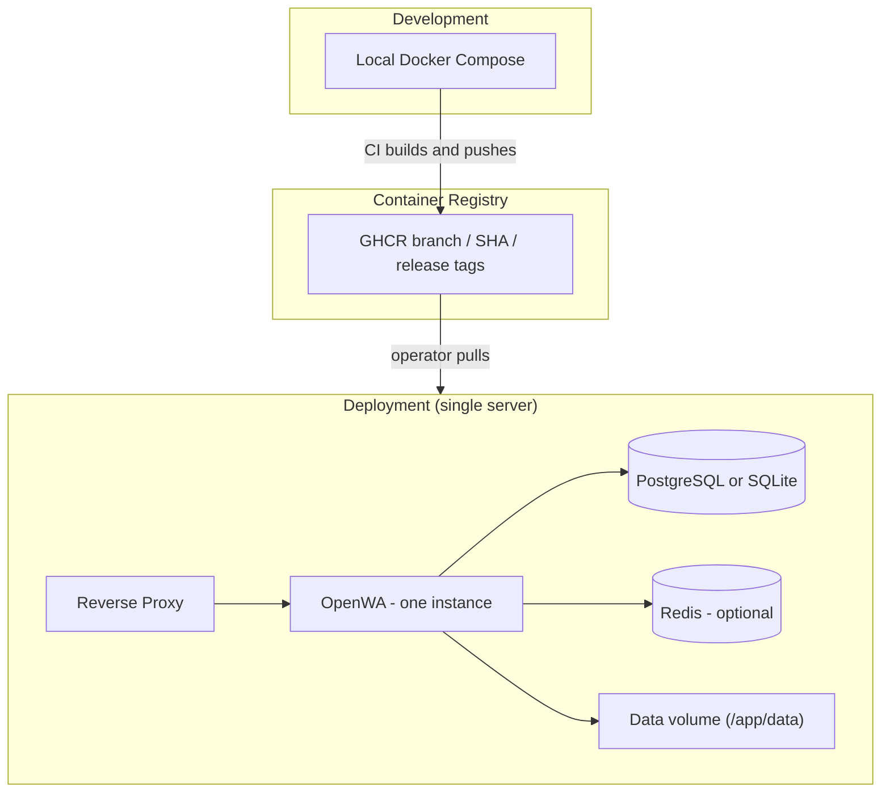
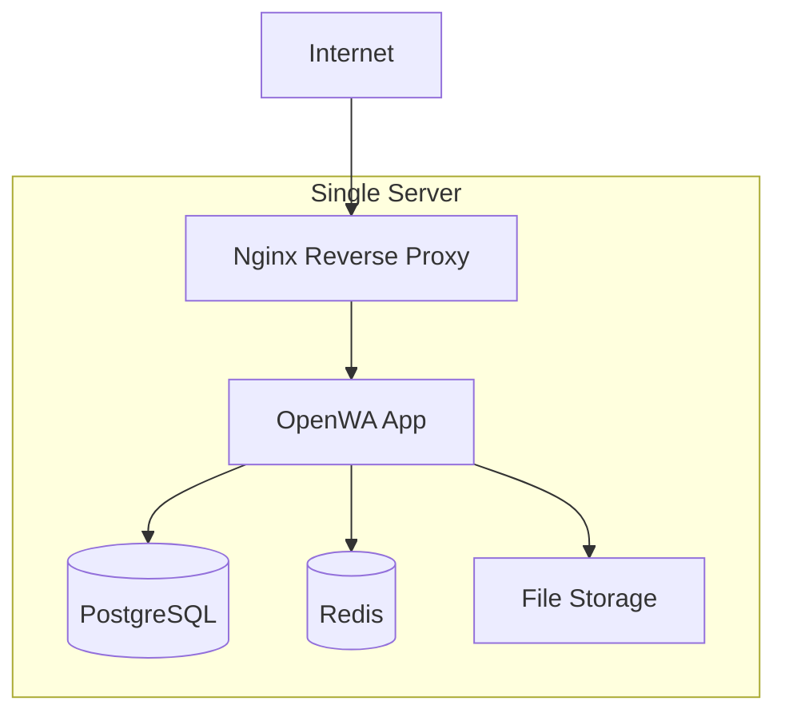
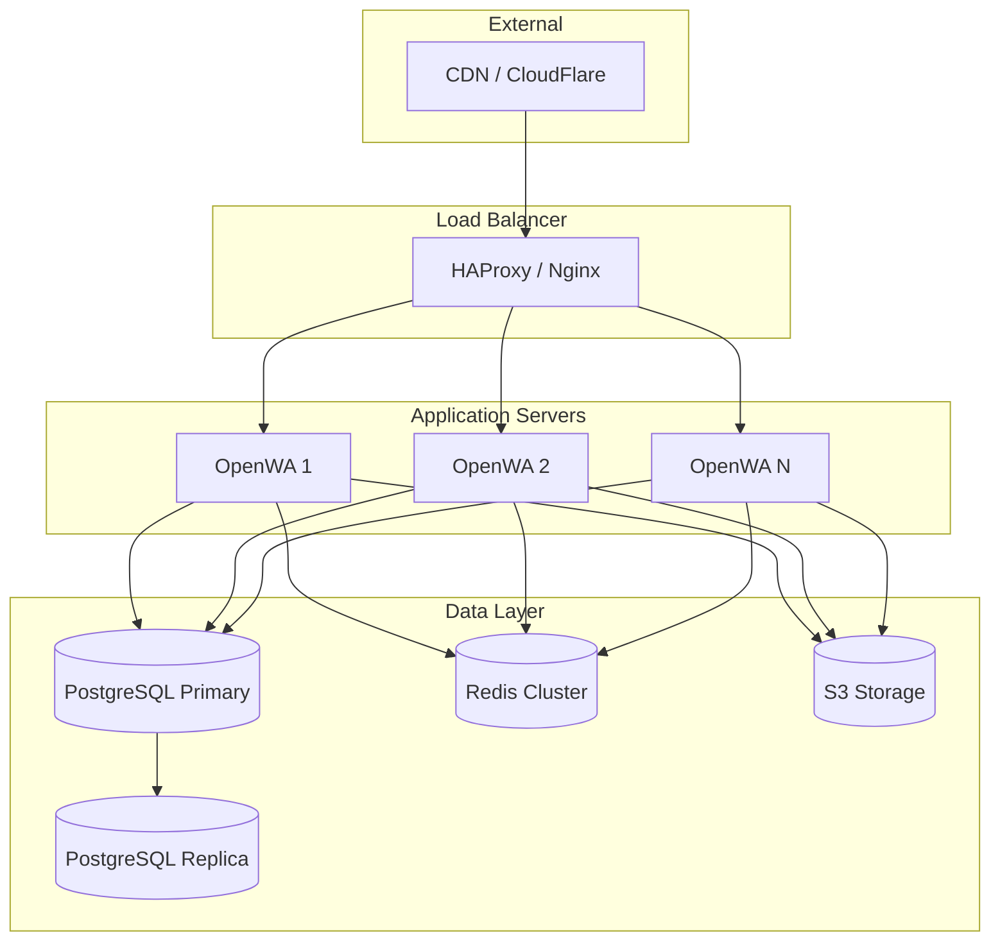
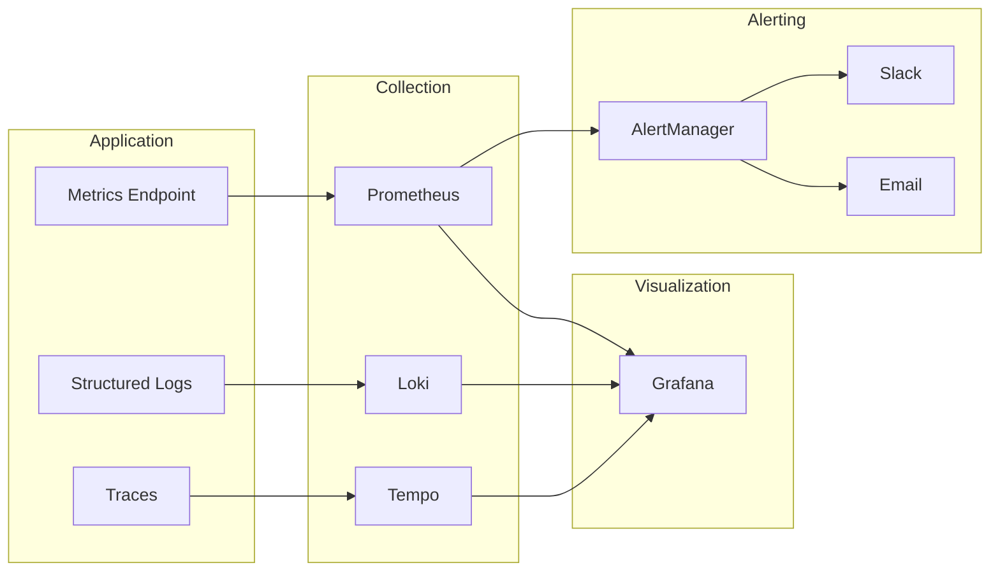
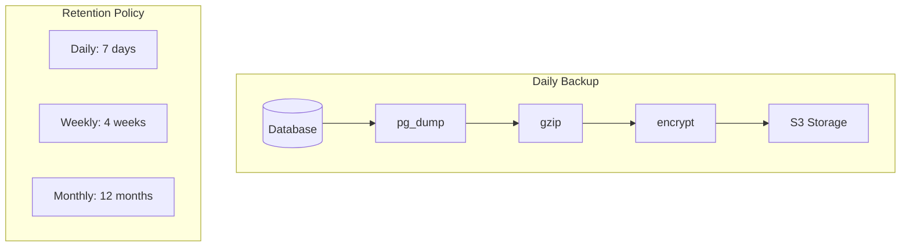

# 10 - DevOps & Infrastructure

> **⚠️ Conceptual reference.** Some examples here predate the shipped runtime and may not
> match it exactly. The **authoritative** sources are the repo's `Dockerfile`, `docker-compose.yml`
> (Docker socket-proxy threat model, gosu non-root drop, loopback-bound datastores, container
> hardening), and `.env.example` (canonical env var names). Where this doc and those disagree,
> the files win. In particular: the API master key env is `API_MASTER_KEY`, datastores have no
> default credentials, and production migrations use `npm run migration:run:prod`.

## 10.1 Infrastructure Overview

OpenWA is a **single-process** application, so a deployment is exactly one app instance per
session-data volume (`replicas: 1` — see §10.2). The repo has no staging/production environments and
no auto-deploy: CI builds and publishes images, and pulling one onto a server is the operator's step.



## 10.2 Docker Configuration

### Dockerfile

```dockerfile
# Dockerfile (multi-stage build)

# Build stage
FROM node:22-slim AS builder
WORKDIR /app
COPY package*.json ./
RUN npm ci
COPY . .
RUN npm run build

# Runtime stage
FROM node:22-slim

# Install Chrome dependencies (avoid Debian's chromium package due to SIGTRAP in non-root)
RUN apt-get update && apt-get install -y \
    curl \
    fonts-ipafont-gothic \
    fonts-wqy-zenhei \
    fonts-thai-tlwg \
    fonts-kacst \
    fonts-freefont-ttf \
    libxss1 \
    libnss3 \
    libnspr4 \
    libatk-bridge2.0-0 \
    libatk1.0-0 \
    libcups2 \
    libdrm2 \
    libxkbcommon0 \
    libxcomposite1 \
    libxdamage1 \
    libxfixes3 \
    libxrandr2 \
    libgbm1 \
    libasound2 \
    --no-install-recommends \
    && rm -rf /var/lib/apt/lists/*

# Set Puppeteer skip download (we install it dynamically later)
ENV PUPPETEER_SKIP_CHROMIUM_DOWNLOAD=true

# Create app directory
WORKDIR /app

# Copy package files & install production dependencies
COPY package*.json ./
RUN npm ci --only=production

# NOTE: Chrome for Testing has no linux-arm64 build, so this example targets linux/amd64.
# For arm64, install Debian's `chromium` package and point PUPPETEER_EXECUTABLE_PATH to
# /usr/bin/chromium — see the repo's Dockerfile for the mixed multi-arch build.
# Download Chrome for Testing via Puppeteer and point ENV to it
RUN mkdir -p /opt/puppeteer && \
    PUPPETEER_CACHE_DIR=/opt/puppeteer ./node_modules/.bin/puppeteer browsers install 'chrome@146.0.7680.31' && \
    chrome_path=$(find /opt/puppeteer/chrome/linux*/chrome-linux64/chrome | head -n 1) && \
    test -n "$chrome_path" && \
    ln -s "$chrome_path" /usr/local/bin/puppeteer-chrome
ENV PUPPETEER_EXECUTABLE_PATH=/usr/local/bin/puppeteer-chrome

# Copy build output
COPY --from=build /app/dist ./dist

# Create non-root user
RUN groupadd -r openwa && useradd -r -g openwa openwa
RUN chown -R openwa:openwa /app /opt/puppeteer
USER openwa


# Expose port
EXPOSE 2785

# Health check (global API prefix is 'api'; readiness probes both databases)
HEALTHCHECK --interval=30s --timeout=10s --start-period=60s \
    CMD curl -f http://localhost:2785/api/health/ready || exit 1

# Start app
CMD ["node", "dist/main.js"]
```

### Docker Compose (Development)

The repo's own `docker-compose.dev.yml` is a single-container local smoke test that runs the
**production** image against a bind-mounted `./data` — it has no source mount and no `start:dev`.
The multi-service file below is a hypothetical hot-reload variant you would write yourself under a
different name (writing it to `docker-compose.dev.yml` would overwrite the shipped file); the
`builder` target is the first stage of the repo `Dockerfile`.

```yaml
# docker-compose.hotreload.yml (write this yourself; not shipped in the repo)
version: '3.8'

services:
  app:
    build:
      context: .
      target: builder
    command: npm run start:dev
    ports:
      - "2785:2785"
    environment:
      - NODE_ENV=development
      - DATABASE_TYPE=postgres
      - DATABASE_HOST=postgres
      - DATABASE_PORT=5432
      - DATABASE_NAME=openwa
      - DATABASE_USERNAME=openwa
      - DATABASE_PASSWORD=openwa
      - REDIS_ENABLED=true
      - REDIS_HOST=redis
      - REDIS_PORT=6379
      # The env var is API_MASTER_KEY (not API_KEY_MASTER); never hardcode a key — set a
      # strong secret. Production refuses to boot with a placeholder/default.
      - API_MASTER_KEY=
      # Pins the plugin directory onto the data volume. This is also the default, so the setting is
      # belt-and-braces — it keeps working if the volume is mounted somewhere else.
      - PLUGINS_DIR=/app/data/plugins
    volumes:
      - ./:/app
      - /app/node_modules
      # Everything the app writes locally (session auth, the main (auth/audit) SQLite DB, media,
      # plugins) lives under /app/data; with DATABASE_TYPE=postgres above, the data DB does not
      - openwa-data:/app/data
    depends_on:
      - postgres
      - redis
    restart: unless-stopped

  postgres:
    image: postgres:16-alpine
    environment:
      - POSTGRES_USER=openwa
      - POSTGRES_PASSWORD=openwa
      - POSTGRES_DB=openwa
    volumes:
      - postgres-data:/var/lib/postgresql/data
    ports:
      - "5432:5432"

  redis:
    image: redis:7-alpine
    volumes:
      - redis-data:/data
    ports:
      - "6379:6379"

  # No separate dashboard service: the `app` image bundles the dashboard SPA and serves it
  # from the same port (2785) via NestJS. Open http://localhost:2785 for the UI.

volumes:
  postgres-data:
  redis-data:
  openwa-data:
```

### Docker Compose (Production)

The repo ships `docker-compose.yml` (full stack, builds the image from source) and
`docker-compose.dev.yml` (local smoke test). The file below is an image-based variant you would
write yourself for a release deployment; it mirrors the shipped compose in the part that matters —
the single `/app/data` volume that holds session auth, the main (auth/audit) SQLite DB, media and
plugins. Note the example below sets `DATABASE_TYPE=postgres`, so the **data** database lives in
PostgreSQL and needs its own backup; only with the SQLite default (what the shipped
`docker-compose.yml` leaves in place) does the data DB sit in this volume too.

```yaml
# docker-compose.release.yml (write this yourself; not shipped in the repo)
version: '3.8'

services:
  app:
    image: ghcr.io/rmyndharis/openwa:latest
    deploy:
      replicas: 1
      resources:
        limits:
          cpus: '2'
          memory: 2G
        reservations:
          cpus: '1'
          memory: 1G
    environment:
      - NODE_ENV=production
      - DATABASE_TYPE=postgres
      - DATABASE_HOST=${DATABASE_HOST}
      - DATABASE_PORT=${DATABASE_PORT}
      - DATABASE_NAME=${DATABASE_NAME}
      - DATABASE_USERNAME=${DATABASE_USERNAME}
      - DATABASE_PASSWORD=${DATABASE_PASSWORD}
      - REDIS_ENABLED=true
      - REDIS_HOST=${REDIS_HOST}
      - REDIS_PORT=${REDIS_PORT}
      - API_MASTER_KEY=${API_MASTER_KEY}
      # Pins the plugin directory onto the data volume. This is also the default, so the setting is
      # belt-and-braces — it keeps working if the volume is mounted somewhere else.
      - PLUGINS_DIR=/app/data/plugins
    volumes:
      # Session auth, the main (auth/audit) SQLite DB, media and plugins all live here — losing
      # this volume loses the linked WhatsApp sessions and the API keys.
      - openwa-data:/app/data
    healthcheck:
      test: ["CMD", "curl", "-f", "http://localhost:2785/api/health/ready"]
      interval: 30s
      timeout: 10s
      retries: 3
    restart: always

  nginx:
    image: nginx:alpine
    ports:
      - "80:80"
      - "443:443"
    volumes:
      - ./nginx.conf:/etc/nginx/nginx.conf:ro
      - ./certs:/etc/nginx/certs:ro
    depends_on:
      - app
    restart: always

volumes:
  openwa-data:
    driver: local
```

> [!IMPORTANT]
> **Keep `replicas: 1`.** OpenWA is a single-process application: live engine state lives in an
> in-memory `Map` in `EngineRegistry` (`src/engine/engine-registry.service.ts`), written solely by
> `SessionEngineLifecycle`. Multi-replica is
> **not** a supported topology — running two replicas against a shared `SESSION_DATA_PATH` makes two
> browsers write the same WhatsApp LocalAuth directory and **corrupts the session** (forced logout /
> ban). Shared storage and sticky sessions do **not** make multi-replica safe. See
> [13 - Horizontal Scaling Guide](./13-horizontal-scaling.md) for the `replicas: 1` stance and the
> (unimplemented) session-claim design that would be required first.

### Helm Chart (Kubernetes)

The maintained way to deploy on Kubernetes is the Helm chart at `charts/openwa/`:

```bash
helm install openwa ./charts/openwa \
  --set secretEnv.API_MASTER_KEY=$(openssl rand -base64 32)
```

It renders a single-replica StatefulSet (`replicaCount: 1` — the same constraint as
the compose warning above) with a PVC for `/app/data`, the compose hardening mirrored
(read-only rootfs, dropped capabilities, writable `emptyDir` at `/tmp`), and optional
Ingress / PodDisruptionBudget / ServiceMonitor. Configuration goes through free-form
`env` and `secretEnv` maps — any variable from `.env.example` works; see
`charts/openwa/README.md` and the inline comments in `charts/openwa/values.yaml`.
The k8s manifests in [13 - Horizontal Scaling Guide](./13-horizontal-scaling.md) are
an illustrative design sketch; the chart is the authoritative artifact.

## 10.3 CI/CD Pipeline

### GitHub Actions Workflow

`.github/workflows/ci.yml` (`name: CI`) runs on pushes and pull requests targeting `main` /
`develop`. It is **integration only** — no job deploys anywhere. The final job publishes branch and
SHA image tags to GHCR; `latest` is deliberately not set there and moves only through the separate,
boot-smoke-gated release workflow.

| Job | Needs | What it runs |
|-----|-------|--------------|
| `lint` | — | ESLint, `tsc --noEmit -p tsconfig.json` (full program, so spec files are type-checked too), `format:check`, `check:versions`, `check:dockerignore`, `openapi:check` |
| `audit` | — | `npm audit --audit-level=high`, split out of `lint` so a newly published advisory can't abort the code-quality gates |
| `test` | — | `npm test -- --coverage`, `test:scripts`, `test:e2e` (a `redis:7-alpine` service backs the queue-on e2e suite), coverage upload |
| `test-postgres` | — | `npm run build`, then `test:pg-smoke` (migrations + uuid-default) and the Postgres FTS migration spec against a `postgres:16-alpine` service |
| `dashboard` | — | In `dashboard/`: `lint`, `typecheck`, `i18n:check`, `build`, `test:unit` |
| `scripts-smoke` | — | `shellcheck` plus the backup/restore smoke test for `scripts/backup.sh` and `scripts/restore.sh` |
| `build` | lint, audit, test, dashboard, scripts-smoke | `npm run build`, uploads the `dist` artifact |
| `docker` | build, test-postgres | Buildx multi-arch build (`linux/amd64,linux/arm64`) with provenance + SBOM attestations; pushes to `ghcr.io/<owner>/<repo>` on push events (fork PRs build both architectures without publishing) |

Rollout is left to the operator — the repo has no SSH deploy step, no staging/production
environments and no auto-deploy on merge.

## 10.4 Deployment Architecture

### Single Server Deployment



### Multi-Server Deployment

> **Design sketch, not a supported topology.** OpenWA is single-process with in-memory engine state,
> so the multi-`OpenWA` fan-out below would corrupt WhatsApp auth across replicas. It is retained only
> as the target architecture once the session-claim design in
> [13 - Horizontal Scaling Guide](./13-horizontal-scaling.md) is implemented. Deploy with `replicas: 1`.



## 10.5 Environment Configuration

### Environment Variables

```bash
# .env — excerpt of the commonly-tuned keys. The repo's `.env.example` is the canonical,
# fully annotated list; add nothing here that does not appear there.

# ===========================================
# APPLICATION
# ===========================================
NODE_ENV=production
PORT=2785
# The global `/api` prefix is fixed in code — there is no env var for it.
LOG_LEVEL=info
LOG_FORMAT=json

# ===========================================
# DATABASE (choose one)
# ===========================================
# Option 1: SQLite (for minimal deployments)
# For SQLite, DATABASE_NAME is the database FILE PATH.
DATABASE_TYPE=sqlite
DATABASE_NAME=./data/openwa.sqlite

# Option 2: PostgreSQL (for production) — DATABASE_NAME is the database NAME here
# DATABASE_TYPE=postgres
# DATABASE_HOST=localhost
# DATABASE_PORT=5432
# DATABASE_NAME=openwa
# DATABASE_USERNAME=user
# DATABASE_PASSWORD=pass
# DATABASE_POOL_SIZE=20
# DATABASE_SSL=false

# ===========================================
# MEDIA STORAGE (choose one)
# ===========================================
# STORAGE_TYPE accepts only `local` or `s3` — env validation rejects anything else and the app
# FAILS TO BOOT ("Invalid environment configuration"). There is no silent fallback to local disk.
# Option 1: Local filesystem (default)
STORAGE_TYPE=local
STORAGE_LOCAL_PATH=./data/media

# Option 2: S3 (AWS) — leave S3_ENDPOINT unset; the SDK derives it from the region
# STORAGE_TYPE=s3
# S3_BUCKET=openwa
# S3_REGION=ap-southeast-1
# S3_ACCESS_KEY_ID=your-access-key
# S3_SECRET_ACCESS_KEY=your-secret-key

# Option 3: MinIO / other S3-compatible store — same STORAGE_TYPE=s3 plus an endpoint.
# Setting S3_ENDPOINT is what enables path-style addressing; there is no separate flag.
# STORAGE_TYPE=s3
# S3_ENDPOINT=http://minio:9000
# S3_BUCKET=openwa
# S3_ACCESS_KEY_ID=minioadmin
# S3_SECRET_ACCESS_KEY=minioadmin

# ===========================================
# CACHE & QUEUE
# ===========================================
# Both are opt-in and both need a reachable Redis, configured with the discrete host/port pair
# (there is no REDIS_URL). Defaults: no cache at all (CacheService is a no-op and every read falls
# through to the database — there is no in-memory tier) and inline (non-queued) dispatch.
REDIS_ENABLED=false
REDIS_HOST=localhost
REDIS_PORT=6379
# Redis-backed caching switches on when REDIS_ENABLED=true OR CACHE_ENABLED=true — enabling Redis
# for the queue alone therefore also enables the cache.
# CACHE_ENABLED=true
# QUEUE_ENABLED=true   # process webhooks/ingress through the BullMQ queue

# ===========================================
# WHATSAPP ENGINE
# ===========================================
# ENGINE_TYPE=baileys   # whatsapp-web.js (default) | baileys; omit to use the dashboard selection

# Session
SESSION_DATA_PATH=./data/sessions

# Puppeteer (for whatsapp-web.js)
PUPPETEER_EXECUTABLE_PATH=/usr/bin/chromium
PUPPETEER_HEADLESS=true
PUPPETEER_ARGS=--no-sandbox,--disable-setuid-sandbox

# ===========================================
# SECURITY
# ===========================================
# Generate with: openssl rand -base64 32
API_MASTER_KEY=your-master-api-key
# Optional HMAC pepper so a DB leak alone can't precompute key hashes
API_KEY_PEPPER=optional-key-hashing-pepper

# ===========================================
# WEBHOOK
# ===========================================
WEBHOOK_TIMEOUT=10000
WEBHOOK_RETRY_DELAY=5000
WEBHOOK_DISPATCH_CONCURRENCY=16
WEBHOOK_DISPATCH_MAX_QUEUED=1000
# Retry attempts are configured per webhook with the retryCount API field (default 3, range 0-5).

# ===========================================
# RATE LIMITING
# ===========================================
# Three global per-IP windows (short/medium/long); defaults shown
RATE_LIMIT_MEDIUM_TTL=60000
RATE_LIMIT_MEDIUM_LIMIT=100
```

### Configuration Service

```typescript
// config/configuration.ts (shape abbreviated — see src/config/configuration.ts for the real file)
export default () => ({
  port: parseInt(process.env.PORT || '2785', 10),
  // Main boot DB: always SQLite (auth/audit)
  database: {
    type: 'sqlite',
    database: process.env.MAIN_DATABASE_NAME || './data/main.sqlite',
  },
  // Data DB: pluggable backend
  dataDatabase: {
    type: process.env.DATABASE_TYPE || 'sqlite',
    // SQLite file path when type is sqlite; PostgreSQL database name when type is postgres
    database: process.env.DATABASE_NAME || './data/openwa.sqlite',
    name: process.env.DATABASE_NAME || 'openwa',
    host: process.env.DATABASE_HOST || 'localhost',
    port: parseInt(process.env.DATABASE_PORT || '5432', 10),
    username: process.env.DATABASE_USERNAME,
    password: process.env.DATABASE_PASSWORD,
  },
  redis: {
    host: process.env.REDIS_HOST || 'localhost',
    port: parseInt(process.env.REDIS_PORT || '6379', 10),
    username: process.env.REDIS_USERNAME,
    password: process.env.REDIS_PASSWORD,
  },
  // API_MASTER_KEY is NOT part of this factory — `security` holds only trustedProxies, and the
  // master key is read straight from process.env by the auth service.
  security: {
    trustedProxies: (process.env.TRUSTED_PROXIES || '').split(',').map(proxy => proxy.trim()).filter(Boolean),
  },
  // Session data path and Puppeteer both live under `engine` — there is no top-level
  // `session` or `puppeteer` key.
  engine: {
    type: process.env.ENGINE_TYPE || 'whatsapp-web.js',
    sessionDataPath: process.env.SESSION_DATA_PATH || './data/sessions',
    puppeteer: {
      executablePath: process.env.PUPPETEER_EXECUTABLE_PATH || undefined,
      headless: process.env.PUPPETEER_HEADLESS !== 'false',
      // Split on commas AND whitespace; the default is a four-flag string, not an empty list
      args: (process.env.PUPPETEER_ARGS || '--no-sandbox,--disable-setuid-sandbox,--disable-dev-shm-usage,--disable-gpu')
        .split(/[\s,]+/)
        .filter(Boolean),
    },
  },
  webhook: {
    timeout: parseInt(process.env.WEBHOOK_TIMEOUT || '10000', 10),
    retryDelay: parseInt(process.env.WEBHOOK_RETRY_DELAY || '5000', 10),
    dispatchConcurrency: parseInt(process.env.WEBHOOK_DISPATCH_CONCURRENCY || '16', 10),
    dispatchMaxQueued: parseInt(process.env.WEBHOOK_DISPATCH_MAX_QUEUED || '1000', 10),
  },
  // Rate limits are nested under `api` — read them as `api.rateLimit.*`
  api: {
    rateLimit: {
      shortTtl: parseInt(process.env.RATE_LIMIT_SHORT_TTL || '1000', 10),
      shortLimit: parseInt(process.env.RATE_LIMIT_SHORT_LIMIT || '10', 10),
      mediumTtl: parseInt(process.env.RATE_LIMIT_MEDIUM_TTL || '60000', 10),
      mediumLimit: parseInt(process.env.RATE_LIMIT_MEDIUM_LIMIT || '100', 10),
      longTtl: parseInt(process.env.RATE_LIMIT_LONG_TTL || '3600000', 10),
      longLimit: parseInt(process.env.RATE_LIMIT_LONG_LIMIT || '1000', 10),
    },
  },
});
```

## 10.6 Monitoring & Observability

### Monitoring Stack



### Docker Compose Monitoring Stack

```yaml
# docker-compose.monitoring.yml
version: '3.8'

services:
  prometheus:
    image: prom/prometheus:v2.47.0
    volumes:
      - ./monitoring/prometheus.yml:/etc/prometheus/prometheus.yml
      - ./monitoring/alerts.yml:/etc/prometheus/alerts.yml
      # Holds the METRICS_TOKEN value; see the scrape config below
      - ./monitoring/metrics_token:/etc/prometheus/metrics_token:ro
      - prometheus-data:/prometheus
    command:
      - '--config.file=/etc/prometheus/prometheus.yml'
      - '--storage.tsdb.retention.time=30d'
    ports:
      - "9090:9090"
    restart: unless-stopped

  grafana:
    image: grafana/grafana:10.1.0
    volumes:
      - ./monitoring/grafana/provisioning:/etc/grafana/provisioning
      - ./monitoring/grafana/dashboards:/var/lib/grafana/dashboards
      - grafana-data:/var/lib/grafana
    environment:
      - GF_SECURITY_ADMIN_PASSWORD=${GRAFANA_PASSWORD:-admin}
      - GF_USERS_ALLOW_SIGN_UP=false
    ports:
      - "3001:3000"
    depends_on:
      - prometheus
      - loki
    restart: unless-stopped

  loki:
    image: grafana/loki:2.9.0
    volumes:
      - ./monitoring/loki.yml:/etc/loki/local-config.yaml
      - loki-data:/loki
    command: -config.file=/etc/loki/local-config.yaml
    ports:
      - "3100:3100"
    restart: unless-stopped

  promtail:
    image: grafana/promtail:2.9.0
    volumes:
      - ./monitoring/promtail.yml:/etc/promtail/config.yml
      - /var/log:/var/log:ro
      - /var/lib/docker/containers:/var/lib/docker/containers:ro
    command: -config.file=/etc/promtail/config.yml
    depends_on:
      - loki
    restart: unless-stopped

  alertmanager:
    image: prom/alertmanager:v0.26.0
    volumes:
      - ./monitoring/alertmanager.yml:/etc/alertmanager/alertmanager.yml
    ports:
      - "9093:9093"
    restart: unless-stopped

  node-exporter:
    image: prom/node-exporter:v1.6.1
    volumes:
      - /proc:/host/proc:ro
      - /sys:/host/sys:ro
      - /:/rootfs:ro
    command:
      - '--path.procfs=/host/proc'
      - '--path.sysfs=/host/sys'
    ports:
      - "9100:9100"
    restart: unless-stopped

volumes:
  prometheus-data:
  grafana-data:
  loki-data:
```

### Prometheus Configuration

```yaml
# monitoring/prometheus.yml
global:
  scrape_interval: 15s
  evaluation_interval: 15s

alerting:
  alertmanagers:
    - static_configs:
        - targets: ['alertmanager:9093']

rule_files:
  - 'alerts.yml'

scrape_configs:
  - job_name: 'openwa'
    static_configs:
      - targets: ['app:2785']
    metrics_path: '/api/metrics'
    # /api/metrics is disabled (404) until METRICS_TOKEN is set, and then rejects a scrape
    # without the bearer (401) — either way `up` goes to 0 and ServiceDown fires.
    # Prometheus does not expand env vars in its config, so mount the token as a file.
    authorization:
      type: Bearer
      credentials_file: /etc/prometheus/metrics_token

  - job_name: 'node'
    static_configs:
      - targets: ['node-exporter:9100']

  - job_name: 'prometheus'
    static_configs:
      - targets: ['localhost:9090']
```

### Alert Rules

These rules use the metric names OpenWA actually exports (`openwa_*`). The memory rule below uses a
node-exporter metric — an **external** exporter, not the app — and is kept as a host-level example.

```yaml
# monitoring/alerts.yml
groups:
  - name: openwa-alerts
    rules:
      # Service Down — openwa_up disappears (or the scrape fails)
      - alert: ServiceDown
        expr: up{job="openwa"} == 0 or absent(openwa_up)
        for: 1m
        labels:
          severity: critical
        annotations:
          summary: "OpenWA service is down"
          description: "The OpenWA application is not responding"

      # Session(s) disconnected
      - alert: SessionDisconnected
        expr: openwa_sessions{status="disconnected"} > 0
        for: 2m
        labels:
          severity: warning
        annotations:
          summary: "WhatsApp session disconnected"
          description: "{{ $value }} session(s) in disconnected state"

      # Failed messages currently stored
      - alert: FailedMessagesPresent
        expr: openwa_messages_failed_total > 0
        for: 5m
        labels:
          severity: warning
        annotations:
          summary: "Messages are failing"
          description: "{{ $value }} message(s) are currently in FAILED state"

      # Process memory growth (app-exported RSS; ~2GB example threshold)
      - alert: HighProcessMemory
        expr: openwa_process_resident_memory_bytes > 2e9
        for: 10m
        labels:
          severity: warning
        annotations:
          summary: "High OpenWA process memory"
          description: "RSS is {{ $value | humanize1024 }}B"

      # Host memory pressure — EXTERNAL (node-exporter), not exported by OpenWA
      - alert: HighHostMemoryUsage
        expr: |
          (node_memory_MemTotal_bytes - node_memory_MemAvailable_bytes)
          / node_memory_MemTotal_bytes > 0.85
        for: 5m
        labels:
          severity: warning
        annotations:
          summary: "High host memory usage"
          description: "Host memory usage is {{ $value | humanizePercentage }}"
```

### AlertManager Configuration

```yaml
# monitoring/alertmanager.yml
global:
  resolve_timeout: 5m
  slack_api_url: '${SLACK_WEBHOOK_URL}'

route:
  group_by: ['alertname', 'severity']
  group_wait: 10s
  group_interval: 10s
  repeat_interval: 1h
  receiver: 'slack-notifications'
  routes:
    - match:
        severity: critical
      receiver: 'slack-critical'
    - match:
        severity: warning
      receiver: 'slack-warnings'

receivers:
  - name: 'slack-notifications'
    slack_configs:
      - channel: '#openwa-alerts'
        send_resolved: true

  - name: 'slack-critical'
    slack_configs:
      - channel: '#openwa-critical'
        send_resolved: true
        title: '🚨 CRITICAL: {{ .GroupLabels.alertname }}'
        text: '{{ range .Alerts }}{{ .Annotations.description }}{{ end }}'

  - name: 'slack-warnings'
    slack_configs:
      - channel: '#openwa-alerts'
        send_resolved: true
        title: '⚠️ WARNING: {{ .GroupLabels.alertname }}'
```

### Health Check Endpoint

All health endpoints are `@Public()` (no API key) and `@SkipThrottle()`, and live under the global
`api` prefix. There is **no** `/health/detailed` endpoint.

| Endpoint | Purpose | Body | Codes |
|----------|---------|------|-------|
| `GET /api/health` | Basic check | `{ status, timestamp, version }` (version from `package.json`) | 200 |
| `GET /api/health/live` | Liveness (deliberately static — a transient dependency outage must not KILL the pod) | `{ status: 'ok' }` | 200 |
| `GET /api/health/ready` | Readiness — probes **both** databases (`main` + `data`, `SELECT 1`, 3s timeout each) and reports 503 while draining (graceful shutdown) | `{ status, details: { mainDatabase, dataDatabase } }` | 200 / 503 |

```typescript
// health/health.controller.ts
@Controller('health')
@Public()       // no API key required
@SkipThrottle()
export class HealthController {
  @Get()
  check(): { status: string; timestamp: string; version: string } {
    return { status: 'ok', timestamp: new Date().toISOString(), version: APP_VERSION };
  }

  @Get('live')
  liveness(): { status: string } {
    return { status: 'ok' };
  }

  @Get('ready')
  async readiness(): Promise<HealthCheckResult> {
    // 503 while draining so the LB stops routing before teardown.
    if (this.shutdownService.isShuttingDown()) {
      throw new ServiceUnavailableException({ status: 'error', details: { shutdown: { status: 'draining' } } });
    }
    const [main, data] = await Promise.all([
      this.probeDatabase(this.mainDataSource),
      this.probeDatabase(this.dataDataSource),
    ]);
    const details = { mainDatabase: { status: main }, dataDatabase: { status: data } };
    if (main === 'down' || data === 'down') {
      throw new ServiceUnavailableException({ status: 'error', details });
    }
    return { status: 'ok', details };
  }
}
```

### Prometheus Metrics Implementation

The metrics surface is small, so OpenWA emits Prometheus text exposition format (v0.0.4) **by hand** —
there is **no `prom-client` dependency** and **no `collectDefaultMetrics`**. `MetricsService` reads an
aggregate overview from `StatsService` plus `process.memoryUsage()`, memoizes the rendered text for a
short TTL (~5s, so back-to-back scrapes don't repeat the DB scan), and exposes it at
`GET /api/metrics`.

Access is **disabled by default**: the endpoint returns **404** unless `METRICS_TOKEN` is set. When
set, scrapers must send `Authorization: Bearer <token>` (compared with `timingSafeEqual`); a missing or
wrong token returns 401. The token is **separate** from the API key — the route is `@Public()` (skips
the API-key guard) and `@SkipThrottle()`.

```typescript
// metrics/metrics.service.ts (dependency-free; emits text v0.0.4 by hand)
@Injectable()
export class MetricsService {
  constructor(
    private readonly config: ConfigService,
    private readonly statsService: StatsService,
  ) {}

  async render(): Promise<string> {
    const overview = await this.statsService.getOverview();
    const mem = process.memoryUsage();
    const lines: string[] = [];
    // ... gauge() helper pushes `# HELP` / `# TYPE` / value lines ...
    gauge('openwa_up', '...', 1);
    gauge('openwa_process_uptime_seconds', '...', Math.round(process.uptime()));
    gauge('openwa_process_resident_memory_bytes', '...', mem.rss);
    gauge('openwa_process_heap_used_bytes', '...', mem.heapUsed);
    gauge('openwa_sessions_total', '...', overview.sessions.total);
    gauge('openwa_sessions_active', '...', overview.sessions.active);
    // openwa_sessions{status="..."} — one line per status
    // openwa_messages_total{direction="outgoing"|"incoming"}
    // openwa_messages_failed_total
    return lines.join('\n') + '\n';
  }
}
```

**Exported metric names** (the complete set — nothing else is emitted):

| Metric | Type | Labels | Meaning |
|--------|------|--------|---------|
| `openwa_up` | gauge | — | Always `1` when scraped |
| `openwa_process_uptime_seconds` | gauge | — | Process uptime |
| `openwa_process_resident_memory_bytes` | gauge | — | RSS |
| `openwa_process_heap_used_bytes` | gauge | — | V8 heap used |
| `openwa_sessions_total` | gauge | — | Configured sessions |
| `openwa_sessions_active` | gauge | — | READY (active) sessions |
| `openwa_sessions` | gauge | `status` | Session count per status |
| `openwa_messages_total` | gauge | `direction` (`incoming`/`outgoing`) | Current stored messages by direction |
| `openwa_messages_failed_total` | gauge | — | Current messages in FAILED state |

### Grafana Dashboard Definition

```json
// monitoring/grafana/dashboards/openwa.json — panels use the openwa_* metrics OpenWA exports
{
  "title": "OpenWA Dashboard",
  "uid": "openwa-main",
  "panels": [
    {
      "title": "Active Sessions",
      "type": "stat",
      "gridPos": { "x": 0, "y": 0, "w": 6, "h": 4 },
      "targets": [
        { "expr": "openwa_sessions_active" }
      ]
    },
    {
      "title": "Stored Outgoing Messages",
      "type": "stat",
      "gridPos": { "x": 6, "y": 0, "w": 6, "h": 4 },
      "targets": [
        { "expr": "openwa_messages_total{direction=\"outgoing\"}" }
      ]
    },
    {
      "title": "Failed Messages",
      "type": "stat",
      "gridPos": { "x": 12, "y": 0, "w": 6, "h": 4 },
      "targets": [
        { "expr": "openwa_messages_failed_total" }
      ]
    },
    {
      "title": "Sessions by Status",
      "type": "timeseries",
      "gridPos": { "x": 0, "y": 4, "w": 12, "h": 8 },
      "targets": [
        { "expr": "openwa_sessions", "legendFormat": "{{status}}" }
      ]
    },
    {
      "title": "Stored Messages by Direction",
      "type": "timeseries",
      "gridPos": { "x": 12, "y": 4, "w": 12, "h": 8 },
      "targets": [
        { "expr": "openwa_messages_total", "legendFormat": "{{direction}}" }
      ]
    },
    {
      "title": "Process Memory",
      "type": "timeseries",
      "gridPos": { "x": 0, "y": 12, "w": 12, "h": 8 },
      "targets": [
        { "expr": "openwa_process_resident_memory_bytes / 1024 / 1024", "legendFormat": "RSS (MB)" },
        { "expr": "openwa_process_heap_used_bytes / 1024 / 1024", "legendFormat": "Heap used (MB)" }
      ]
    },
    {
      "title": "Uptime",
      "type": "stat",
      "gridPos": { "x": 12, "y": 12, "w": 12, "h": 8 },
      "targets": [
        { "expr": "openwa_process_uptime_seconds" }
      ]
    }
  ]
}
```

### Structured Logging

Logging is dependency-free: there is no winston (or any logging library) in `package.json`. The
logger is a small custom `LoggerService` in `src/common/services/logger.service.ts` that writes to
the console — `error` and `warn` go to **stderr**, every other level to **stdout**, so a shipper
configured for stdout alone drops exactly the lines you most want. `LOG_LEVEL`
(`error|warn|info|debug|verbose`) sets verbosity and `LOG_FORMAT` (`json|pretty`) the rendering,
defaulting to `json` under `NODE_ENV=production` and `pretty` elsewhere. Metadata whose **key name**
looks like a secret (password, token, api-key, authorization, …) keeps the key and has its **value**
replaced with `[REDACTED]` before the line is written.

There is no in-app Loki transport: in the stack above, logs reach Loki because **promtail** scrapes
the container's stdout and stderr from `/var/lib/docker/containers`.

```typescript
// common/services/logger.service.ts — usage
import { createLogger } from '../common/services/logger.service';

@Injectable()
export class MessageService {
  private readonly logger = createLogger('MessageService');

  async send(): Promise<void> {
    // log/warn/debug/verbose take (message, context?) where context is a string or metadata object;
    // error() is (message, trace?, context?) — the stack trace comes second
    this.logger.log('Message sent', {
      sessionId: 'sess_123',
      chatId: '628xxx@c.us',
      messageType: 'text',
    });
  }
}
```

### Key Metrics to Monitor

These are the metrics OpenWA actually exports at `GET /api/metrics`:

| Category | Metric | Description | Alert Idea |
|----------|--------|-------------|------------|
| **Liveness** | `openwa_up` | Always `1` when scraped (absence/scrape-failure = down) | Target down |
| **Sessions** | `openwa_sessions_total` | Configured sessions | Near your expected session count |
| **Sessions** | `openwa_sessions_active` | READY (active) sessions | Drops below expected |
| **Sessions** | `openwa_sessions{status="..."}` | Per-status counts (e.g. `disconnected`, `failed`) | `disconnected`/`failed` > 0 |
| **Messages** | `openwa_messages_total{direction="outgoing"}` | Current stored outgoing messages | Unexpected change |
| **Messages** | `openwa_messages_total{direction="incoming"}` | Current stored incoming messages | Unexpected change |
| **Messages** | `openwa_messages_failed_total` | Current messages in FAILED state | Above acceptable threshold |
| **System** | `openwa_process_resident_memory_bytes` | RSS | Growth / near limit |
| **System** | `openwa_process_heap_used_bytes` | V8 heap used | Growth |
| **System** | `openwa_process_uptime_seconds` | Process uptime | Frequent restarts (resets) |

> OpenWA does **not** expose request-rate, latency-histogram, webhook, queue, or Node default
> (`nodejs_*`) metrics. For host/container-level signals (CPU, memory pressure, event-loop), scrape
> external exporters: `up` and `container_memory_usage_bytes` come from blackbox/cAdvisor, and
> `node_*` from node-exporter — not from the app.


## 10.7 Backup & Recovery

### Backup Strategy



### Backup Script

Use the shipped [`scripts/backup.sh`](../scripts/backup.sh); do not maintain a second inline copy.
It captures the always-SQLite `main.sqlite`, the configured data database, whatsapp-web.js session
state (`SESSION_DATA_PATH`), Baileys auth state (`BAILEYS_AUTH_DIR`, default `./data/baileys`), local
media, installed plugin packages, plugin registry/state, and generated secret/config files. See the
authoritative [backup runbook](./11-operational-runbooks.md#runbook-database-backup).

### Recovery Procedure

Use the matching [`scripts/restore.sh`](../scripts/restore.sh) and follow the
[restore runbook](./11-operational-runbooks.md#runbook-restore-from-backup). Stop the application
before restoring; PostgreSQL dumps still require the explicit `psql` step described there.

## 10.8 Scaling Guidelines

### Vertical Scaling

OpenWA scales **vertically** — add CPU/RAM to a single instance. The table below is **unbenchmarked
starting guidance**, not measured figures; actual usage depends heavily on engine choice
(whatsapp-web.js spawns a Chromium per session; Baileys is far lighter), message volume, and media.
Size up from your own monitoring.

| Sessions | RAM | CPU | Storage |
|----------|-----|-----|---------|
| 1-5 | 2GB | 2 cores | 20GB |
| 5-10 | 4GB | 4 cores | 50GB |
| 10-20 | 8GB | 8 cores | 100GB |
| 20+ | 16GB+ | 16+ cores | 200GB+ |

### Horizontal Scaling

**Not currently supported.** OpenWA is a single-process application with in-memory engine state, so
multiple replicas against a shared session volume corrupt WhatsApp auth. Run exactly **one** API
instance per session-data volume (`replicas: 1`). The DB-backed session registry / node-claim design
that would be required to scale out is documented — as a future design sketch, not a shipped feature —
in [13 - Horizontal Scaling Guide](./13-horizontal-scaling.md).
---

<div align="center">

[← 09 - Testing Strategy](./09-testing-strategy.md) · [Documentation Index](./README.md) · [Next: 11 - Operational Runbooks →](./11-operational-runbooks.md)

</div>
