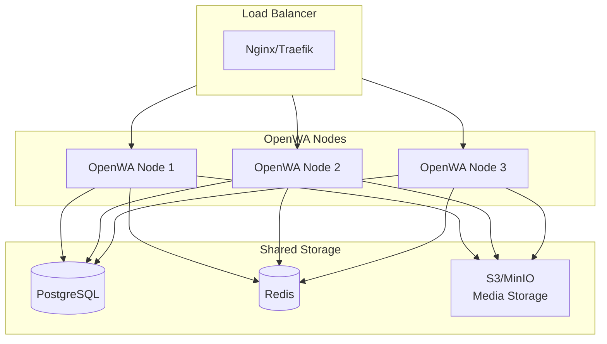

# 13 - Horizontal Scaling Guide

> ## ⚠️ PARTIALLY IMPLEMENTED — STILL DEPLOY `replicas: 1`
>
> **Supported topology remains exactly one API instance per session-data volume.** Do not
> run the multi-replica examples below yet.
>
> **What now exists.** Sessions carry an owner (`nodeId`) and a renewed lease
> (`leaseExpiresAt`). A process claims a session before starting its engine and refuses
> when another node holds a live claim, so two replicas can no longer both launch the same
> session — which is what corrupted the shared LocalAuth directory. A booting process also
> resets only the sessions it may claim, instead of reporting a live peer's sessions as
> disconnected. Claims are released on a clean shutdown and expire otherwise, so failover
> does not depend on one. `NODE_ID` names the process; it defaults to the hostname and must
> be stable across restarts.
>
> A node that loses its claim gives up the engine. A lease can lapse while the process is
> perfectly healthy — a slow query is enough — after which a peer may legitimately take the
> session; renewal detects the loss and tears the local engine down at the next heartbeat, so
> any two-engine overlap is bounded to roughly one heartbeat interval (and a teardown failure
> is logged as an error rather than silently retried). A failed renewal is deliberately not
> read as a loss: the TTL is sized to absorb a database blip, and concluding otherwise would
> stop every healthy engine on the node.
>
> Bulk-send batches follow the same rule. A batch is only ever driven by the process
> holding its session's engine, so a booting replica now reaps only the batches whose
> sessions it may claim, instead of declaring a peer's in-flight batches FAILED while they
> are still sending. A data import likewise reports the sessions it could not reconcile
> because another node is running them.
>
> **Failover now completes on its own.** A periodic takeover sweep (default every 30s,
> `SESSION_TAKEOVER_SWEEP_MS`, gated by the same `AUTO_START_SESSIONS` flag as boot
> auto-start) adopts sessions whose holder's lease lapsed — a crashed peer, or a recreated
> container whose new identity boots before its old lease expires. Only authenticated
> sessions in a running-or-should-be state are adopted; mid-pairing and operator-`failed`
> ones are left alone, and a cleanly stopped session releases its claim so it is never
> "lapsed". Adopting a session fails its stuck in-flight batches (no auto-resume — the dead
> node's already-sent messages are unknowable).
>
> **Request routing now exists, opt-in via `NODE_URL`.** When every node sets its own
> reachable URL (e.g. `NODE_URL=http://10.0.0.5:2785`), a session-scoped request landing on
> a non-owner is forwarded to the live owner and the owner's response is relayed back
> (`x-openwa-served-by` names it). The forward happens after API-key auth, carries the
> caller's credentials (both nodes share the auth database), is bounded by
> `SESSION_PROXY_TIMEOUT_MS` (default 60s), and is one hop only — a forwarded request is
> never forwarded again; one that still lands on a live non-owner (stale ownership, or a
> client-forged hop marker) is refused with a retryable 409 rather than executed there. A
> lapsed owner is deliberately NOT forwarded to: the local node handles the request,
> which is exactly how a takeover begins. Without `NODE_URL` the whole path is inert and
> single-node deployments pay nothing.
>
> **The lease compares timestamps written by different nodes, so their clocks must agree.** Each
> node writes `leaseExpiresAt` from its own clock and reads every other node's the same way, so a
> node whose clock runs more than one lease TTL (default 60s) ahead sees healthy peers as lapsed and
> will take their sessions over. Run NTP (or any time sync) on every node — the default on ordinary
> server images — and treat a skew larger than `SESSION_LEASE_TTL_MS` as a misconfiguration.
>
> **A forwarded request is throttled on both nodes.** The receiving node counts it before
> forwarding, and the owner counts it again on arrival; with `REDIS_ENABLED=true` both counts land
> in the same shared bucket. Size the rate limits with that in mind for a routed deployment.
>
> Forwards carry the client address in `x-forwarded-for` (inbound chain preserved, the
> observed peer appended). For an `allowedIps`-restricted key or the per-IP throttler to see
> the REAL client on forwarded calls, each node must list its peer nodes' addresses in its
> `TRUSTED_PROXIES` — otherwise the owner (correctly) ignores the chain and every forwarded
> request appears to come from the peer node itself.
>
> **WebSocket events now fan out across replicas** when Redis is enabled (`REDIS_ENABLED=true`,
> the same flag the throttler and cache already use). The gateway broadcasts to rooms; a Redis
> pub/sub adapter attached to Socket.IO relays those broadcasts to every replica, so a client
> connected to node A receives an event raised on node B. Scope honestly: this distributes event
> **fan-out only**. Mid-connection key eviction (`socketsByKeyId`) is still process-local — a key
> revoked on node A tears down only A's sockets — as are the per-key WS rate-limit buckets (counted
> per replica) and the engine registry. Without `REDIS_ENABLED` the adapter is inert and delivery
> is single-node, exactly as before.
>
> **What does not exist yet, and is why one replica is still the answer.** The cross-replica gaps
> just named (key eviction, WS rate-limit state) remain process-local. Not every lifecycle path is
> fenced: the liveness watchdog and reconnect timers still act on whatever is in the local
> registry. `BulkMessageService` keeps its live batch state in process, so a takeover cannot resume
> a batch — only fail it. MCP/agent tool invocations execute on the node that received them rather
> than being forwarded.
>
> Everything below (node affinity, `replicas: 3`) remains a **design sketch** until those
> land.

This guide explains a _proposed_ design for deploying OpenWA in a horizontally scaled environment for high availability and increased capacity.

## 13.1 Architecture Overview



### Key Principles

| Principle            | Description                                                   |
| -------------------- | ------------------------------------------------------------- |
| **Session Affinity** | WhatsApp sessions are stateful and must stay on the same node |
| **Shared Database**  | PostgreSQL stores all persistent data across nodes            |
| **Redis for State**  | Shared cache and queue coordination                           |
| **Sticky Sessions**  | Load balancer routes session requests to the correct node     |

## 13.2 Session Affinity Strategy

Since WhatsApp sessions maintain active connections (a browser instance for `whatsapp-web.js`, or a WebSocket for `baileys` — set via `ENGINE_TYPE`), they cannot be freely moved between nodes.

### Strategy 1: Session-to-Node Mapping (Recommended)

Store session-node mapping in the database. **(Not implemented — no `node_id` / `node_url` column
exists in any entity or migration; the DDL below is illustrative of the future design.)**

```sql
-- Illustrative only: these columns do not exist in the shipped schema
ALTER TABLE sessions ADD COLUMN node_id VARCHAR(50);
ALTER TABLE sessions ADD COLUMN node_url VARCHAR(255);
```

The load balancer reads the mapping and routes accordingly.

### Strategy 2: Consistent Hashing

Route sessions based on session ID hash. **(Not implemented — no such routing helper exists in
code; the sketch below is illustrative of the future design.)**

```typescript
function getNodeForSession(sessionId: string, nodes: string[]): string {
  const hash = crypto.createHash('md5').update(sessionId).digest('hex');
  const index = parseInt(hash.substring(0, 8), 16) % nodes.length;
  return nodes[index];
}
```

### Strategy 3: Session Claim

Each node "claims" sessions on startup and releases them on shutdown. **(Not implemented — no claim/lease logic exists in code; this is the design target.)**

## 13.3 Docker Swarm Deployment

### docker-compose.swarm.yml

```yaml
version: '3.8'

services:
  openwa:
    image: ghcr.io/rmyndharis/openwa:latest
    deploy:
      replicas: 1 # MUST stay 1 until session-claim is implemented — multiple replicas on one session volume corrupt WhatsApp auth
      update_config:
        parallelism: 1
        delay: 30s
      restart_policy:
        condition: on-failure
        max_attempts: 3
      resources:
        limits:
          memory: 2G
        reservations:
          memory: 512M
    environment:
      - NODE_ENV=production
      - DATABASE_TYPE=postgres
      - DATABASE_HOST=postgres
      - DATABASE_NAME=openwa
      - DATABASE_USERNAME=openwa
      - DATABASE_PASSWORD=${DB_PASSWORD}
      - REDIS_HOST=redis
      - QUEUE_ENABLED=true
      # The session-ownership identity: it names which process holds each session's engine, and
      # it must be STABLE across restarts (a value that changes makes the restarted process a new
      # node, which has to wait out its own previous lease). Defaults to the container hostname.
      - NODE_ID={{.Node.Hostname}}-{{.Task.Slot}}
    volumes:
      - sessions:/app/data/sessions
    networks:
      - openwa-net
    depends_on:
      - postgres
      - redis

  postgres:
    image: postgres:16-alpine
    deploy:
      replicas: 1
      placement:
        constraints:
          - node.role == manager
    environment:
      - POSTGRES_DB=openwa
      - POSTGRES_USER=openwa
      - POSTGRES_PASSWORD=${DB_PASSWORD}
    volumes:
      - postgres-data:/var/lib/postgresql/data
    networks:
      - openwa-net

  redis:
    image: redis:7-alpine
    deploy:
      replicas: 1
    command: redis-server --appendonly yes --maxmemory-policy noeviction
    volumes:
      - redis-data:/data
    networks:
      - openwa-net

  # NOTE (v0.4.0): OpenWA no longer ships a bundled Traefik container.
  # For TLS / public exposure, bring your own reverse proxy (Traefik, nginx,
  # Caddy, a cloud load balancer, etc.) and point it at openwa:2785.
  # See section 13.5 for Traefik / nginx config examples.

volumes:
  postgres-data:
  redis-data:
  sessions:

networks:
  openwa-net:
    driver: overlay
```

### Deploy to Swarm

```bash
# Initialize swarm (if not already)
docker swarm init

# Deploy stack
docker stack deploy -c docker-compose.swarm.yml openwa

# Check status
docker service ls
docker service ps openwa_openwa
```

> **Do not scale the `openwa` service** (`docker service scale openwa_openwa=N`). The `sessions`
> volume above is declared with the default local driver (not `external`), so Swarm creates one per
> node: replicas co-located on a single node share that directory and corrupt the WhatsApp auth
> state, while replicas placed on other nodes each get a fresh empty volume and start an
> unauthenticated engine instead. Either way the deployment breaks — see the warning at the top of
> this guide. Scaling only becomes safe once session-claim exists.

## 13.4 Kubernetes Deployment

### k8s/namespace.yaml

```yaml
apiVersion: v1
kind: Namespace
metadata:
  name: openwa
```

### k8s/configmap.yaml

```yaml
apiVersion: v1
kind: ConfigMap
metadata:
  name: openwa-config
  namespace: openwa
data:
  NODE_ENV: 'production'
  DATABASE_TYPE: 'postgres'
  DATABASE_HOST: 'postgres-service'
  DATABASE_PORT: '5432'
  DATABASE_NAME: 'openwa'
  REDIS_HOST: 'redis-service'
  REDIS_PORT: '6379'
  QUEUE_ENABLED: 'true'
  PORT: '2785'
```

### k8s/secret.yaml

```yaml
apiVersion: v1
kind: Secret
metadata:
  name: openwa-secrets
  namespace: openwa
type: Opaque
stringData:
  DATABASE_USERNAME: openwa
  DATABASE_PASSWORD: your-secure-password
```

### k8s/deployment.yaml

```yaml
apiVersion: apps/v1
kind: StatefulSet
metadata:
  name: openwa
  namespace: openwa
spec:
  serviceName: openwa-headless # must match the headless Service declared in k8s/service.yaml
  replicas: 1 # MUST stay 1 until session-claim is implemented — see the warning at the top of this guide
  selector:
    matchLabels:
      app: openwa
  template:
    metadata:
      labels:
        app: openwa
    spec:
      # OS-level containment is the second half of the plugin sandbox boundary (see docs/23-plugin-
      # sandboxing.md). Without it a worker_thread plugin that abuses Node built-ins (fs, net) runs with
      # the same privileges as the API and can read host files / open raw sockets outside the capability
      # model. The shipped Docker image already runs read-only + non-root + cap_drop:ALL; the manifest
      # below mirrors that so a k8s deploy is not silently weaker.
      securityContext:
        runAsNonRoot: true
        fsGroup: 1000
      containers:
        - name: openwa
          image: ghcr.io/rmyndharis/openwa:latest
          ports:
            - containerPort: 2785
              name: http
          envFrom:
            - configMapRef:
                name: openwa-config
            - secretRef:
                name: openwa-secrets
          env:
            # The session-ownership identity — see the compose example above. It must be STABLE
            # across restarts, which a Deployment's pod name is NOT: use a StatefulSet (whose pod
            # names are ordinal and stable) for a routed multi-node deployment, or pin a value per
            # replica. A changing NODE_ID still converges (the old lease lapses and the sweep
            # adopts), but every restart then costs one lease TTL of downtime for its sessions.
            - name: NODE_ID
              valueFrom:
                fieldRef:
                  fieldPath: metadata.name
          # Container-level hardening. readOnlyRootFilesystem requires every writable path to be an
          # explicitly mounted volume — /app/data (SQLite, sessions, media, plugin storage) and /tmp
          # (Chromium needs a writable HOME/XDG for whatsapp-web.js).
          securityContext:
            readOnlyRootFilesystem: true
            allowPrivilegeEscalation: false
            capabilities:
              drop: ['ALL']
          resources:
            requests:
              memory: '512Mi'
              cpu: '250m'
            limits:
              memory: '2Gi'
              cpu: '1000m'
          volumeMounts:
            - name: openwa-data
              mountPath: /app/data
            - name: tmp
              mountPath: /tmp
          livenessProbe:
            httpGet:
              path: /api/health
              port: 2785
            initialDelaySeconds: 30
            periodSeconds: 10
          readinessProbe:
            httpGet:
              path: /api/health/ready
              port: 2785
            initialDelaySeconds: 10
            periodSeconds: 5
      volumes:
        - name: tmp
          emptyDir: {}
  volumeClaimTemplates:
    - metadata:
        name: openwa-data
      spec:
        accessModes: ['ReadWriteOnce']
        resources:
          requests:
            storage: 10Gi
```

### k8s/service.yaml

```yaml
apiVersion: v1
kind: Service
metadata:
  name: openwa-service
  namespace: openwa
spec:
  type: ClusterIP
  selector:
    app: openwa
  ports:
    - port: 80
      targetPort: 2785
      name: http
---
apiVersion: v1
kind: Service
metadata:
  name: openwa-headless
  namespace: openwa
spec:
  clusterIP: None
  selector:
    app: openwa
  ports:
    - port: 2785
      name: http
```

### k8s/ingress.yaml

```yaml
apiVersion: networking.k8s.io/v1
kind: Ingress
metadata:
  name: openwa-ingress
  namespace: openwa
  annotations:
    nginx.ingress.kubernetes.io/affinity: 'cookie'
    nginx.ingress.kubernetes.io/session-cookie-name: 'openwa-session'
    nginx.ingress.kubernetes.io/session-cookie-max-age: '172800'
spec:
  ingressClassName: nginx
  rules:
    - host: openwa.example.com
      http:
        paths:
          - path: /
            pathType: Prefix
            backend:
              service:
                name: openwa-service
                port:
                  number: 80
  tls:
    - hosts:
        - openwa.example.com
      secretName: openwa-tls
```

### Deploy to Kubernetes

```bash
# Apply all manifests
kubectl apply -f k8s/

# Check pods
kubectl get pods -n openwa

# Check logs
kubectl logs -f statefulset/openwa -n openwa
```

> **Do not raise `replicas` above 1** (`kubectl scale statefulset openwa --replicas=N`). Each pod
> gets its own PVC, so extra replicas do not share a session directory — they each start their own
> unauthenticated engine, and with `AUTO_START_SESSIONS=true` every pod tries to drive the same
> configured sessions from the shared database. See the warning at the top of this guide.

## 13.5 Load Balancer Configuration

### Traefik Dynamic Config

```yaml
# traefik/dynamic-scaling.yml
http:
  routers:
    openwa:
      rule: 'Host(`openwa.example.com`)'
      service: openwa
      middlewares:
        - sticky-session

  middlewares:
    sticky-session:
      headers:
        customResponseHeaders:
          X-OpenWA-Node: '{{.Node}}'

  services:
    openwa:
      loadBalancer:
        sticky:
          cookie:
            name: openwa_node
            secure: true
            httpOnly: true
        servers:
          - url: 'http://openwa-1:2785'
          - url: 'http://openwa-2:2785'
          - url: 'http://openwa-3:2785'
        healthCheck:
          path: /api/health
          interval: 10s
          timeout: 3s
```

### Nginx Upstream Config

```nginx
upstream openwa {
    ip_hash;  # Sticky sessions based on client IP

    server openwa-1:2785 weight=1 max_fails=3 fail_timeout=30s;
    server openwa-2:2785 weight=1 max_fails=3 fail_timeout=30s;
    server openwa-3:2785 weight=1 max_fails=3 fail_timeout=30s;
}

server {
    listen 80;
    server_name openwa.example.com;

    location / {
        proxy_pass http://openwa;
        proxy_http_version 1.1;
        proxy_set_header Upgrade $http_upgrade;
        proxy_set_header Connection "upgrade";
        proxy_set_header Host $host;
        proxy_set_header X-Real-IP $remote_addr;
        proxy_set_header X-Forwarded-For $proxy_add_x_forwarded_for;

        # Session affinity cookie
        proxy_cookie_path / "/; SameSite=Strict; HttpOnly";
    }

    location /api/health {
        proxy_pass http://openwa;
        proxy_connect_timeout 5s;
        proxy_read_timeout 5s;
    }
}
```

## 13.6 Capacity Planning

### Resource Requirements per Node

| Sessions | Memory | CPU      | Disk  |
| -------- | ------ | -------- | ----- |
| 1-5      | 1 GB   | 0.5 vCPU | 5 GB  |
| 5-10     | 2 GB   | 1 vCPU   | 10 GB |
| 10-25    | 4 GB   | 2 vCPU   | 25 GB |
| 25-50    | 8 GB   | 4 vCPU   | 50 GB |

### Scaling Guidelines

The replica count stays at **1** (see 13.3 and 13.4), so the only levers available today are
**vertical** — adjust the `resources` limits/reservations in the manifests above — or run a second
single-instance deployment with its own session volume and split sessions between them. Horizontal
`scale up` / `scale down` becomes an option only once session-claim is implemented.

| Metric                            | Threshold  | Action                                                                                                     |
| --------------------------------- | ---------- | ---------------------------------------------------------------------------------------------------------- |
| CPU > 80%                         | 5 minutes  | Raise `limits.cpu` (StatefulSet); the Swarm block above declares no CPU constraint, so add one             |
| Memory > 85%                      | 5 minutes  | Raise the memory limit                                                                                     |
| CPU < 30%                         | 15 minutes | Lower `requests.cpu` — that is what the scheduler reserves; lowering `limits.cpu` only tightens throttling |
| Active sessions per instance > 20 | -          | Move sessions to a second instance with its own volume                                                     |

### Throughput Projections

Design targets for 2 vCPU / 4GB RAM nodes, **not measurements** — no benchmark artifact in this
repository backs any row, including the 1-node one, and multi-node operation is not implemented (see
the warning at the top of this guide), so the 3- and 5-node rows could not have been run at all:

| Nodes | Sessions | Messages/sec | p95 Latency |
| ----- | -------- | ------------ | ----------- |
| 1     | 10       | 50           | 150ms       |
| 3     | 30       | 150          | 180ms       |
| 5     | 50       | 250          | 200ms       |

## 13.7 Monitoring

### Prometheus Metrics

OpenWA exports Prometheus text exposition at `GET /api/metrics` (`openwa_*` gauges and counters).
The endpoint returns `404` until `METRICS_TOKEN` is set, and then requires that token as a Bearer:

```yaml
# prometheus/prometheus.yml
scrape_configs:
  - job_name: 'openwa'
    static_configs:
      # Swarm service name (13.3). On Kubernetes there is no Service called `openwa` — scrape the
      # pod through the headless Service instead, e.g.
      # openwa-0.openwa-headless.openwa.svc.cluster.local:2785
      - targets: ['openwa:2785']
    metrics_path: '/api/metrics'
    authorization:
      type: Bearer
      credentials_file: /etc/prometheus/metrics_token
```

```yaml
# prometheus/openwa-rules.yaml
groups:
  - name: openwa
    rules:
      - alert: HighMemoryUsage
        expr: container_memory_usage_bytes{container="openwa"} > 1.8e9
        for: 5m
        labels:
          severity: warning
        annotations:
          summary: 'OpenWA node high memory usage'

      - alert: NodeDown
        expr: up{job="openwa"} == 0
        for: 1m
        labels:
          severity: critical
        annotations:
          summary: 'OpenWA node is down'
```

### Health Check Endpoints

| Endpoint            | Purpose                                                                                                      |
| ------------------- | ------------------------------------------------------------------------------------------------------------ |
| `/api/health`       | Basic health check — returns `status`, `timestamp`, `version`                                                |
| `/api/health/live`  | Liveness probe (static `ok`; reflects process liveness only)                                                 |
| `/api/health/ready` | Readiness probe — verifies the main + data databases respond (returns 503 while draining or if a DB is down) |

---

<div align="center">

[← 12 - Troubleshooting & FAQ](./12-troubleshooting-faq.md) · [Documentation Index](./README.md) · [Next: 14 - Migration Guide →](./14-migration-guide.md)

</div>
