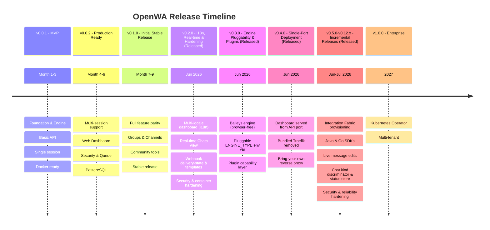
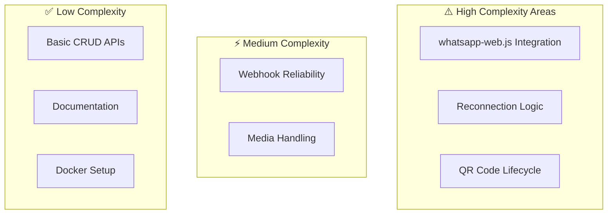
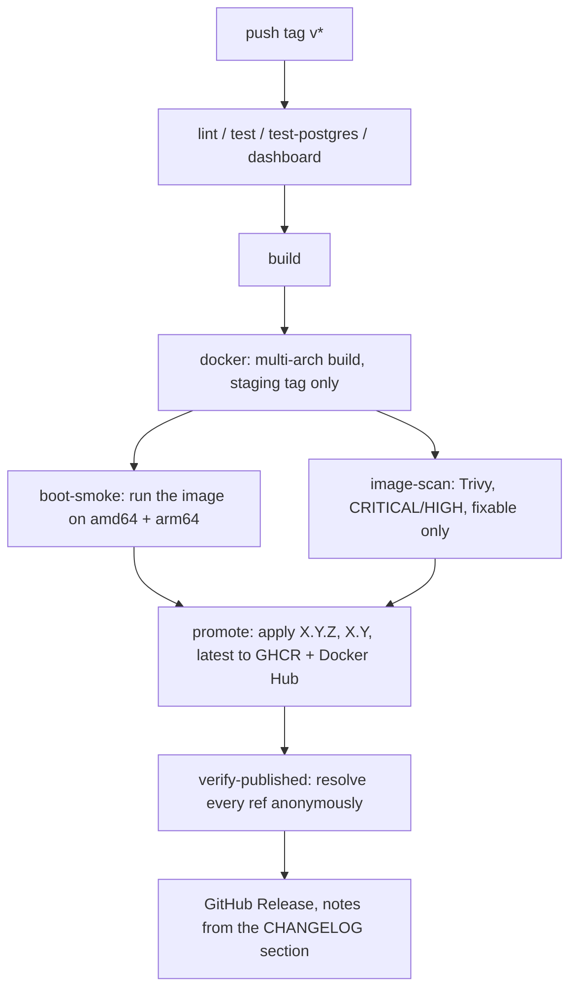

# 15 - Project Roadmap

## 15.1 Release Strategy



### Release Summary

| Version | Focus                                                      | Status      |
| ------- | ---------------------------------------------------------- | ----------- |
| v0.0.1  | MVP - Basic API                                            | ✅ Released |
| v0.0.2  | Production Ready                                           | ✅ Released |
| v0.1.0  | Initial Stable Release                                     | ✅ Released |
| v0.1.7  | Maintenance & fixes                                        | ✅ Released |
| v0.1.8  | Maintenance & fixes                                        | ✅ Released |
| v0.2.0  | i18n, Real-time Chats & Hardening                          | ✅ Released |
| v0.2.1  | Dashboard split-origin fix                                 | ✅ Released |
| v0.2.2  | Security hardening (SSRF, secrets, Prometheus metrics)     | ✅ Released |
| v0.2.3  | Plain-HTTP / LAN dashboard fixes                           | ✅ Released |
| v0.2.4  | CORS LAN fix, pinnable WA-Web version                      | ✅ Released |
| v0.2.5  | Pairing-code linking                                       | ✅ Released |
| v0.2.6  | Chromium hardened-container (read-only) fix                | ✅ Released |
| v0.2.7  | Typing simulation, delete-chat, engine-agnostic groundwork | ✅ Released |
| v0.2.8  | Engine decoupling (ack/type/JID), templates, @lid→phone    | ✅ Released |
| v0.2.9  | Reliability/security/a11y hardening (RBAC, deps, shutdown, retention) | ✅ Released |
| v0.2.10 | Dashboard/CI follow-ups (MessageTester JID, neutral MessageType, qemu v4) | ✅ Released |
| v0.3.0  | Engine pluggability (Baileys engine, plugin layer)                              | ✅ Released |
| v0.4.0  | Single-port deployment (dashboard on API port, Traefik removed)                 | ✅ Released |
| v0.5.x  | Plugin/dashboard hardening and SDK/docs increments                              | ✅ Released |
| v0.6.x  | Operational hardening, API surface refinements, dashboard follow-ups            | ✅ Released |
| v0.7.x  | Dashboard chat UX, infra backup/restore, media-download toggle, infra follow-ups | ✅ Released |
| v0.8.x  | Integration Fabric provisioning (instance API + dashboard tab), Java & Go SDKs   | ✅ Released |
| v0.9.0  | Live message-edit events; `general.sessionTimeout` dropped from settings         | ✅ Released |
| v0.10.x | Chat `kind` discriminator, 24-hour status store, Docker Hub dual-publish         | ✅ Released |
| v0.11.0 | SDK poll / profile-picture / status-media coverage, security & reliability hardening | ✅ Released |
| v0.12.x | Session/engine decomposition (`EngineRegistry`), plugin lifecycle and configuration-precedence fixes | ✅ Released |
| v1.0.0  | Enterprise Ready (K8s Operator, multi-tenant)                                   | 📋 Planned  |

> SDK / docs-site / observability features are delivered **incrementally** as they're additive — they no
> longer gate a single version. The five client SDKs landed this way across `0.7.3`–`0.8.19`; the docs
> site, a Postman export, Grafana and OpenTelemetry remain open (see §15.6). The version **number**
> follows SemVer (see §15.2), not the theme.

### Risk Buffer

Each phase includes a 2–3 week buffer for:

- Bug fixing and stabilization
- WhatsApp protocol changes
- Community feedback integration
- Documentation updates

### Prerequisites & Resources

| Requirement        | Details                                                   |
| ------------------ | --------------------------------------------------------- |
| **Development**    | 1-2 full-time developers (or equivalent part-time)        |
| **Environment**    | Node.js 22 LTS, Docker, Git                               |
| **Testing**        | WhatsApp test accounts (2-3 numbers)                      |
| **Infrastructure** | VPS for staging (2GB RAM minimum)                         |
| **Accounts**       | GitHub organization, npm registry access, Docker Hub/GHCR |

## 15.2 Version Numbering

```
MAJOR.MINOR.PATCH

MAJOR: Breaking changes
MINOR: New features (backward compatible)
PATCH: Bug fixes

Examples:
0.0.1 - Initial MVP
0.0.2 - Production Ready (Multi-session, Dashboard)
0.1.0 - Initial Stable Release (Full features)
0.1.1 - Bug fix for QR timeout
0.2.0 - i18n, Real-time Chats, Webhook Delivery-state & Hardening
0.3.0 - Engine Pluggability (Baileys engine, plugin layer)
1.0.0 - Enterprise Ready
2.0.0 - Breaking API changes
```

### Pre-1.0 policy (we are here)

While the project is on `0.x`, a `1.0.0`/`2.0.0` bump for every breaking change isn't appropriate, so we
follow the SemVer "major version zero" convention:

- **PATCH (`0.2.x`)** — bug fixes **and** backward-compatible additions (new endpoints, optional fields,
  new opt-in features). The default for ongoing work.
- **MINOR (`0.3.0`, `0.4.0`, …)** — **breaking changes** (removed/renamed fields, changed payload
  semantics, deployment-topology changes). A breaking change does **not** stay in `0.2.x`.
- Every breaking change ships with a prominent **⚠️ callout + migration note** in the CHANGELOG and the
  GitHub release, because the version number alone won't fully signal it pre-1.0.

> Note: `0.2.8` shipped one breaking change (webhook `type` neutralization, #270) as a patch — that
> predates this policy and is documented with a migration note; the policy applies from `0.2.9` onward.

## 15.3 Phase 1: MVP (Month 1-3)

### Goals

- Working single-session API
- Basic send/receive functionality
- Docker deployment ready
- Stable WhatsApp connection

### Milestones



```mermaid
gantt
    title Phase 1 - MVP (12 weeks)
    dateFormat  X
    axisFormat Week %W

    section Foundation (Week 1-2)
    Project setup           :done, p1-1, 0, 5d
    Database schema         :done, p1-2, after p1-1, 3d
    Basic NestJS structure  :done, p1-3, after p1-2, 4d

    section WhatsApp Engine (Week 3-5)
    Engine abstraction layer :p1-4, after p1-3, 3d
    whatsapp-web.js wrapper  :p1-5, after p1-4, 7d
    Connection management    :p1-6, after p1-5, 4d
    QR code handling         :p1-7, after p1-6, 3d

    section Session (Week 6-7)
    Session entity & CRUD    :p1-8, after p1-7, 4d
    Session persistence      :p1-9, after p1-8, 4d
    Auto-reconnect logic     :p1-10, after p1-9, 3d

    section Messaging (Week 8-9)
    Send text message        :p1-11, after p1-10, 3d
    Send image               :p1-12, after p1-11, 2d
    Send video/audio         :p1-13, after p1-12, 3d
    Send document            :p1-14, after p1-13, 2d

    section Webhook (Week 10)
    Receive messages event   :p1-15, after p1-14, 2d
    Webhook delivery         :p1-16, after p1-15, 3d
    Retry mechanism          :p1-17, after p1-16, 2d

    section Infrastructure (Week 10-11)
    Docker setup             :p1-18, after p1-3, 3d
    CI/CD pipeline           :p1-18b, after p1-18, 3d
    Swagger documentation    :p1-19, after p1-17, 2d
    Health endpoints         :p1-20, after p1-19, 1d
    Basic logging            :p1-21, after p1-20, 2d

    section Stabilization (Week 12)
    Integration testing      :p1-22, after p1-21, 3d
    Bug fixes                :p1-23, after p1-22, 3d
    Documentation            :p1-24, after p1-23, 2d
    v0.0.1 Release           :milestone, p1-25, after p1-24, 0d
```

### Complexity Notes



| Area                        | Complexity | Time Buffer |
| --------------------------- | ---------- | ----------- |
| whatsapp-web.js integration | High       | +1 week     |
| Connection stability        | High       | +1 week     |
| Media handling              | Medium     | +3 days     |
| Webhook delivery            | Medium     | +3 days     |

### v0.0.1 Features

> **Note:** Phase 1 release - MVP with core API functionality.

#### Core API & Session Management

| Feature            | Priority | Status |
| ------------------ | -------- | ------ |
| Create session     | P0       | ✅     |
| Delete session     | P0       | ✅     |
| Get session status | P0       | ✅     |
| Generate QR code   | P0       | ✅     |
| Session reconnect  | P1       | ✅     |

#### Basic Messaging

| Feature           | Priority | Status |
| ----------------- | -------- | ------ |
| Send text message | P0       | ✅     |
| Send image        | P0       | ✅     |
| Send video        | P1       | ✅     |
| Send audio        | P1       | ✅     |
| Send document     | P1       | ✅     |
| Receive messages  | P0       | ✅     |

#### Basic Webhooks

| Feature          | Priority | Status |
| ---------------- | -------- | ------ |
| Webhook delivery | P0       | ✅     |
| Webhook retry    | P0       | ✅     |

#### Infrastructure

| Feature        | Priority | Status |
| -------------- | -------- | ------ |
| SQLite storage | P0       | ✅     |
| Docker support | P0       | ✅     |
| Health check   | P1       | ✅     |
| Swagger docs   | P0       | ✅     |

### Deliverables

```
v0.0.1 Release Package:
├── Docker image (ghcr.io/rmyndharis/openwa:0.0.1)
├── docker-compose.yml
├── Basic API documentation (Swagger)
├── README with quick start
├── Single session example
└── CI/CD workflows (GitHub Actions)
    ├── Build & test pipeline
    └── Docker image build
```

## 15.4 Phase 2: Production Ready (Month 4-6)

### Goals

- Multi-session support
- Web dashboard
- Production-grade security
- Database scalability

### Milestones



```mermaid
gantt
    title Phase 2 - Production Ready (12 weeks)
    dateFormat  X
    axisFormat Week %W

    section Multi-session (Week 1-3)
    Session manager redesign    :p2-1, 0, 5d
    Memory management           :p2-2, after p2-1, 4d
    Concurrent sessions         :p2-3, after p2-2, 4d
    Session isolation           :p2-4, after p2-3, 3d
    Resource quotas             :p2-5, after p2-4, 3d

    section Database (Week 4-5)
    PostgreSQL adapter          :p2-6, 0, 4d
    Migration system            :p2-7, after p2-6, 3d
    Connection pooling          :p2-8, after p2-7, 2d
    Table partitioning          :p2-9, after p2-8, 3d

    section Security (Week 5-7)
    API key system              :p2-10, after p2-5, 4d
    Permission model            :p2-11, after p2-10, 3d
    Rate limiting               :p2-12, after p2-11, 3d
    IP whitelisting             :p2-13, after p2-12, 2d
    Audit logging               :p2-14, after p2-13, 3d

    section Queue System (Week 6-7)
    Redis integration           :p2-15, after p2-9, 3d
    Bull queue setup            :p2-16, after p2-15, 3d
    Webhook queue               :p2-17, after p2-16, 2d
    Message queue               :p2-18, after p2-17, 2d

    section Dashboard (Week 8-10)
    React + bespoke-CSS setup   :p2-19, after p2-18, 3d
    Authentication UI           :p2-20, after p2-19, 3d
    Session management          :p2-21, after p2-20, 4d
    QR code display             :p2-22, after p2-21, 2d
    Webhook management          :p2-23, after p2-22, 4d
    Logs viewer                 :p2-24, after p2-23, 3d
    Test message sender         :p2-25, after p2-24, 2d

    section Stabilization (Week 11-12)
    Load testing                :p2-26, after p2-25, 3d
    Security audit              :p2-27, after p2-26, 3d
    Performance tuning          :p2-28, after p2-27, 3d
    v0.0.2 Release              :milestone, p2-29, after p2-28, 0d
```

### v0.0.2 Features

> **Note:** Phase 2 release - Production Ready with multi-session, dashboard, and security.

#### Multi-Session & Database

| Feature            | Priority | Status |
| ------------------ | -------- | ------ |
| Multi-session      | P0       | ✅     |
| Session isolation  | P0       | ✅     |
| Proxy per session  | P1       | ✅     |
| PostgreSQL support | P0       | ✅     |
| Redis cache        | P1       | ✅     |
| Job queue (Bull)   | P1       | ✅     |
| Connection pooling | P1       | ✅     |

#### Security & Auth

| Feature                | Priority | Status |
| ---------------------- | -------- | ------ |
| API key authentication | P0       | ✅     |
| Rate limiting          | P0       | ✅     |
| Permission system      | P1       | ✅     |
| IP whitelisting        | P2       | ✅     |
| Audit logging          | P2       | ✅     |

#### Dashboard

| Feature               | Priority | Status |
| --------------------- | -------- | ------ |
| Web dashboard         | P0       | ✅     |
| Session management UI | P0       | ✅     |
| QR code display       | P0       | ✅     |
| Webhook management UI | P1       | ✅     |
| Logs viewer           | P1       | ✅     |
| Test message sender   | P2       | ✅     |

### Deliverables

```
v0.0.2 Release Package:
├── Docker image (ghcr.io/rmyndharis/openwa:0.0.2)
├── docker-compose.yml (with PostgreSQL & Redis)
├── Web Dashboard
├── API authentication (API keys)
├── Enhanced API documentation
├── Multi-session examples
└── Production deployment guide
```

## 15.5 Phase 3: Advanced Features (Month 7-9)

### Goals

- Complete feature parity with WAHA Plus
- Stable v0.1.0 release
- Community adoption

### Milestones



```mermaid
gantt
    title Phase 3 - Advanced Features (12 weeks)
    dateFormat  X
    axisFormat Week %W

    section Groups (Week 1-2)
    Get groups list         :p3-1, 0, 2d
    Group info & members    :p3-2, after p3-1, 2d
    Create group            :p3-3, after p3-2, 2d
    Manage participants     :p3-4, after p3-3, 3d
    Group settings          :p3-5, after p3-4, 2d

    section Channels (Week 3-4)
    Channel list            :p3-6, 0, 2d
    Channel messages        :p3-7, after p3-6, 3d
    Create channel          :p3-8, after p3-7, 2d

    section Advanced Messages (Week 5-6)
    Send location           :p3-9, after p3-5, 1d
    Send contact            :p3-10, after p3-9, 1d
    Send sticker            :p3-11, after p3-10, 2d
    Message reactions       :p3-12, after p3-11, 1d
    Reply to message        :p3-13, after p3-12, 1d
    Forward message         :p3-14, after p3-13, 1d

    section Scaling (Week 7-8)
    Horizontal scaling docs :p3-15, after p3-8, 3d
    Session affinity        :p3-16, after p3-15, 2d
    Load testing            :p3-17, after p3-16, 2d

    section Community (Week 9-10)
    n8n community node      :p3-18, after p3-17, 3d
    Example projects        :p3-19, after p3-18, 2d
    Video tutorials         :p3-20, after p3-19, 3d

    section Release (Week 11-12)
    Security audit          :p3-21, after p3-20, 3d
    Performance tuning      :p3-22, after p3-21, 2d
    v0.1.0 Release          :milestone, p3-23, after p3-22, 0d
```

### v0.1.0 Features

> **Note:** Phase 3 release - Initial Stable Release with full feature parity.

#### Advanced Messaging

| Feature           | Priority | Status |
| ----------------- | -------- | ------ |
| Send location     | P1       | ✅     |
| Send contact      | P1       | ✅     |
| Send sticker      | P2       | ✅     |
| Message reactions | P2       | ✅     |
| Reply to message  | P1       | ✅     |
| Forward message   | P1       | ✅     |
| Message history   | P2       | ✅     |

#### Groups, Channels & Contacts

| Feature             | Priority | Status |
| ------------------- | -------- | ------ |
| Groups API (full)   | P0       | ✅     |
| Channels/Newsletter | P1       | ✅     |
| Labels management   | P2       | ✅     |
| Contact list API    | P1       | ✅     |

#### Scaling & Infrastructure

| Feature            | Priority | Status |
| ------------------ | -------- | ------ |
| Horizontal scaling | P2       | 📄 Design reference only; single active owner per session remains required |
| Session affinity   | P2       | 📄 Documented for future topology, not implemented as multi-replica runtime |
| Security audit     | P0       | ✅     |

#### Community & Tooling

| Feature         | Priority | Status             |
| --------------- | -------- | ------------------ |
| n8n integration | P1       | ✅ (separate repo) |
| CI/CD pipeline  | P0       | ✅                 |

### Deliverables

```
v0.1.0 Release Package:
├── Docker image (ghcr.io/rmyndharis/openwa:0.1.0)
├── docker-compose.yml (production ready)
├── Full-featured Web Dashboard
├── Complete API documentation (Swagger)
├── README with comprehensive guide
├── Integration examples
│   ├── n8n community node
│   └── Basic automation examples
└── CI/CD workflows (GitHub Actions)
    ├── Build & test pipeline
    ├── Docker image build & push
    └── Release automation
```

## 15.6 Future Roadmap (v0.3.0+)

> **Note:** Version 0.1.0 is the initial stable release including all features from Phases 1-3.
> Versions 0.1.7 through 0.11.0 have since shipped (see the CHANGELOG); v1.0.0
> onward is forward-looking.

```mermaid
flowchart LR
    subgraph Phase1["Phase 1"]
        V001[v0.0.1 - MVP<br/>Basic API & Single Session]
    end

    subgraph Phase2["Phase 2"]
        V002[v0.0.2 - Production Ready<br/>Multi-session & Dashboard]
    end

    subgraph Stable["✅ Released"]
        V010[v0.1.0 - Initial Stable Release<br/>All Core Features]
        V020[v0.2.0 - i18n, Real-time Chats,<br/>Webhook Delivery-state & Hardening]
    end

    subgraph v0.x["✅ Released (v0.3–v0.11)"]
        V030[v0.3.0 - Engine Pluggability<br/>Baileys engine + plugin layer]
        V040[v0.4.0 - Single-Port Deployment<br/>Dashboard on API port, no bundled Traefik]
        V011[v0.5.0-v0.12.x - Incremental releases<br/>see the CHANGELOG]
    end

    subgraph v1.x["v1.x Series - Enterprise"]
        V10[v1.0.0 - Enterprise Ready]
    end

    Phase1 --> Phase2 --> Stable --> v0.x --> v1.x
```



### v0.2.0 - i18n, Real-time Chats, Webhook Delivery-state & Hardening (Released)

| Feature                          | Priority | Status |
| -------------------------------- | -------- | ------ |
| Multi-locale dashboard (i18n)    | P1       | ✅     |
| Real-time Chats view (WebSocket) | P1       | ✅     |
| Message templates                | P1       | ✅     |
| Webhook delivery-state tracking  | P1       | ✅     |
| Security & API surface hardening | P0       | ✅     |
| Container / Podman hardening     | P1       | ✅     |

### v0.3.0 — Engine pluggability & plugin layer (Released)

`0.3.0` shipped as a **breaking** release (per §15.2). It introduced a pluggable engine layer
(`ENGINE_TYPE` env var: `whatsapp-web.js` default or `baileys` for a browser-free alternative loaded
lazily), moved Puppeteer/browser config out of the neutral engine contract (#265), and added a Tier-2
plugin capability layer (`ctx.messages` / `ctx.engine`; `PluginContext.getService` removed).
Ships with a migration guide.

### v0.4.0 — Single-port deployment (Released)

`0.4.0` shipped as a **breaking** release. The dashboard SPA is now served directly from the API on its
own port (default `:2785`) via `@nestjs/serve-static`; the bundled Traefik service is removed (#275,
#276). Use your own reverse proxy (nginx, Caddy, a cloud load balancer) for TLS/public exposure.
`SERVE_DASHBOARD=false` opts out. The `DASHBOARD_PORT`, `PROXY_ENABLED`, and `DASHBOARD_ENABLED` env
vars are removed. Ships with a migration guide.

#### Incremental themes — SDK, Developer Tools & Observability

Delivered additively whenever ready, per SemVer (not gated to one version). Prometheus metrics shipped
in `0.2.2` and the five client SDKs across `0.7.3`–`0.8.19`; the rest remain open.

| Feature                | Priority | Status | Description                     |
| ---------------------- | -------- | ------ | ------------------------------- |
| JavaScript/Node.js SDK | P1       | ✅ Shipped (`@rmyndharis/openwa`) | Official client library |
| Python SDK             | P2       | ✅ Shipped (`rmyndharis-openwa`) | Python client library |
| PHP SDK                | P2       | ✅ Shipped (`rmyndharis/openwa`) | PHP client library |
| Java SDK               | P2       | ✅ Shipped (`com.rmyndharis:openwa`) | Java client library |
| Go SDK                 | P2       | ✅ Shipped (`github.com/rmyndharis/OpenWA/sdk/go`) | Go client library |
| Postman Collection     | P1       | ◐ cURL collection (doc 07); Postman export TBD | Ready-to-use API collection |
| Docs Site              | P1       | ☐ Open | Documentation website |
| Video Tutorials        | P2       | ☐ Open | Getting started video series    |
| Example Projects       | P1       | ◐ A few under `docs/examples/` | Real-world integration examples |

**Performance & Observability**

| Feature                | Priority | Status | Description                      |
| ---------------------- | -------- | ------ | -------------------------------- |
| Prometheus Metrics     | P1       | ✅ Shipped (`GET /api/metrics`, `openwa_*`) | /metrics endpoint for monitoring |
| Grafana Dashboard      | P2       | ☐ Open | Pre-built monitoring dashboard   |
| OpenTelemetry Tracing  | P2       | ☐ Open | Distributed tracing support      |
| Performance Benchmarks | P1       | ☐ Open | Documented performance metrics   |
| Memory Optimization    | P1       | ☐ Open | Reduced memory per session       |

### Integration Fabric — inbound integrations for plugins (in progress)

A core substrate that lets sandboxed marketplace plugins implement bidirectional external integrations
(helpdesk agent inboxes, chatbot flow builders, CRMs) **without running their own server**. Until now a
plugin could only make outbound calls; the Integration Fabric adds a governed **inbound** path — the core
receives a signature-verified webhook, dedups and queues it, and hands it to the plugin, which replies to
the WhatsApp chat through a normalized capability. The core owns ingress, verification, ordering,
delivery, and the dead-letter queue; the plugin owns only provider-specific logic. Plugins consume it
through a stable, versioned **Integration SDK (v1)**. Motivated by #553.

Delivered in phases (additive; see [25 - Integration Fabric](./25-integration-fabric.md) for the
architecture and design rationale):

| Phase | Scope                                                                                                                                                                          | Status                         |
| ----- | ------------------------------------------------------------------------------------------------------------------------------------------------------------------------------ | ------------------------------ |
| P0    | Core substrate: inbound webhook RPC, `@Public` ingress endpoint with HMAC-over-raw-body verification, plugin-instance primitive, normalized send capability, identity/dedup/DLQ tables, ingress queue. SDK v1 frozen. | ✅ Merged (internal substrate) |
| P1    | Scale-correctness: per-conversation FIFO ordering, per-instance fairness, DLQ redrive, bot/human handover.                                                                    | ✅ Merged (internal substrate) |
| P2    | Operator provisioning (mint plugin instances and secrets, dashboard) + the first adapter (helpdesk inbox) shipped as a marketplace plugin — closes #553 end-to-end.           | ✅ Shipped (provisioning `0.8.0`; adapter needs `0.8.7`+) |
| P3    | A second ingress adapter — validates the substrate generalizes beyond the first consumer.                                                                                     | ✅ Shipped (`supabase-otp-hook`) |
| P4    | Developer experience: SDK reference docs, compatibility test suite, multi-node routing.                                                                                       | 📋 Planned                     |

> **Provisioning is operator-facing since `0.8.0`.** An ADMIN key mints a per-plugin instance and its
> ingress secret through `POST /api/integration/plugins/:pluginId/instances`, and rotates that secret
> through `POST /api/integration/plugins/:pluginId/instances/:instanceId/regenerate-secret`; both are also
> reachable from the **Instances** tab of the dashboard plugin dialog. Rotation is a hard cutover — the old
> secret stops verifying the moment the new one is minted, so a dual-secret grace window is still open.
> `chatwoot-adapter` is P2's helpdesk adapter and needs a gateway on `0.8.7`+. P3 is closed by
> `supabase-otp-hook`, the second official ingress plugin — a different vehicle than the chatbot flow
> builder this row originally named, but it is what proved the substrate generalizes to an independent
> consumer. Adapters ship from the
> [OpenWA-plugins](https://github.com/rmyndharis/OpenWA-plugins) catalog, so consult that repository for
> each plugin's declared capabilities. P4 remains open: the published SDK reference, a compatibility test
> suite, and multi-node routing.

### v1.0.0 - Enterprise Ready

| Feature             | Priority | Description                    |
| ------------------- | -------- | ------------------------------ |
| Kubernetes Operator | P3       | Native K8s deployment          |
| Multi-tenant        | P3       | Enterprise SaaS features       |
| Encryption at rest  | P2       | Full data encryption           |
| Audit compliance    | P2       | SOC2, GDPR compliance          |
| WhatsApp Pay        | P3       | Payment links integration      |

## 15.7 Cutting a Release

Releases are cut by a maintainer from `main`. There is no release branch and no release PR: the
version bump lands as a single commit on `main`, and pushing the tag hands everything else to
`.github/workflows/release.yml`.

### Before you start

- `main` is green and holds everything intended for the release. Cross-check the merged PRs against
  the `[Unreleased]` entries: `git log <last-tag>..HEAD --oneline`.
- Working tree clean, on `main`, and `git config user.email` is the intended author identity.
- The release job needs `DOCKERHUB_USERNAME` / `DOCKERHUB_TOKEN` (promotion logs into both
  registries before applying any tag) and optionally `RELEASE_PAT` (authors the GitHub Release as a
  user rather than the bot). Check with `gh secret list`.
- Pick the version per [15.2](#152-version-numbering). Pre-1.0, a release containing **any**
  breaking change is a MINOR — patch releases carry none.

### The release commit

Exactly four files change. Nothing else belongs in this commit.

```bash
npm version --no-git-tag-version <version>   # package.json + package-lock.json
npm run openapi:export                        # openapi.json info.version follows package.json
```

Then in `CHANGELOG.md`, insert the new heading directly under the retained, now-empty
`## [Unreleased]` — the accumulated entries fall under it by position:

```markdown
## [Unreleased]

## [<version>] - <YYYY-MM-DD>
```

`## [<version>]` is not cosmetic: `npm run check:versions` fails without it, and the GitHub Release
body is extracted from this heading to the next `## [`. An absent or misspelled heading silently
degrades the release notes to a bare `Release v<version>`.

### Verify, commit, tag

Run the same gates the tag will run, so a failure costs a local minute rather than a released tag:

```bash
npm run check:versions && npm run openapi:check && npm run lint && npm run format:check
npx tsc --noEmit -p tsconfig.json && npm run check:dockerignore
npm audit --audit-level=high
npm test && npm run test:e2e && npm run build
cd dashboard && npm run lint && npm run typecheck && npm run i18n:check && npm run build && npm run test:unit
```

```bash
git add package.json package-lock.json openapi.json CHANGELOG.md
git commit -m "chore(release): v<version>"
git tag -a v<version> -m "v<version>"
git push origin main --follow-tags
```

The tag must be annotated and `v`-prefixed; `release.yml` triggers on `v*` and refuses to proceed if
the tag string and `package.json` disagree.

### What the tag automates



The build publishes **only** a `smoke-<run_id>` staging tag. Release tags are applied by `promote`,
after the image has both booted on each architecture and passed the vulnerability scan, so a tag
never points at an image that was not tested. `verify-published` then re-resolves every promoted ref
with no registry login, asserting public pullability and digest identity on both platforms. The
GitHub Release is gated on all of it.

Prereleases (`-rc`, `-beta`, `-alpha` in the tag) skip the mutable `X.Y` and `latest` channels and
are flagged prerelease on GitHub.

### When a gate fails

Everything from `promote` onward is skipped, so no release tag reaches either registry and no GitHub
Release is created — the previous release stays intact. Confirm that is what happened, fix the cause
on `main`, then re-tag the version **only if nothing was published under it**:

```bash
git push origin :refs/tags/v<version>   # delete the remote tag
git tag -d v<version>
# ... commit the fix ...
git tag -a v<version> -m "v<version>" && git push origin v<version>
```

Re-using a version is safe precisely because nothing was published under it. A version that DID
publish before a defect was found must not be re-tagged — never move or reuse an already-pushed tag;
supersede it with a new release instead (e.g. `v0.10.3` → `v0.10.4`).

Two failure classes are worth anticipating because they depend on the outside world rather than on
the change being released:

- **`npm audit --audit-level=high`** in the release gate is time-dependent: a tree that was clean
  last week can fail on a newly published advisory.
- **The image scan reads the base image**, including the dependency tree bundled inside its npm CLI,
  which `npm audit` never sees. Accepted findings live in `.trivyignore`, each with a written
  justification and the condition for removing it.

### After the release

```bash
gh run list --workflow=release.yml --limit 1
gh release view v<version>
docker buildx imagetools inspect ghcr.io/rmyndharis/openwa:<version>
docker buildx imagetools inspect docker.io/rmyndharis/openwa:latest
```

Do the registry checks logged **out**. A promotion can look green while the tags are unreachable to
everyone else — that is the failure mode that took `latest`, `0.10` and `0.10.5` offline after
v0.10.5 published its GitHub Release.

Upgrading a Compose deployment is `git pull && docker compose up -d --build`: the bundled
`docker-compose.yml` **builds** the API service rather than pulling it, so `docker compose pull` is
a no-op for OpenWA itself.

## 15.8 Success Metrics

### Phase 1 Success Criteria

| Metric                     | Target    | Type     |
| -------------------------- | --------- | -------- |
| Core API endpoints working | 100%      | Internal |
| Docker deployment works    | ✅        | Internal |
| Single session stable      | 24+ hours | Internal |
| Message delivery rate      | > 95%     | Internal |
| API response time          | < 500ms   | Internal |
| CI/CD pipeline operational | ✅        | Internal |

### Phase 2 Success Criteria

| Metric                | Target       | Actual            | Type     |
| --------------------- | ------------ | ----------------- | -------- |
| Multi-session support | 10+ sessions | ✅ Achieved       | Internal |
| Dashboard functional  | All features | ✅ Achieved       | Internal |
| PostgreSQL stable     | ✅           | ✅ Achieved       | Internal |
| Webhook delivery rate | > 99%        | ✅ Achieved       | Internal |
| Test coverage         | > 70%        | ⚠️ 66.87% line coverage; 80% improvement plan active | Internal |
| GitHub stars          | 100+         | 📋 Pending        | External |

### Phase 3 Success Criteria

| Metric                        | Target  | Actual            | Type     |
| ----------------------------- | ------- | ----------------- | -------- |
| Feature parity with WAHA Plus | 90%+    | ✅ Achieved       | Internal |
| API response time (p95)       | < 200ms | ✅ Achieved       | Internal |
| Test coverage                 | > 80%   | ⚠️ 66.87% line coverage; in progress | Internal |
| Documentation coverage        | 100%    | ✅ 95%+           | Internal |
| Production users              | 50+     | 📋 Pending        | External |
| GitHub stars                  | 500+    | 📋 Pending        | External |
| Community contributors        | 5+      | 📋 Pending        | External |

---

<div align="center">

[← 14 - Migration Guide](./14-migration-guide.md) · [Documentation Index](./README.md) · [Next: 16 - Risk Management →](./16-risk-management.md)

</div>
