# 16 - Risk Management

## 16.1 Risk Overview

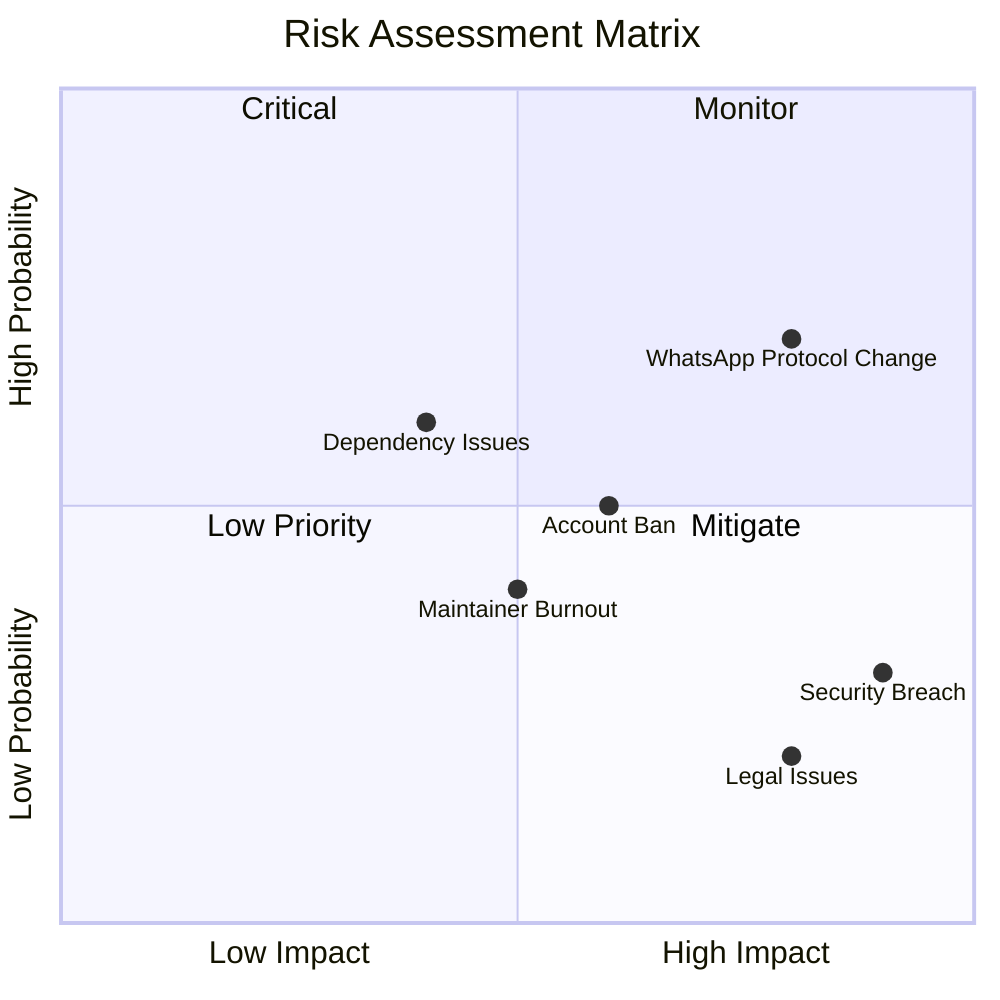

## 16.2 Risk Register

### R001: WhatsApp Protocol Changes

| Attribute | Value |
|-----------|-------|
| **ID** | R001 |
| **Category** | Technical |
| **Probability** | High (70%) |
| **Impact** | High |
| **Risk Level** | Critical |

**Description:**  
WhatsApp can change their Web protocol at any time, which can cause the `whatsapp-web.js` library to stop working.

**Indicators:**
- Spike in `whatsapp-web.js` issues
- Sudden increase in error rates
- Authentication failures

**Mitigation Strategies:**

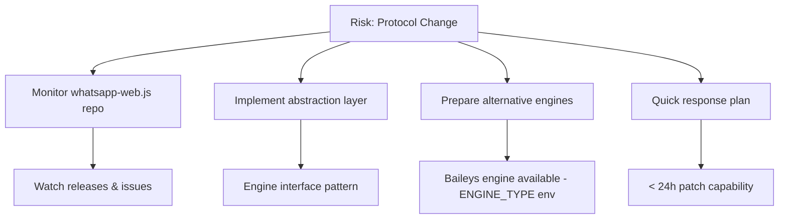

**Action Items:**
1. Subscribe to `whatsapp-web.js` releases
2. Engine abstraction layer — implemented (pluggable `ENGINE_TYPE`: `whatsapp-web.js` default, `baileys` alternative)
3. Document fallback procedures
4. Maintain relationships with library maintainers

---

### R002: User Account Banned

| Attribute | Value |
|-----------|-------|
| **ID** | R002 |
| **Category** | Operational |
| **Probability** | Medium (50%) |
| **Impact** | Medium |
| **Risk Level** | Medium |

**Description:**  
WhatsApp users can be banned for using unofficial APIs or behavior detected as spam.

**Indicators:**
- User reports of banned accounts
- Sudden disconnections
- QR code fails for specific numbers

**Mitigation Strategies:**

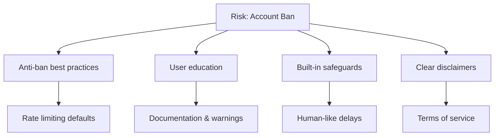

**Built-in Safeguards:**

```typescript
// src/modules/message/bulk-message.service.ts — bulk-send pacing defaults
const options = {
  delayBetweenMessages: dto.options?.delayBetweenMessages ?? 3000, // 3s (DTO range 1000–60000)
  randomizeDelay: dto.options?.randomizeDelay ?? true,             // adds 0–2s jitter per message
  stopOnError: dto.options?.stopOnError ?? false,
};
```

Alongside that:

- `SIMULATE_TYPING` (on by default; `SIMULATE_TYPING_MAX_MS` default 5000) shows the engine's typing
  indicator and pauses for a length-scaled, jittered interval before a **text** send — `send-text`,
  and `send-template` only because it renders to text and delegates to the same path. Every other
  send (image, video, audio, document, sticker, location, contact, poll, reply, forward) reaches the
  engine with no typing indicator and no pause.
- `BULK_MAX_CONCURRENT_BATCHES` (default 50, `0` = unlimited) caps concurrent bulk batches per process.
- A single bulk request carries at most 100 messages (`@ArrayMaxSize(100)` on
  `SendBulkMessageDto.messages`); a 101st entry is rejected by the global `ValidationPipe` with HTTP 400.

Not implemented: there are no per-minute / per-hour / per-day send caps, no media-specific delay and
no new-number warmup enforcement. The guidelines below are operator discipline, not something the
gateway enforces.

**User Guidelines:**

```markdown
## Anti-Ban Best Practices

### DO ✅
- Warm up new numbers (normal usage for 1-2 weeks)
- Use realistic delays between messages
- Personalize messages (avoid identical content)
- Respond to incoming messages
- Use residential proxies if needed

### DON'T ❌
- Send bulk messages to unknown numbers
- Use identical message templates
- Send >100 messages/day on new numbers
- Ignore replies (one-way communication)
- Use datacenter IPs without proxy
```

---

### R003: Security Breach

| Attribute | Value |
|-----------|-------|
| **ID** | R003 |
| **Category** | Security |
| **Probability** | Low (30%) |
| **Impact** | Critical |
| **Risk Level** | High |

**Description:**  
Security vulnerabilities may lead to unauthorized access to sessions, data, or infrastructure.

**Potential Vectors:**
- API key leakage
- SQL injection
- Insecure session storage
- Dependency vulnerabilities

**Mitigation Strategies:**

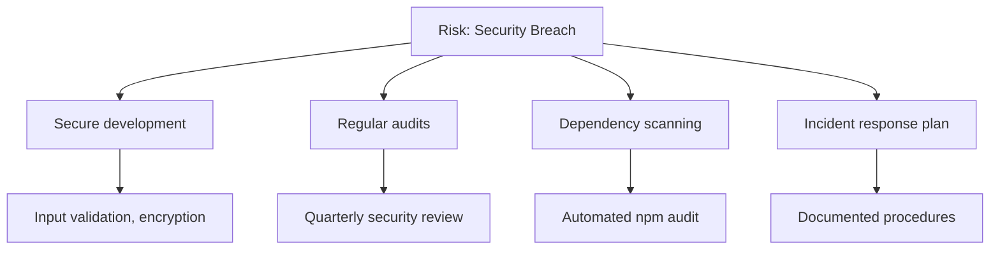

**Security Checklist:**

```markdown
## Security Review Checklist

### Code Security
- [ ] Input validation on all endpoints
- [ ] Parameterized database queries
- [ ] API key hashing (never plain storage)
- [ ] Sensitive data encryption
- [ ] No secrets in codebase

### Infrastructure Security
- [ ] HTTPS enforced
- [ ] Security headers configured
- [ ] Rate limiting enabled
- [ ] Firewall rules reviewed
- [ ] Access logs enabled

### Dependency Security
- [ ] npm audit clean
- [ ] Dependabot alerts reviewed
- [ ] Dependencies up to date
- [ ] No known vulnerabilities
```

**Incident Response Plan:**

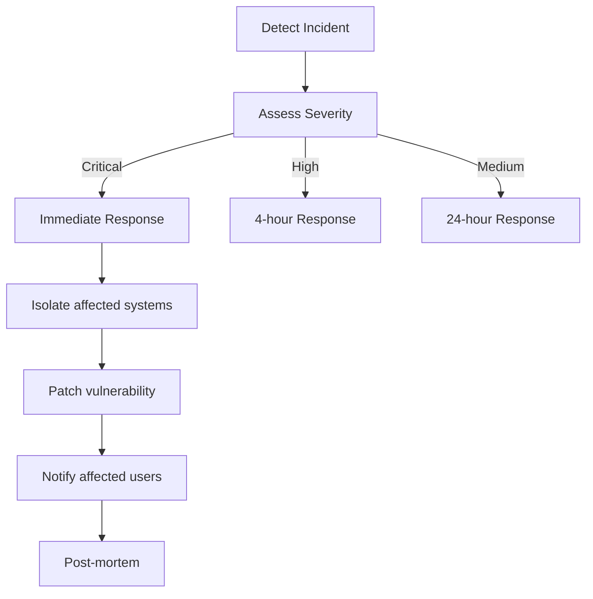

---

### R004: Maintainer Burnout

| Attribute | Value |
|-----------|-------|
| **ID** | R004 |
| **Category** | Organizational |
| **Probability** | Medium (40%) |
| **Impact** | Medium |
| **Risk Level** | Medium |

**Description:**  
An open-source project can stagnate if maintainers burn out or lack time.

**Indicators:**
- Increasing response time to issues
- PR review delays
- Reduced commit frequency
- Maintainer communication gaps

**Mitigation Strategies:**

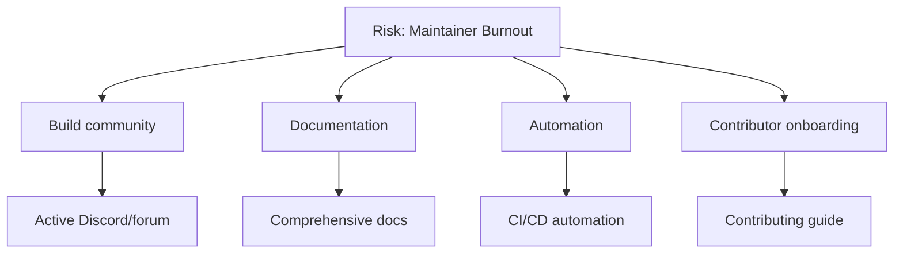

**Sustainability Measures:**

1. **Comprehensive Documentation**
   - Anyone can understand the codebase
   - Clear architecture decisions
   - Troubleshooting guides

2. **Automation**
   - Automated testing
   - Automated releases
   - Issue/PR templates

3. **Community Building**
   - Recognize contributors
   - Good first issues
   - Mentorship program

4. **Multiple Maintainers**
   - Bus factor > 1
   - Clear ownership areas
   - Succession planning

---

### R005: Dependency Vulnerabilities

| Attribute | Value |
|-----------|-------|
| **ID** | R005 |
| **Category** | Technical |
| **Probability** | High (60%) |
| **Impact** | Medium |
| **Risk Level** | Medium |

**Description:**  
Dependencies (`whatsapp-web.js`, Puppeteer, NestJS, etc.) may have vulnerabilities or breaking changes.

**Mitigation Strategies:**

> **Current state:** the real dependency check is a dedicated `audit` job in `ci.yml` running `npm audit --audit-level=high` (on push / PR — not on a daily schedule); it is deliberately split out of the `Lint` job so a newly published advisory cannot abort the other quality gates. `release.yml` repeats the same `npm audit --audit-level=high` and additionally runs a Trivy image scan (`CRITICAL,HIGH`, `ignore-unfixed`) against an explicit `.trivyignore` before the release tags are promoted. Dependabot PRs cover npm for `/` and `/dashboard` (weekly), GitHub Actions (monthly) and Docker base/compose images (weekly), with version-pinned ignores for `typescript >=7` and `better-sqlite3 >=13`. There is **no** standalone `security.yml` and **no** Snyk integration. The workflow below is a recommended enhancement to add scheduled scanning.

```yaml
# .github/workflows/security.yml
name: Security Scan

on:
  schedule:
    - cron: '0 0 * * *'  # Daily
  push:
    branches: [main]

jobs:
  audit:
    runs-on: ubuntu-latest
    steps:
      - uses: actions/checkout@v4
      
      - name: npm audit
        run: npm audit --audit-level=high
        
      - name: Snyk scan
        uses: snyk/actions/node@master
        env:
          SNYK_TOKEN: ${{ secrets.SNYK_TOKEN }}
```

**Dependency Management Policy:**

| Action | Frequency |
|--------|-----------|
| npm audit (`--audit-level=high`, dedicated `audit` job in CI) | Every push / PR |
| Trivy image scan (`CRITICAL,HIGH`, `.trivyignore`) | Every release |
| Snyk scan | Not configured (planned) |
| Dependabot PRs (npm: `/` and `/dashboard`; docker) | Weekly |
| Dependabot PRs (github-actions) | Monthly |
| Major updates | Reviewed manually |
| Security patches | Immediate |

---

### R006: Legal/Compliance Issues

| Attribute | Value |
|-----------|-------|
| **ID** | R006 |
| **Category** | Legal |
| **Probability** | Low (20%) |
| **Impact** | Critical |
| **Risk Level** | Medium |

**Description:**  
WhatsApp/Meta may take legal action against unofficial APIs, or users may misuse the system for illegal activities.

**Mitigation Strategies:**

1. **Clear Disclaimers**

```markdown
## Disclaimer

This project is not affiliated with, authorized, maintained, 
sponsored or endorsed by WhatsApp or any of its affiliates.

This is an independent and unofficial software. Use at your own risk.

By using this software, you agree that:
1. You will not use it for spam or illegal activities
2. You are responsible for compliance with local laws
3. The maintainers are not liable for any misuse
```

2. **Terms of Service for Users**
3. **No support for spam/illegal use cases**
4. **Built-in anti-abuse measures**

---

## 16.3 Risk Monitoring

### Monitoring Dashboard

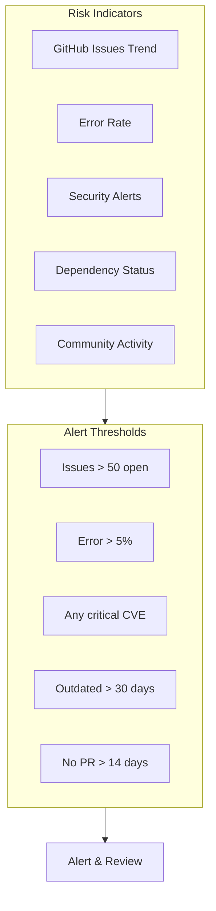

### Weekly Risk Review

```markdown
## Weekly Risk Review Template

### Date: YYYY-MM-DD

### Technical Risks
- [ ] whatsapp-web.js status: ___
- [ ] Error rate trend: ___
- [ ] Security scan results: ___
- [ ] Dependency updates needed: ___

### Operational Risks
- [ ] User ban reports: ___
- [ ] Support ticket volume: ___
- [ ] Performance issues: ___

### Community Health
- [ ] Open issues: ___
- [ ] Open PRs: ___
- [ ] New contributors: ___
- [ ] Response time (avg): ___

### Actions Needed
1. ___
2. ___
3. ___
```

## 16.4 Contingency Plans

### Plan A: WhatsApp Protocol Change

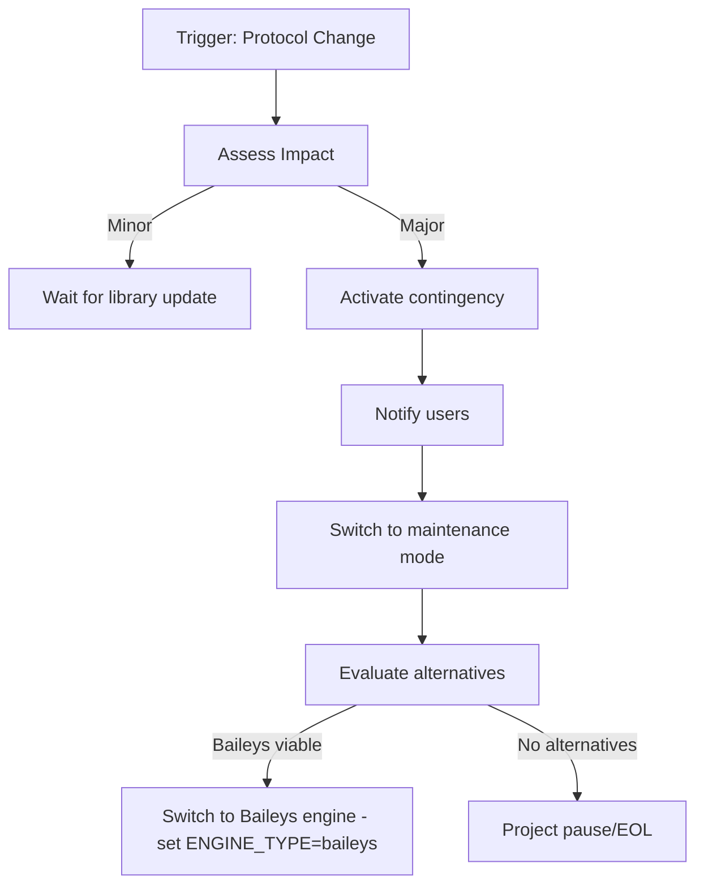

### Plan B: Critical Security Vulnerability

```
Timeline: < 24 hours response

Hour 0-1:
- Assess severity
- Disable affected features if needed
- Notify critical users

Hour 1-4:
- Develop patch
- Test patch
- Prepare release

Hour 4-8:
- Deploy patch
- Notify all users
- Monitor for issues

Hour 8-24:
- Post-mortem
- Update procedures
- Additional hardening
```

### Plan C: Project Handover

```markdown
## Project Handover Checklist

### Documentation
- [ ] Architecture documented
- [ ] All decisions logged
- [ ] Deployment procedures
- [ ] Credentials inventory

### Access
- [ ] GitHub owner transfer
- [ ] npm publish rights
- [ ] Domain ownership
- [ ] Cloud accounts

### Knowledge Transfer
- [ ] Codebase walkthrough
- [ ] Known issues list
- [ ] Roadmap handover
- [ ] Community introduction
```

## 16.5 Additional Risk Mitigations

### R007: Rate Limiting & WhatsApp Throttling

| Attribute | Value |
|-----------|-------|
| **ID** | R007 |
| **Category** | Operational |
| **Probability** | High (70%) |
| **Impact** | Medium |
| **Risk Level** | Medium |

**Description:**
WhatsApp has undocumented internal rate limits. Sending too many messages can trigger temporary blocks or permanent bans.

**Built-in Safeguards:**

The gateway enforces HTTP request throttling (`@nestjs/throttler`, registered globally as
`ProxyAwareThrottlerGuard` and tracked per client IP) plus the bulk-send pacing described in R002:

| Control | Default | Scope |
|---------|---------|-------|
| `RATE_LIMIT_SHORT_TTL` / `RATE_LIMIT_SHORT_LIMIT` | 1000 ms / 10 requests | HTTP burst window |
| `RATE_LIMIT_MEDIUM_TTL` / `RATE_LIMIT_MEDIUM_LIMIT` | 60000 ms / 100 requests | HTTP sustained window |
| `RATE_LIMIT_LONG_TTL` / `RATE_LIMIT_LONG_LIMIT` | 3600000 ms / 1000 requests | HTTP hourly window |
| `delayBetweenMessages` / `randomizeDelay` | 3000 ms + 0–2 s jitter | Bulk send, between consecutive messages inside a batch |
| `BULK_MAX_CONCURRENT_BATCHES` | 50 (`0` = unlimited) | Concurrent bulk batches per process |
| `@ArrayMaxSize(100)` on `SendBulkMessageDto.messages` | 100 messages (hard limit) | Messages accepted per bulk request |
| `SIMULATE_TYPING` / `SIMULATE_TYPING_MAX_MS` | on / 5000 ms | Typing pause, text sends only (`send-text` / `send-template`) |

These bound API traffic and bulk pacing — they are **not** per-session WhatsApp send caps. The
gateway does not count messages per minute, hour or day per session, so staying inside WhatsApp's
undocumented limits remains the operator's responsibility. The thresholds below are targets for
operator-side monitoring, not values the gateway enforces.

**Monitoring Metrics:**

| Metric | Warning Threshold | Critical Threshold |
|--------|-------------------|--------------------|
| Messages per minute | > 15 | > 25 |
| Failed sends | > 5% | > 15% |
| Connection drops | > 2/hour | > 5/hour |
| QR re-auth requests | > 1/day | > 3/day |

---

### R008: Data Loss

| Attribute | Value |
|-----------|-------|
| **ID** | R008 |
| **Category** | Technical |
| **Probability** | Low (20%) |
| **Impact** | High |
| **Risk Level** | Medium |

**Mitigation Strategy:**

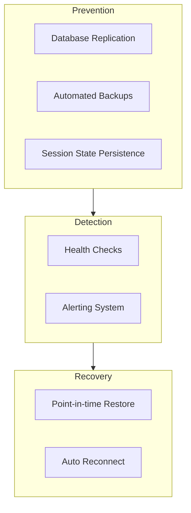

**Backup Coverage:**

| Data Type | Frequency | Retention | Storage |
|-----------|-----------|-----------|---------|
| Databases (`main.sqlite` plus the data store, or a `pg_dump` when `DATABASE_TYPE=postgres`) | Each operator-run of `scripts/backup.sh` — the repo ships no scheduled backup | Whatever the operator keeps; the script never prunes | One `openwa-backup-<timestamp>.tar.gz` under `BACKUP_DIR` (default `./backups`) — local disk, no object-storage upload |
| Session auth state | On change | Indefinite | Filesystem — `SESSION_DATA_PATH` (default `./data/sessions`), `BAILEYS_AUTH_DIR` (default `./data/baileys`) |
| Configuration | On change | Indefinite | Git |

> Session auth state is **not** in the database: whatsapp-web.js `LocalAuth` writes under
> `SESSION_DATA_PATH` and Baileys writes multi-file auth state under `BAILEYS_AUTH_DIR/<sessionId>`.
> A database-only backup loses every pairing — those directories must be in the file-level backup.
> `scripts/backup.sh` already captures both alongside the databases. Running it on a schedule and
> copying the archives off-box are the operator's responsibility.

---

## 16.6 Escalation Procedures

### Severity Levels

| Level | Description | Response Time | Notification |
|-------|-------------|---------------|--------------|
| **P1 - Critical** | System down, data breach | < 15 minutes | Phone + Slack |
| **P2 - High** | Major feature broken | < 1 hour | Slack + Email |
| **P3 - Medium** | Feature degraded | < 4 hours | Slack |
| **P4 - Low** | Minor issue | < 24 hours | GitHub Issue |

### Escalation Flow

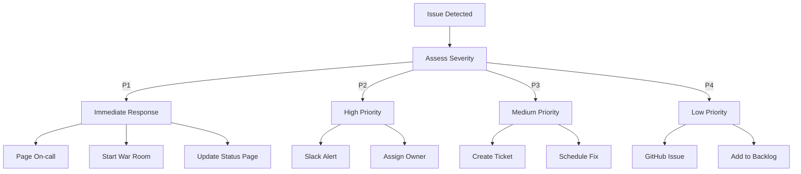

### On-Call Rotation

```yaml
# Example PagerDuty/Opsgenie configuration
schedule:
  name: "OpenWA On-Call"
  rotation:
    - week: 1
      primary: "developer-a"
      secondary: "developer-b"
    - week: 2
      primary: "developer-b"
      secondary: "developer-a"

escalation:
  - level: 1
    wait: 5m
    target: primary
  - level: 2
    wait: 10m
    target: secondary
  - level: 3
    wait: 15m
    target: all-team
```

---

## 16.7 Risk Dashboard

### Key Risk Indicators (KRI)

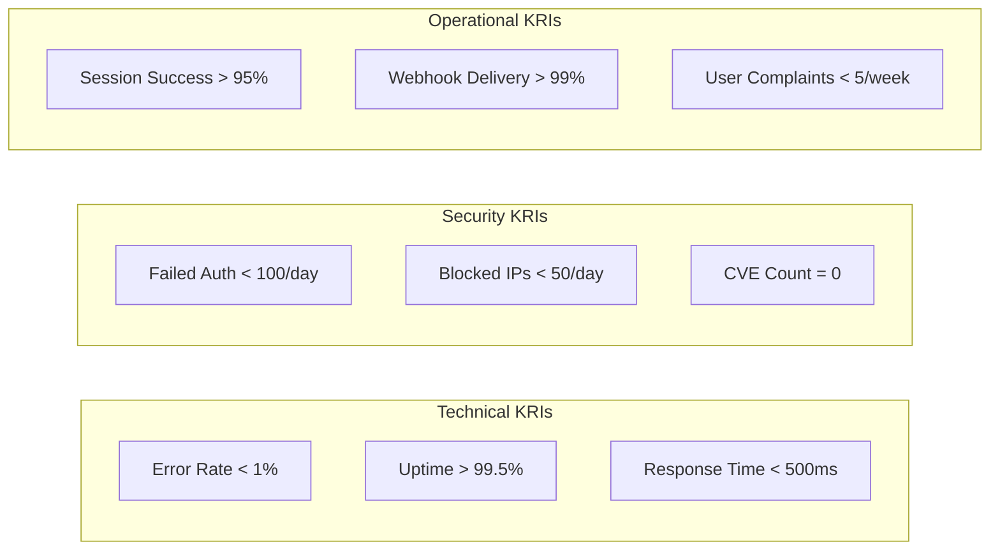

### Weekly Risk Report Template

```markdown
## Weekly Risk Report - Week XX

### Summary
- Overall Risk Status: 🟢 Green / 🟡 Yellow / 🔴 Red
- New Risks Identified: X
- Risks Mitigated: X
- Active Incidents: X

### KRI Status

| KRI | Target | Actual | Status |
|-----|--------|--------|--------|
| Error Rate | < 1% | X.XX% | 🟢/🟡/🔴 |
| Uptime | > 99.5% | XX.XX% | 🟢/🟡/🔴 |
| Response Time | < 500ms | XXXms | 🟢/🟡/🔴 |

### Top Risks This Week

1. **Risk Name**
   - Status: Monitoring/Mitigating/Resolved
   - Action: [Description]

### Dependencies Update

| Dependency | Current | Latest | CVEs | Action |
|------------|---------|--------|------|--------|
| whatsapp-web.js | X.X.X | X.X.X | 0 | OK |
| puppeteer | X.X.X | X.X.X | 0 | OK |

### Action Items
- [ ] Action 1
- [ ] Action 2
```

---

## 16.8 Risk Summary

| ID | Risk | Probability | Impact | Level | Status |
|----|------|-------------|--------|-------|--------|
| R001 | Protocol Changes | High | High | 🔴 Critical | Monitoring |
| R002 | Account Ban | Medium | Medium | 🟡 Medium | Partially mitigated |
| R003 | Security Breach | Low | Critical | 🟡 Medium | Mitigated |
| R004 | Maintainer Burnout | Medium | Medium | 🟡 Medium | Planning |
| R005 | Dependency Issues | High | Medium | 🟡 Medium | Automated |
| R006 | Legal Issues | Low | Critical | 🟡 Medium | Mitigated |
| R007 | Rate Limiting | High | Medium | 🟡 Medium | Partially mitigated |
| R008 | Data Loss | Low | High | 🟡 Medium | Mitigated |

### Risk Trend

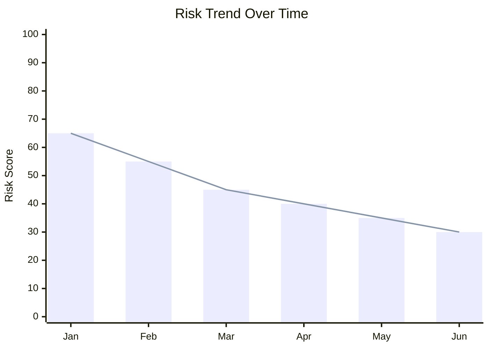
---

<div align="center">

[← 15 - Project Roadmap](./15-project-roadmap.md) · [Documentation Index](./README.md) · [Next: 17 - Dashboard Design →](./17-dashboard-design.md)

</div>
