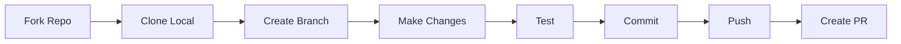
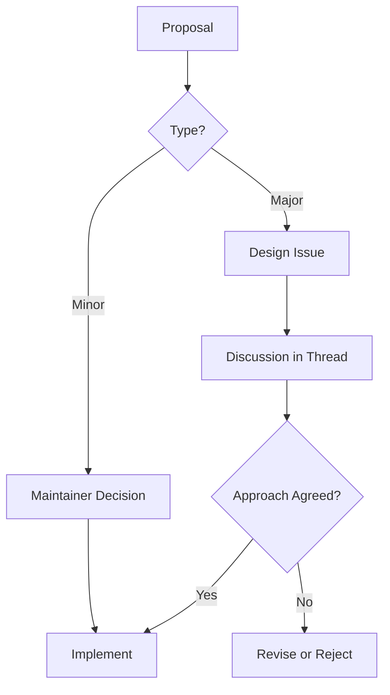

# 20 - Community Guidelines

## 20.1 Code of Conduct

### Our Pledge

OpenWA is committed to providing a welcoming and inclusive environment for everyone. We pledge to make participation in our project and community a harassment-free experience for all, regardless of:

- Age, body size, disability, ethnicity, sex characteristics
- Gender identity and expression
- Level of experience, education, socio-economic status
- Nationality, personal appearance, race, religion
- Sexual identity and orientation

### Our Standards

**Examples of behavior that contributes to a positive environment:**

- Using welcoming and inclusive language
- Being respectful of differing viewpoints and experiences
- Gracefully accepting constructive criticism
- Focusing on what is best for the community
- Showing empathy towards other community members

**Examples of unacceptable behavior:**

- Trolling, insulting/derogatory comments, and personal or political attacks
- Public or private harassment
- Publishing others' private information without explicit permission
- Spam, excessive self-promotion, or off-topic content
- Any conduct which could reasonably be considered inappropriate in a professional setting

### Enforcement

Project maintainers are responsible for clarifying the standards and will take appropriate and fair corrective action in response to any unacceptable behavior.

Project maintainers have the right to remove, edit, or reject comments, commits, code, wiki edits, issues, and other contributions that do not align with this Code of Conduct.

## 20.2 Contributing Guidelines

### Getting Started



### Development Setup

```bash
# 1. Fork the repository on GitHub

# 2. Clone your fork
git clone https://github.com/YOUR_USERNAME/openwa.git
cd openwa

# 3. Add upstream remote
git remote add upstream https://github.com/rmyndharis/OpenWA.git

# 4. Install dependencies
npm install

# 5. Copy environment file
cp .env.example .env

# 6. Start development
npm run dev
```

### Branch Naming

```
feature/     - New features
bugfix/      - Bug fixes
hotfix/      - Critical production fixes
docs/        - Documentation changes
refactor/    - Code refactoring
test/        - Test additions/modifications

Examples:
- feature/add-group-management
- bugfix/fix-qr-timeout
- docs/update-api-reference
- refactor/session-manager
```

### Commit Messages

We follow [Conventional Commits](https://www.conventionalcommits.org/):

```
<type>(<scope>): <description>

[optional body]

[optional footer(s)]
```

**Types:**

- `feat`: A new feature
- `fix`: A bug fix
- `docs`: Documentation only changes
- `style`: Changes that don't affect code meaning (formatting, etc.)
- `refactor`: Code change that neither fixes a bug nor adds a feature
- `perf`: Performance improvement
- `test`: Adding missing tests
- `chore`: Changes to build process or auxiliary tools

**Examples:**

```
feat(sessions): add support for multiple proxy configurations

fix(webhook): resolve timeout issue on slow connections

docs(api): update message endpoint documentation

refactor(database): migrate to TypeORM repository pattern
```

### Pull Request Process

1. **Before submitting:**
   - Ensure tests pass: `npm test`
   - Lint your code: `npm run lint`
   - Update documentation if needed
   - Rebase on latest `main`

2. **PR Description Template:**

   GitHub pre-fills `.github/pull_request_template.md`:

```markdown
## Description

Brief description of changes

## Type of Change

- [ ] Bug fix
- [ ] New feature
- [ ] Breaking change
- [ ] Documentation update

## Checklist

- [ ] Tests added/updated
- [ ] Documentation updated
- [ ] Lint passes
- [ ] Self-reviewed

## Screenshots (if applicable)

## Related Issues

Closes #
```

3. **Review Process:**
   - CI (`.github/workflows/ci.yml`) runs on every pull request targeting `main` or `develop`
   - A maintainer reviews the change and merges it
   - Address review comments
   - Keep the PR focused on one logical change

### Code Style

**TypeScript:**

```typescript
// Use explicit types
function sendMessage(sessionId: string, phone: string, text: string): Promise<Message> {
  // ...
}

// Use interfaces for complex types
interface SendMessageOptions {
  quotedMessageId?: string;
  mentions?: string[];
}

// Document public APIs
/**
 * Sends a text message to the specified phone number
 * @param sessionId - The session to use for sending
 * @param phone - Phone number in format 628xxx@c.us
 * @param text - Message text content
 * @returns Promise resolving to the sent message
 */
async function sendTextMessage(sessionId: string, phone: string, text: string): Promise<Message> {
  // ...
}
```

**Naming Conventions:**

| Type       | Convention                          | Example                 |
| ---------- | ----------------------------------- | ----------------------- |
| Classes    | PascalCase                          | `SessionManager`        |
| Interfaces | PascalCase with I prefix (optional) | `Session` or `ISession` |
| Functions  | camelCase                           | `sendMessage`           |
| Variables  | camelCase                           | `sessionCount`          |
| Constants  | UPPER_SNAKE_CASE                    | `MAX_SESSIONS`          |
| Files      | kebab-case                          | `session-manager.ts`    |

## 20.3 Issue Guidelines

### Issue vs. Discussions

Before opening an Issue, decide whether it belongs here or in **GitHub Discussions**.
Most misrouted reports are configuration, provider, or environment questions rather than
defects in OpenWA — routing them correctly upfront saves time for everyone (faster answers
for you, cleaner triage for maintainers). When in doubt, open a Discussion first; it can
always be promoted to an Issue once a real defect is confirmed.

| Open an **Issue**                                                        | Open a **Discussion**                                                       |
| ------------------------------------------------------------------------ | --------------------------------------------------------------------------- |
| Reproducible defect in OpenWA code with clear steps, expected vs. actual | Setup / configuration help ("my proxy doesn't work, how do I configure X?") |
| Crash, panic, wrong API response, regression after upgrade               | Provider-specific quirks (webshare, IPRoyal, brightdata, Twilio, etc.)      |
| Documented behavior contradicted by actual behavior                      | "Is X possible?" / "What's the best way to Y?"                              |
| Security issue (use `SECURITY.md`, not a public issue)                   | Hosting-platform / network / firewall questions                             |

**Common gray-zone examples (these go to Discussions, not Issues):**

- "My proxy works on first start but fails after pod restart" → almost always a
  provider-side IP allowlist, not an OpenWA bug. See `docs/12-troubleshooting-faq.md`.
- "WhatsApp blocked my number" → provider/WhatsApp policy, not a code defect.
- "How do I deploy behind nginx/Traefik?" → configuration, use Discussions.
- "Why is my QR not showing?" → start with the troubleshooting FAQ; open an Issue only
  if the documented fixes don't resolve it.

If an Issue lands in the gray zone, it will be labeled `needs-info`, `not-a-bug`, or
`move-to-discussions`. Environmental or provider-side reports are closed and continued in
Discussions.

### Bug Reports

Blank issues are disabled — GitHub presents the **Bug report** form
(`.github/ISSUE_TEMPLATE/bug_report.yml`). Required fields:

| Field              | Notes                                                                        |
| ------------------ | ---------------------------------------------------------------------------- |
| Pre-flight         | Both checkboxes: searched for duplicates, and on the latest released version |
| OpenWA version     | e.g. `0.2.1` (shown on the dashboard Login screen) or a commit SHA           |
| Deployment         | Docker Compose / Docker (manual run) / Bare metal (npm) / Other              |
| Database           | SQLite (default) / PostgreSQL                                                |
| What happened?     | The bug and its impact                                                       |
| Steps to reproduce | Exact steps, including the API call or dashboard action                      |

Optional but valuable: **WhatsApp engine** (defaults to `whatsapp-web.js`), **Expected
behavior**, **Relevant logs** (redact API keys and secrets), and **Environment /
additional context**.

### Feature Requests

The **Feature request** form (`.github/ISSUE_TEMPLATE/feature_request.yml`) asks for the
problem first — describe what you are trying to do and what gets in the way, since the
best solution isn't always the one initially imagined.

| Field                   | Notes                                                       |
| ----------------------- | ----------------------------------------------------------- |
| Pre-flight              | Required: searched existing issues, not already requested   |
| Problem / motivation    | Required: what you're trying to do and what blocks it today |
| Proposed solution       | Optional: API shape, dashboard behavior, config, etc.       |
| Alternatives considered | Optional                                                    |
| Scope                   | Acknowledgment that some features are limited by the engine |

The scope checkbox matters: capabilities such as interactive Buttons / List messages are
not supported on whatsapp-web.js, the default engine.

### Issue Labels

| Label                 | Description                                                                     |
| --------------------- | ------------------------------------------------------------------------------- |
| `bug`                 | Something isn't working                                                         |
| `enhancement`         | New feature or request                                                          |
| `documentation`       | Improvements to docs                                                            |
| `good first issue`    | Good for newcomers                                                              |
| `help wanted`         | Extra attention needed                                                          |
| `question`            | Further information requested                                                   |
| `needs-info`          | Awaiting reporter input to proceed                                              |
| `not-a-bug`           | External/environmental cause (provider, network, hosting); not an OpenWA defect |
| `move-to-discussions` | Belongs in GitHub Discussions, not Issues — see §20.3 Issue vs. Discussions     |
| `invalid`             | This doesn't seem right                                                         |
| `wontfix`             | This will not be worked on                                                      |
| `duplicate`           | This issue already exists                                                       |
| `security`            | Security-related                                                                |
| `design`              | Architecture / design discussion                                                |
| `engine:baileys`      | Baileys engine specific                                                         |
| `upstream-blocked`    | Blocked on upstream library/WhatsApp behavior; no OpenWA-side fix               |

## 20.4 Community Channels

### GitHub Discussions

Primary community forum for:

- Questions and answers
- Feature discussions
- Show and tell
- General discussions

Categories:

- **Announcements**: Official announcements from maintainers
- **Q&A**: Questions about using OpenWA
- **Ideas**: Feature suggestions and brainstorming
- **Show and Tell**: Share your projects using OpenWA
- **General**: General discussion

### Support Priority

1. **GitHub Issues** - Bug reports and feature requests
2. **GitHub Discussions** - Questions and general discussion

There is no official real-time chat server. The issue-template contact links
(`.github/ISSUE_TEMPLATE/config.yml`) point only to the documentation and to the private
security-advisory form.

## 20.5 Governance

### Decision Making



### Design Discussions

There is no separate RFC repository or directory. For substantial architectural changes
(new frameworks, large rewrites) — and for any change to REST response shapes or status
codes, since the REST API is the public contract — open a GitHub Issue to align on the
approach **before** investing the work. Maintainers label these `design`, and the issue
thread is the design record.

A design issue should cover:

- **Summary** - one paragraph explaining the change
- **Motivation** - the problem it solves, and for whom
- **Proposed design** - the API, config, or schema surface it touches
- **Alternatives** - other approaches considered, and why they were set aside
- **Open questions** - what is still undecided

Once the approach is agreed, implementation proceeds as an ordinary pull request.

### Roles

| Role            | Responsibilities                                                                    |
| --------------- | ----------------------------------------------------------------------------------- |
| **Maintainer**  | Triage and label issues, review and merge PRs, version stamping and release cutting |
| **Contributor** | Submit PRs, report issues, take part in Discussions                                 |

There is no tiered committer body and no documented nomination process.

## 20.6 Recognition

### Contributors

Contributions are credited in:

- `CHANGELOG.md` - a "Thanks @handle." line on the entry describing the change
- GitHub release notes, which are generated from that release's CHANGELOG section
- The pull request and issue threads themselves

### Contribution Types

We value all contributions:

- Code contributions
- Documentation improvements
- Bug reports
- Feature suggestions
- Community support
- Translations
- Design contributions

### Acknowledgment

A CHANGELOG entry carrying credit looks like this:

```markdown
- **Short summary of the user-visible change.** What was wrong, and what happens instead
  now. Thanks @handle. (#1234)
```

Security reporters are credited in the advisory and the release notes instead, unless they
prefer to remain anonymous - see `SECURITY.md`.

## 20.7 Security Policy

`SECURITY.md` at the repository root is the authoritative policy; it also carries
hardening notes for operators. The summary below tracks it.

### Reporting Vulnerabilities

**DO NOT** report security vulnerabilities through public GitHub issues, discussions, or
pull requests.

Report privately through either channel:

1. **GitHub Security Advisories** (preferred) — open a private report at
   <https://github.com/rmyndharis/OpenWA/security/advisories/new>
2. **Email** — yudhi@rmyndharis.com

Include, where possible:

- A description of the issue and its impact
- Steps to reproduce or a proof of concept
- Affected version(s) and deployment details (Docker / bare metal, database, engine)

### What to Expect

No fixed response SLA is promised, but in practice:

- An acknowledgement, typically within a few days
- An assessment, and — where applicable — a coordinated fix and release
- Credit in the advisory / release notes, unless you'd prefer to remain anonymous

---

<div align="center">

[← 19 - Plugin Architecture](./19-plugin-architecture.md) · [Documentation Index](./README.md) · [Next: 21 - Glossary →](./21-glossary.md)

</div>
