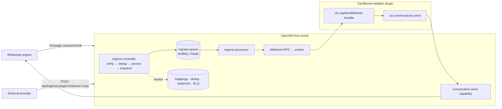

# 25 - Integration Fabric

> **Status:** Shipped. The core substrate, operator provisioning (an ADMIN instance API and a dashboard
> **Instances** tab), and the official ingress adapters are all in place; the public SDK reference is
> still to come (P4). This document describes the architecture and the design rationale — *why* it is
> built this way — not a how-to or an API reference (see
> [15 - Project Roadmap](./15-project-roadmap.md) for the phase table).

## 25.1 What it is

The **Integration Fabric** is a core substrate that lets sandboxed marketplace plugins implement
bidirectional integrations with external systems — helpdesk agent inboxes, chatbot flow builders, CRMs —
**without running their own server**. A third party ships an adapter as a normal marketplace plugin,
declares its needs in the manifest, and never binds a port, never touches Redis or the queue, and never
re-implements signature verification, deduplication, ordering, or delivery.

It is the inbound counterpart to the existing plugin capability surface. Today a sandboxed plugin is
outbound-only: it can send messages, read engine state, use per-plugin storage, and make SSRF-guarded
HTTP calls (`ctx.net.fetch`). What it **cannot** do is receive an inbound external HTTP request — and a
real bidirectional integration needs exactly that: an agent replies in an external inbox, the external
system fires a webhook, and something must receive it and relay the reply to WhatsApp.

The core owns ingress, verification, dedup, ordering, delivery, the dead-letter queue, secret storage,
and the identity-mapping table. The adapter owns only provider-specific logic (API calls, HMAC recompute
for exotic schemes, handover heuristics). Plugins consume the substrate through a **stable, versioned
public contract — Integration SDK v1** — because the contract, not any single adapter, is the product.

## 25.2 Design principle: one new primitive, everything else a clone

The overriding goal is to preserve the untrusted-worker safety invariants *by construction*. OpenWA
plugins run in a capability-gated worker thread with no ambient host access (see
[30 - Plugin Sandboxing](./30-plugin-sandboxing.md)). Every host↔worker message is a serializable POJO
across a `structuredClone` boundary; host-initiated calls fail open on a timeout and drain on a worker
crash; permissions are manifest-static and cannot be widened by configuration; session scope is enforced
host-side.

Rather than invent new machinery that would have to re-earn those properties, the Integration Fabric is
**~90% a faithful clone of seams OpenWA already ships**:

| Concern | Cloned from |
| ------- | ----------- |
| Host→worker dispatch with fail-open timeout + crash-drain | the existing hook bridge |
| Worker→host capability calls | the existing capability router |
| Durable delivery with retry + dead-letter | the outbound webhook queue and DLQ |
| Identity mapping table (no foreign key, last-write-wins) | the LID↔phone mapping table |
| Inbound deduplication (insert-or-skip on a unique key) | the inbound-message dedup oracle |
| SSRF-guarded egress | `ctx.net.fetch` (reused verbatim) |
| Secret masking on read | the plugin config redaction utility |

Exactly **one** genuinely new primitive exists: a host→worker RPC that returns an **HTTP status + body**
from a sandboxed worker — inbound webhook ingress. It is modelled line-for-line on the hook bridge so its
correctness properties (its own pending map, a fail-open timeout, and a drain in the worker-exit handler)
come for free. If a worker crashes mid-request, the pending ingress call resolves to a `502` instead of
hanging the HTTP request forever.

## 25.3 Architecture

The topology is intentionally two-tier (an n8n-style queue mode): an **ingress tier** (the public
controller: authenticate → normalize → persist → enqueue → fast `202`) decoupled by a durable queue from
a **dispatch tier** (the processor that runs the plugin). A provider spike, a slow adapter, or a wedged
plugin never loses events; the tiers scale independently with backpressure.

Alongside this async pipeline, a route may additionally declare a `response` contract — host-side
`preflight` checks and a declarative `ack` — that shapes the synchronous HTTP response the provider sees
**without** altering the dispatch model. The plugin still always runs async (enqueued, full DLQ/retry);
`response` only controls what the provider receives back on the request socket. See §25.4 and §25.8.

## 25.4 Core components

- **Ingress RPC** — the one new primitive. Delivers a verified inbound request into the worker and returns
  its HTTP result. The worker claims routes with `ctx.registerWebhook(route, handler)`.
- **Ingress controller** — a `@Public` endpoint (`POST|GET /api/ingress/:pluginId/:instanceId/:route`).
  It is public to the API-key guard because an external provider cannot present the gateway's API key, so
  it self-validates (see §25.6). It never runs the plugin inline — providers enforce short acknowledgement
  deadlines, so the controller fast-acks and defers the work to the queue. A route may additionally
  declare a host-side `response` contract that shapes that synchronous reply without making the plugin
  inline. Its `preflight` checks (today: `session-alive`) run **after** signature verification and
  **before** the dedup persist — returning `503` only for a definitively-dead concrete-scoped WhatsApp
  session (no live engine or `FAILED`); recoverable statuses and `READY` pass through to a normal
  `202`+enqueue so the worker can still fail fast and the dedup row still holds the delivery. A declared
  `ack` (`status`/`body`/`headers`) replaces the default `202 accepted`. For a route declaring `response`,
  the ack is returned without awaiting enqueue so a queue-disabled deployment cannot block the provider's
  deadline; the dedup row already persisted is the durability handle. A route with no `response` is
  byte-identical to today's default fast-ack.
- **Plugin instance** — a first-class `instanceId` namespaced under a `pluginId`. One adapter can back
  many instances (for example, one external account per WhatsApp number). Each instance owns a host-minted
  ingress secret, a resolved session scope, and a config slice. It is a serializable field threaded
  through payloads and rows — **not** a separate worker; there is still one worker per plugin.
- **`conversation.send` capability** — a normalized outbound send authored by the plugin and translated
  host-side to the message service, so persistence and the message hook chain are preserved. It is gated
  by a `conversation:send` permission and the instance's session scope.
- **Identity, dedup, and DLQ tables** — see §25.5.
- **Ingress queue** — a durable BullMQ queue that is a *sibling* of the outbound webhook queue (its own
  worker, not the reordering webhook worker), with exponential-backoff retries and a dead-letter row on
  the final attempt.

## 25.5 Data model

Four tables live on the data connection, each created by a hand-authored dual-dialect migration
(SQLite and PostgreSQL):

- **`plugin_instances`** — one configured instance of an adapter: its host-minted secret (masked on read),
  resolved session scope, and config.
- **`conversation_mappings`** — the WhatsApp-chat ↔ external-conversation identity map, indexed in both
  directions, plus a `handoverState` column (`bot | human | closed`) the core reads before dispatching so
  a human-handled conversation deterministically stops the bot. `sessionId` is non-foreign-key provenance
  because a mapping outlives a session.
- **`ingress_events`** — the persist-before-acknowledge row and the inbound deduplication oracle
  (`UNIQUE(pluginId, instanceId, providerDeliveryId)`, insert-or-skip). It also carries the dispatch-lifecycle
  markers the reconciler sweeps on: `dispatchState` (`pending | dispatched | failed`, `NULL` on rows
  that predate the columns on a synchronize-bootstrapped DB — "not watched"), `dispatchAttempts`, and
  `lastDispatchAt`. New rows are `pending`; a recorded enqueue outcome flips them to `dispatched`;
  `failed` is terminal (recovery continues via the DLQ row + redrive). The row carries the **full
  request payload only while it is the sole durability handle** — from the persist until the dispatch
  outcome is recorded. Once the dispatch tier owns the delivery (the BullMQ job data, or the DLQ row
  on failure), the payload is retired to `NULL` and the row slims to its dedup marker plus
  `payloadHash` (a sha256 of the raw body kept for operator correlation). This keeps steady-state
  growth at a few hundred bytes per delivery instead of up to 2× `maxBodyBytes`; dedup rows are
  pruned on their own short window (`INGRESS_DEDUP_RETENTION_DAYS`, default 7 — a dedup oracle is not
  an audit log, and `<= 0` falls back to the default rather than disabling the prune into unbounded
  growth).
- **`integration_delivery_failures`** — a dead-letter record of last resort for both directions, with a
  redrive path (added in P1).

## 25.6 Security model

- **Authentication inversion.** A provider webhook cannot carry an OpenWA API key, so ingress is public to
  the API-key guard but validates a **per-instance HMAC (or shared secret)** over the **raw** request
  bytes with a constant-time comparison. The raw body is preserved by a verify callback on the body parser
  because a re-serialized payload is not byte-identical to what the provider signed. The global rate-limit
  guard still applies, and the payload is intentionally not bound to a DTO so strict validation cannot
  reject unknown provider fields.
- **Replay and duplication.** A signed-timestamp tolerance rejects stale deliveries, and
  `(pluginId, instanceId, providerDeliveryId)` deduplication plus a queue job id keyed on the delivery id
  provides best-effort de-duplication when the provider supplies a stable delivery id. Standard Webhooks defaults
  to its signed `webhook-id`; other handlers must remain idempotent because arbitrary provider headers
  are not authenticated by every scheme. Freshness is enforced whenever a route declares
  `signature.timestampHeader`: the declared `toleranceSec` wins, and otherwise the host default
  (`INGRESS_TIMESTAMP_TOLERANCE_SEC`, default 300) applies — a declared timestamp is never accepted
  without a freshness check. Freshness alone is not replay protection, though: an **unsigned**
  timestamp can simply be re-minted by whoever replays a captured (body, signature) pair with a new
  delivery id. hmac-sha256 routes should therefore bind the timestamp into the signed bytes by
  including `{timestamp}` in the `contentTemplate` (e.g. `{timestamp}.{rawBody}`, the Chatwoot shape)
  so the signature itself expires with the window; the loader warns when a route declares the header
  without signing it (or signs the token without declaring the header). `standard-webhooks` binds
  id + timestamp by spec. A provider that sends no timestamp header at all stays outside the replay
  window by construction — dedup and handler idempotency are its only protections.
- **Tenancy scoping.** Every durable ingress artifact — secret, dedup store, and dead-letter row — is
  partitioned by instance, and downstream capability calls carry the instance's resolved session scope, so
  a cross-tenant send is blocked host-side.
- **Fail-closed by construction.** No request — including an empty-body request — is accepted by an
  authenticating scheme without the correct per-instance secret. HMAC and Standard Webhooks bind body
  integrity; `shared-secret` authenticates only the caller header and does not bind the body.
  `scheme: "none"` is the only unauthenticated path, and a route declaring it **fails the whole plugin's
  load** unless the operator has explicitly opted in with `ALLOW_UNSIGNED_INGRESS=true` — manifest
  validation throws, so none of that plugin's other routes load either and its registry status is set to
  `ERROR`. When the operator has opted in, the loader still logs its boot warning for every such route.
- **Raw-body content types.** Signature verification observes exact bytes for `application/json` and
  `application/x-www-form-urlencoded`. Plain text, XML, octet streams, and non-UTF JSON charsets are not
  supported ingress body formats and fail verification/content handling rather than being re-serialized.
- **Egress.** The only outbound path remains the existing SSRF-guarded `ctx.net.fetch`, scoped to the
  manifest's allowed hosts.
- **Re-entrancy.** A reply issued *inside* an ingress handler seeds the in-flight hook set, so an adapter's
  own outbound message hook cannot echo-loop the reply back out to the external system.

## 25.7 Scale and durability

Persist-before-acknowledge; best-effort de-duplication keyed by a stable provider delivery id and queue
job id; per-instance fairness via a token bucket; and a dead-letter record with bounded redrive. On the
queued worker path, an **in-process** per-conversation lock prevents concurrent starts for the same lane;
strict FIFO is not preserved across retry/redrive, and the lock is single-node state rather than Redis or
PostgreSQL state. When the queue is disabled, ingress dispatches inline after persisting and does not
serialize concurrent same-conversation deliveries. Providers already deliver over unordered,
at-least-once HTTP, so plugin handlers must be idempotent and treat ingress as a reconciliation trigger.

Persist-before-acknowledge alone is not delivery: a crash between the persist and the enqueue, or a
fire-and-forget enqueue on a `response` route whose outcome is never recorded, would strand the row
with the provider already acknowledged. The **ingress reconciler** closes that window: every
`INGRESS_RECONCILE_INTERVAL_MS` (default 60s, `0` disables; a blank or unparseable value falls
back to the default rather than disabling the sweep) it re-dispatches a bounded batch
(`INGRESS_RECONCILE_BATCH_SIZE`, default 50) of `pending` rows whose last activity is older than a
grace period (`INGRESS_RECONCILE_GRACE_MS`, default 60s), through the same queue-or-inline enqueue the
live path uses and with the original delivery id as job id, so a replay is idempotent against a job
the crashed live path may have enqueued. The stored row is sufficient for re-dispatch — while
`pending` it is the full verified request (headers/query/body/rawBody) plus the route and session
provenance; the conversation lane is re-derived from the current manifest. After
`INGRESS_RECONCILE_MAX_ATTEMPTS` (default 5) the row goes `failed` (terminal) and a dead-letter row
is guaranteed to exist **before** the row's payload is retired, so recovery continues through the
bounded redrive path instead of an infinite replay loop; a successful replay likewise retires the
row's payload with the `dispatched` mark and retires any live-path dead-letter row for the same
delivery so a later redrive never double-delivers. A `pending` row found without a payload (only
possible for imported/corrupt history — payloads are retired only with a recorded outcome) is
skipped loudly, never replayed empty.

Table growth is bounded by construction rather than by operator hygiene: the per-instance ingress
throttle caps the row-creation rate, dispatched rows slim to a marker + hash, and the two retention
windows prune what remains — `INGRESS_DEDUP_RETENTION_DAYS` (default 7) for the dedup oracle and
`INGRESS_RETENTION_DAYS` (default 90, `<= 0` disables) for the DLQ. There is deliberately no
per-instance row-count cap: eviction under a flood of forged delivery ids would silently drop legit
dedup rows and re-admit their replays, which is worse than the bounded growth it would prevent.

## 25.8 The Integration SDK (v1)

The stable surface untrusted adapters consume. A plugin declares `sdkVersion: "1"` and an `ingress`
descriptor (the route, its signature scheme, replay tolerance, dedup header, and an optional verification
handshake) in its manifest, and requests the `webhook:ingress` and `conversation:send` permissions. The
host refuses to load an ingress-declaring plugin whose declared **major** differs from the host's
supported major, and the surface is **additive-only** within a major. The worker-facing API centres on
`ctx.registerWebhook(...)` (claim an inbound route), `ctx.conversations.send(...)` (normalized reply), and
per-instance mapping and handover helpers.

The `signature.scheme` field enumerates `hmac-sha256` (HMAC over a `contentTemplate`), `shared-secret`
(constant-time header compare), `standard-webhooks`, and `none` (unauthenticated — a route declaring it
fails the whole plugin's load unless the operator sets `ALLOW_UNSIGNED_INGRESS=true`; see §25.6). The
`standard-webhooks` scheme verifies a [Standard Webhooks](https://github.com/standard-webhooks/standard-webhooks)
payload host-side — Supabase Auth's Send-SMS hook and any Svix-routed provider speak it natively. Its wire
format is fixed by the spec (the `webhook-id` / `webhook-timestamp` / `webhook-signature` header triple,
signed over `${id}.${timestamp}.${rawBody}`), so only `toleranceSec` (falling back to the host
`INGRESS_TIMESTAMP_TOLERANCE_SEC`, default 300) and `dedupHeader` apply; `header`, `contentTemplate`,
`encoding`, `prefix`, and `timestampHeader` are ignored, and the
operator pastes the provider's Svix secret (`v1,whsec_<base64>`) as the instance secret. It is the
recommended scheme for Standard-Webhooks providers: because the `session-alive` preflight (§25.4) runs
*after* signature verification, an unauthenticated caller can no longer use that preflight as a liveness
oracle on a route that previously declared `scheme: "none"`. The existing `hmac-sha256`/`shared-secret`/
`none` behavior is unchanged. For `hmac-sha256`, declaring `timestampHeader` always activates the replay
window (§25.6) — declare it together with a `contentTemplate` that includes `{timestamp}` so the checked
timestamp is also signed.

Within major 1 the surface grows additively. A route's optional `response` contract — `preflight[]`
(host-side checks such as `session-alive`, evaluated after signature verify), `ack{}` (`status`/`body`/
`headers`, rendered host-side with `{rawBody}`/`{timestamp}`/`{id}` templates from the verified request),
and an advisory `deadlineMs` — lets an adapter shape the synchronous HTTP response the provider sees; the
plugin still always runs async, and a route with no `response` is byte-identical to today's default
fast-ack. The `mode: 'sync-reply'` value is **deprecated** in favor of `response`: it was inert dead code
that was never wired to the HTTP response (the pipeline is always async + fast-ack), and it is kept in the
`mode` union only to preserve SDK v1 additive-only compatibility — do not remove it within major 1, and do
not rely on it at runtime.

The full SDK reference — every manifest field, the envelope schema, the lifecycle, and the golden
compatibility fixtures — is a P4 deliverable and is not published yet, so this document and the manifest
types remain the source of truth.

## 25.9 Phasing and status

See [15 - Project Roadmap](./15-project-roadmap.md) for the full phase table. In brief: **P0** (this
substrate) is merged; **P1** added scale-correctness (per-conversation ordering, per-instance fairness,
DLQ redrive, handover); **P2** shipped operator provisioning in v0.8.0 — an ADMIN-only instance API
(`POST|GET /api/integration/plugins/:pluginId/instances` to create and list, with
`GET|PATCH|DELETE /api/integration/plugins/:pluginId/instances/:instanceId` and
`POST /api/integration/plugins/:pluginId/instances/:instanceId/regenerate-secret` on the item path) and a
dashboard **Instances** tab; **P3** validated the substrate against a second ingress adapter
(`supabase-otp-hook`). The official
ingress adapters ship as sandboxed plugins in the
[OpenWA-plugins](https://github.com/rmyndharis/OpenWA-plugins) catalog, not in this repository. What
remains open is **P4**: the published SDK reference, a compatibility test suite, and multi-node routing.

> **Provisioning is a first-class operator surface.** An ADMIN key mints a plugin instance against an
> ingress-capable plugin, binds it to a session scope, and receives the ingress URLs for the plugin's
> declared routes. The instance's ingress secret (and its `verifyToken`) are revealed once, on create and
> on regenerate, and masked on every later read.

---

> See also: [03 - System Architecture](03-system-architecture.md),
> [04 - Security Design](04-security-design.md),
> [19 - Plugin Architecture](19-plugin-architecture.md),
> [30 - Plugin Sandboxing](30-plugin-sandboxing.md),
> [15 - Project Roadmap](15-project-roadmap.md).
