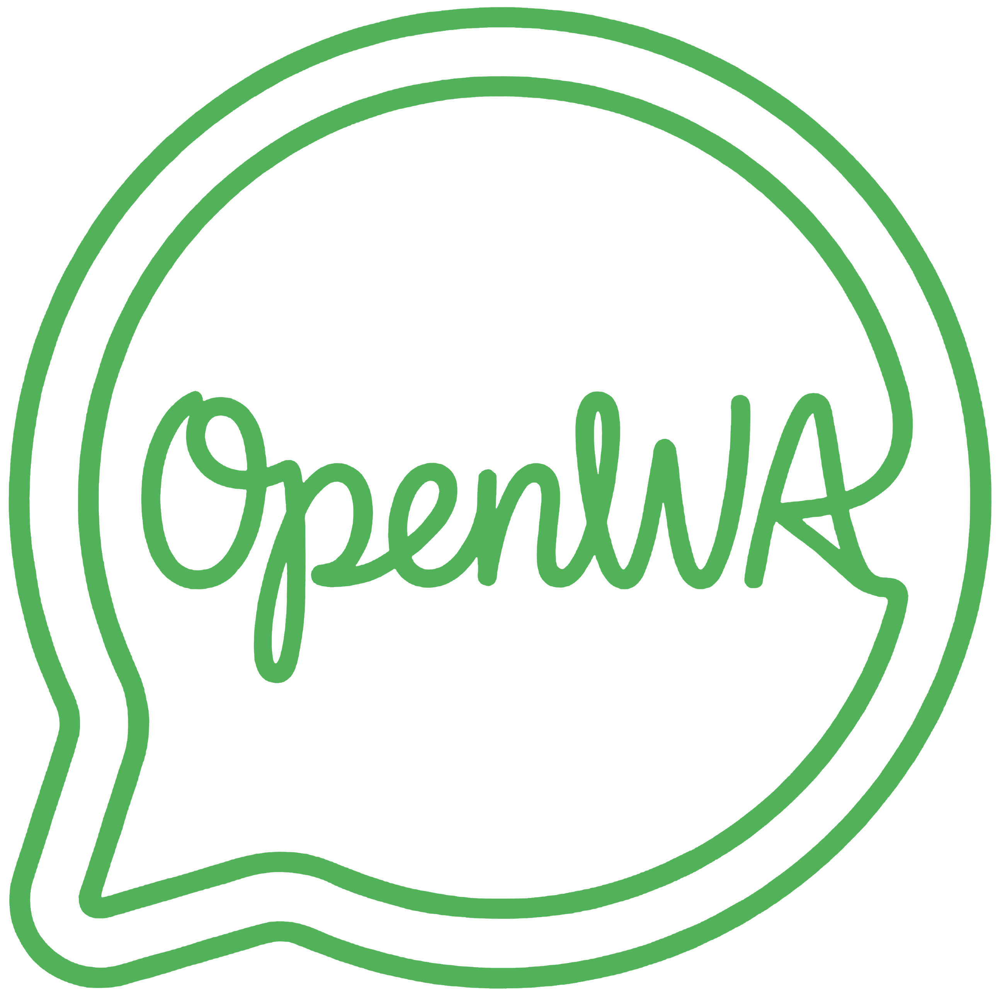

<p align="center">
  
</p>

<h1 align="center">OpenWA Documentation</h1>
<p align="center">
  <strong>Open Source WhatsApp API Gateway</strong>
</p>

<p align="center">
  <a href="#features-current">Features</a> •
  <a href="#quick-start">Quick Start</a> •
  <a href="#documentation-map">Docs</a> •
  <a href="#api-example">API</a> •
  <a href="#contributing">Contributing</a>
</p>

<p align="center">
  
  
  
  
  
  
</p>

---

## Documentation Map

**Full Index (by number)**

| No  | Document                                                         | Description                                       |
| --- | ---------------------------------------------------------------- | ------------------------------------------------- |
| 01  | [Project Overview](./01-project-overview.md)                     | Vision, goals, scope, current status              |
| 02  | [Requirements Specification](./02-requirements-specification.md) | Functional and non-functional requirements        |
| 03  | [System Architecture](./03-system-architecture.md)               | Architecture, modules, and runtime flows          |
| 04  | [Security Design](./04-security-design.md)                       | Auth, rate limiting, and security controls        |
| 05  | [Database Design](./05-database-design.md)                       | Entities and storage considerations               |
| 06  | [API Specification](./06-api-specification.md)                   | REST API and WebSocket protocol                   |
| 07  | [API Collection](./07-api-collection.md)                         | Example requests and Postman import tips          |
| 08  | [Development Guidelines](./08-development-guidelines.md)         | Coding standards and workflow                     |
| 09  | [Testing Strategy](./09-testing-strategy.md)                     | Test types and tooling                            |
| 10  | [DevOps & Infrastructure](./10-devops-infrastructure.md)         | Docker, deployment, and environment configuration |
| 11  | [Operational Runbooks](./11-operational-runbooks.md)             | Incident, maintenance, and backup runbooks        |
| 12  | [Troubleshooting FAQ](./12-troubleshooting-faq.md)               | Common issues and fixes                           |
| 13  | [Horizontal Scaling](./13-horizontal-scaling.md)                 | Multi-node deployment guidance                    |
| 14  | [Migration Guide](./14-migration-guide.md)                       | Upgrade and data migration guidance               |
| 15  | [Project Roadmap](./15-project-roadmap.md)                       | Near-term and long-term roadmap                   |
| 16  | [Risk Management](./16-risk-management.md)                       | Risks and mitigations                             |
| 17  | [Dashboard Design](./17-dashboard-design.md)                     | Dashboard UX overview                             |
| 18  | [SDK Design](./18-sdk-design.md)                                 | SDK plans and conventions                         |
| 19  | [Plugin Architecture](./19-plugin-architecture.md)               | Extensibility concepts                            |
| 20  | [Community Guidelines](./20-community-guidelines.md)             | Contribution and governance                       |
| 21  | [Glossary](./21-glossary.md)                                     | Terms and definitions                             |
| 22  | [n8n Integration](./22-n8n-integration.md)                       | n8n community nodes for OpenWA                    |
| 23  | [Community Integrations](./23-community-integrations.md)         | Third-party adapters built on the OpenWA API      |
| 24  | [MCP Integration](./24-mcp-integration.md)                       | Model Context Protocol tools and auth model       |
| 25  | [Integration Fabric](./25-integration-fabric.md)                | Inbound webhook substrate for plugin integrations |
| 26  | [Global Search](./26-global-search.md)                          | Cross-session message search and the provider model |
| 27  | [Plugin Search Providers](./27-plugin-search-providers.md)      | Writing a search-provider plugin                  |
| 28  | [Multitenancy](./28-multitenancy.md)                            | Multi-tenant target design (draft proposal)       |
| 29  | [Engine Capability Matrix](./29-engine-capability-matrix.md)    | Per-engine capability support, gaps, and roadmap  |
| 30  | [Plugin Sandboxing](./30-plugin-sandboxing.md)                   | Worker isolation, capabilities, and plugin limits |

**Examples**

| Example | Description |
| ------- | ----------- |
| [Session Phone-Number Pairing](./examples/session-phone-number-pairing.md) | Link an existing WhatsApp account by phone number instead of scanning QR |
| [Chat History Limits](./examples/chat-history-limits.md) | Understand local message history vs bounded live WhatsApp history |
| [Webhook Signature Verification](./examples/webhook-signature-verification.md) | Verify signed OpenWA webhook deliveries in Node.js and Python |
| [n8n Appointment Booking Workflow](./examples/n8n-appointment-booking.md) | Build an appointment-booking flow with OpenWA and n8n |

## Quick Start

### Option A: Minimal Setup (SQLite, no Docker services)

```bash
# Clone repository
git clone https://github.com/rmyndharis/OpenWA.git
cd OpenWA

# Install the locked dependencies & configure
npm ci
cp .env.minimal .env

# Create data directories
mkdir -p data/sessions data/media

# Run
npm run start:dev
```

Access:

- API: `http://localhost:2785/api`
- Swagger: `http://localhost:2785/api/docs`
- Health: `http://localhost:2785/api/health`

### Option B: Docker (single container: API + Dashboard)

```bash
# Clone repository
git clone https://github.com/rmyndharis/OpenWA.git
cd OpenWA

# Start services
docker compose up -d
```

Access (the dashboard is bundled into the API and served on the same port):

- Dashboard: `http://localhost:2785`
- API: `http://localhost:2785/api`
- Swagger: `http://localhost:2785/api/docs`

### API Key

OpenWA seeds a default API key on first run and writes it to:

- `data/.api-key` (development)
- `/app/data/.api-key` inside the API container when using Docker

The startup logs also print the initial key. By default a cryptographically
random `owa_k1_...` admin key is generated on first run in all environments; set
`ALLOW_DEV_API_KEY=true` to seed the well-known `dev-admin-key` for local
development only. Use an admin key to create additional keys with
`POST /api/auth/api-keys` (see
[API Specification](./06-api-specification.md#649-api-keys)).

## API Example

```bash
# Create a session
curl -X POST http://localhost:2785/api/sessions \
  -H "X-API-Key: your-api-key" \
  -H "Content-Type: application/json" \
  -d '{"name": "my-bot"}'

# Start the session
curl -X POST http://localhost:2785/api/sessions/{sessionId}/start \
  -H "X-API-Key: your-api-key"

# Get QR code (base64)
curl http://localhost:2785/api/sessions/{sessionId}/qr \
  -H "X-API-Key: your-api-key"

# Send a message
curl -X POST http://localhost:2785/api/sessions/{sessionId}/messages/send-text \
  -H "X-API-Key: your-api-key" \
  -H "Content-Type: application/json" \
  -d '{"chatId": "628123456789@c.us", "text": "Hello from OpenWA!"}'
```

## WebSocket Example (Socket.IO)

```javascript
import { io } from 'socket.io-client';

const socket = io('http://localhost:2785/events', {
  extraHeaders: { 'X-API-Key': 'your-api-key' },
  transports: ['websocket'],
});

socket.on('connect', () => {
  socket.emit('message', {
    type: 'subscribe',
    sessionId: '550e8400-e29b-41d4-a716-446655440000',
    events: ['message.received', 'session.status'],
    requestId: 'req_001',
  });
});

socket.on('message', msg => {
  if (msg.type === 'event') {
    console.log('Event:', msg.payload.event, msg.payload.data);
  }
});
```

## Features (Current)

| Feature                         | Status                        |
| ------------------------------- | ----------------------------- |
| REST API for WhatsApp           | Ready                         |
| WebSocket Events (Socket.IO)    | Ready                         |
| Multi-session Support           | Ready                         |
| Web Dashboard                   | Ready                         |
| Docker Deployment               | Ready                         |
| Webhooks with HMAC Signature    | Ready                         |
| SQLite / PostgreSQL Storage     | Ready                         |
| API Key Authentication & Roles  | Ready                         |
| CIDR IP Whitelisting            | Ready                         |
| Rate Limiting                   | Ready                         |
| Audit Logging                   | Ready                         |
| Groups / Contacts / Labels API  | Ready                         |
| Channels / Status API           | Experimental (engine-limited) |
| Catalog / Product API           | Endpoints defined; `501` on both engines |
| Pluggable Engine (wwebjs / Baileys) | Ready (set `ENGINE_TYPE`)  |
| Plugin Extension System         | Ready                         |
| Queue-based Webhook Retries     | Optional (QUEUE_ENABLED=true) |

## Tech Stack

| Layer     | Technology                    |
| --------- | ----------------------------- |
| Runtime   | Node.js 22 LTS                |
| Framework | NestJS 11.x                   |
| Language  | TypeScript 6.x                |
| WA Engine | Pluggable (`ENGINE_TYPE`): whatsapp-web.js (default) or Baileys |
| WebSocket | Socket.IO                     |
| Database  | SQLite (default) / PostgreSQL |
| ORM       | TypeORM                       |
| Container | Docker + Docker Compose       |
| Dashboard | React + Vite + TanStack Query |

## Project Structure

```
OpenWA/
├── src/                    # Backend source code
├── dashboard/              # Frontend dashboard
├── docker-compose.yml      # API (serves bundled dashboard) + optional datastores
├── docker-compose.dev.yml  # Dev-only compose
├── docs/                  # Project documentation
└── data/                   # Local runtime data (sessions, media, api key)
```

## Contributing

See [Development Guidelines](./08-development-guidelines.md) for coding standards and workflow.

## License

MIT License.

---

<div align="center">

**Start Reading: [01 - Project Overview](./01-project-overview.md)**

_OpenWA Documentation · Last updated: 2026-07-28_

</div>
